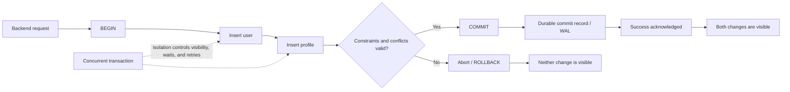

# SD-BEG-050 — Relational Databases

> **Track:** Beginner
>
> **Artifact state:** Ready
>
> **Learning state:** Not started
>
> **Last updated:** 2026-09-01

## Source and coverage check

- Inspected: the complete transcript, every page of the slide document, the complete 19:34 video, and the final section at five-second visual intervals.
- Coverage: complete. The two supplied slide files were byte-identical, so there was one unique three-page slide document.
- Unclear source points: none remain unresolved. The transcript has no timestamps, so ranges were mapped from the video. The instructor alternates between interrupting a process and interrupting the database; the task lab uses an isolated database-server crash because that is the stronger experiment he describes.
- Instructor-task scan: complete. One multi-part experiment was found at approximately `00:17:05-00:19:20`; see [`SD-BEG-050-T01`](tasks/SD-BEG-050-T01/README.md).

## What I should be able to do

- Model a small domain as tables with keys, relationships, and constraints, and explain the invariant each constraint protects.
- Explain atomicity, consistency, isolation, and durability without treating them as four vague synonyms for "safe."
- Predict the database state after rollback, a client disconnect, an uncommitted server crash, and a crash after a successful commit.
- Choose transaction boundaries in backend code and diagnose constraint failures, lock waits, aborted transactions, and durability pressure from evidence.
- Correctly adapt the design when concurrency, write rate, consistency, latency, durability, availability, or cost changes.

## Small bridge from earlier ideas

A **table** is a named collection of rows with declared columns. A **row** represents one fact or entity instance. A **primary key** uniquely identifies a row. A **foreign key** makes a value point to an existing row in another table. A **transaction** groups one or more statements into one commit-or-rollback boundary.

Those definitions are enough to study this lecture independently. Formal relational theory is richer than "rows and columns," but that extra theory is not a prerequisite here.

## The 60-second story

The course begins with a practical observation: the database is often the component whose latency, failure, or corruption affects the whole system. Relational databases organize data into tables and are especially useful when relationships and correctness rules matter. Their transaction boundary lets several statements become one logical change.

ACID describes four different guarantees. **Atomicity** prevents a transaction from leaving only some of its changes. **Consistency** means a successful transaction preserves the invariants the schema and application actually define. **Isolation** controls the effects concurrent transactions can observe and the anomalies the database permits. **Durability** means a reported commit survives the failures covered by the database's storage and configuration contract.

For a social network, inserting an authentication user and its profile is one logical operation. If the database crashes before commit, neither row should survive. If commit succeeds and the server then crashes, both rows should survive. That contrast is the instructor's central hands-on exercise.

## Why the terms matter

| Term | Simple meaning | Why it matters here | Common confusion |
|---|---|---|---|
| Relation/table | Structured rows governed by one schema | It establishes data ownership and joinable relationships | A spreadsheet has rows and columns too, but normally lacks transactional constraints and concurrent database semantics |
| Key | A value used to identify or connect rows | Primary and foreign keys protect identity and references | An index accelerates access; it is not automatically a correctness rule |
| Transaction | One logical unit with one outcome | It makes multiple statements commit or abort together | A request, function, and transaction need not have identical boundaries |
| Invariant | A rule that must remain true | "Every profile belongs to a user" is a precise correctness target | A hoped-for convention is not enforced unless code or schema protects it |
| Atomicity | All transaction effects or none | It prevents a user without its required profile after interruption | It does not mean a statement runs instantaneously or without concurrency |
| Consistency | Valid state before and after a successful transaction | It connects business rules to constraints and transaction logic | It is not the same as replica consistency or isolation |
| Isolation | Rules for concurrent visibility and anomalies | It determines what overlapping requests can safely observe | `SERIALIZABLE` does not necessarily run only one transaction at a time |
| Durability | A successful commit survives covered failures | It separates "acknowledged" from merely buffered work | It is not a backup and cannot defeat every storage or operator failure |
| Constraint | A database-enforced rule | It rejects invalid rows regardless of which code path writes them | A trigger can enforce logic too, but it is not the same mechanism |
| WAL | A recovery log written before affected data pages | PostgreSQL can redo committed changes after a crash | WAL on one machine is not a geographically independent backup |

## Big picture

### Question this visual answers

Where do schema rules and the four ACID guarantees act during one multi-statement change?



### How to read this visual

Follow the solid arrows from request to `BEGIN`, through both writes, and then through validation. A violation takes the rollback branch. A valid transaction reaches commit; PostgreSQL's normal durable path records enough WAL before success is returned. The dotted arrows show that other transactions may overlap, while isolation decides what they can observe and whether one waits or retries.

### Key insight

ACID is not one feature located in one box. The transaction boundary supplies the unit, constraints help define valid states, concurrency control governs overlap, and the recovery log protects acknowledged commits.

### Simplification or limitation

The diagram omits client libraries, statement-level savepoints, replicas, group commit, buffer caches, disk controllers, and distributed failure. A real durability promise depends on configuration and hardware, and application invariants may require more than declarative constraints.

## Core concepts

### Relational data: rows, columns, keys, and relationships

**Course:** The lecture introduces relational databases through ledgers and tabular accounting. The historical story is an intuition for why correctness, durability, integrity, constraints, and transactions became central; it should not be treated as a universal claim that every technical revolution first appeared in finance.

**Simple meaning:** Store related facts in tables, give rows stable identities, and express connections through matching keys.

**Formal meaning:** A relation has a defined set of attributes; an implementation such as PostgreSQL represents it as a table with typed columns and rows. Keys and constraints restrict allowed states. SQL tables also have implementation details, such as row ordering not being guaranteed without `ORDER BY`.

**Why it exists:** Without declared identity and relationships, every application path must manually prevent duplicate users, profiles with no user, self-follows, and dangling posts.

**How it works:**

1. Choose the fact each table owns: authentication data in `app_user`, public details in `profile`, authored content in `post`.
2. Give each independently addressed entity a primary key.
3. Put the parent's key in the child as a foreign key.
4. Declare optionality, uniqueness, checks, and delete behavior.
5. Index access paths separately; a foreign key on the child does not automatically imply every useful child-side index.

**Invariant or deciding condition:** Every non-null foreign-key value must match an allowed referenced key. For a strict one-to-one user/profile relationship, `profile.user_id` is both a foreign key and unique—commonly the profile's primary key.

**Small example:** User `42` may have profile `42`, many posts whose `author_id=42`, and many follow edges. A follow edge uses `(follower_id, followed_id)` as a composite primary key so the same edge cannot be inserted twice.

**Trade-off:** Normalized tables reduce duplication and centralize invariants, but joins and multi-row transactions add query and coordination cost. Denormalization can speed a read path but creates another value that must be reconciled.

**Failure/observability:** Foreign-key errors expose missing parents; unique violations expose duplicate identities; unexpected nulls expose weak optionality rules. Track rejected statements by SQLSTATE and table/constraint name, not by brittle parsing of full error text.

**When not to use it:** Do not split one small object into many tables merely to appear normalized. If the data is genuinely document-shaped, mostly read and written as one object, and cross-object invariants are weak, a document model may be simpler. That choice does not imply that non-relational databases lack transactions.

### Transaction boundary

**Simple meaning:** The database sees several statements as one logical attempt.

**Formal meaning:** `BEGIN` opens a transaction block, `COMMIT` makes its changes permanent and visible according to the engine's rules, and `ROLLBACK` cancels its uncommitted effects. PostgreSQL also wraps each standalone statement in an implicit transaction.

**Why it exists:** A request often changes more than one row or table. A network error, exception, constraint failure, or process crash can occur between any two statements.

**How it works:**

1. The application acquires one database connection.
2. It begins a transaction on that connection.
3. It executes all statements and checks their outcomes.
4. Any failure causes rollback; the connection must not be returned to the pool in an aborted transaction.
5. Only after every required statement succeeds does it commit.
6. The application reports success only after the commit call succeeds.

**Invariant or deciding condition:** Every write that belongs to the same externally visible state change must share the same transaction and the same database commit boundary.

**Small example:** Creating a login row and its required profile row should commit together. Sending a welcome email cannot be made atomic merely by putting SQL around it; use an outbox or another cross-system reliability mechanism.

**Trade-off:** A wider transaction protects more invariants, but holds locks and versions longer, increases contention, and raises the cost of retries. Keep transactions complete but short; do network calls outside them when possible.

**Failure/observability:** "Idle in transaction" sessions, long transaction age, lock waits, pool exhaustion, and high rollback counts reveal bad boundaries. Log a transaction/request correlation ID, SQLSTATE, elapsed time, and commit outcome without logging secrets.

**When not to use it:** Do not hold a transaction open while waiting for user input or a slow third-party API. A saga or outbox may be required when one operation spans independently committed systems.

### Atomicity: no partial transaction effect

**Course:** The lecture uses two examples: inserting a post while incrementing a stored post count, and debiting one account while crediting another. If a crash happens between the statements, a transaction prevents only one side from becoming permanent.

**Simple meaning:** Commit all required changes, or keep none of them.

**Formal meaning:** If a transaction aborts, its database effects do not become committed effects. Atomicity concerns the transaction's outcome; it does not say execution has no intermediate internal work.

**Why it exists:** A program can fail after statement 1 but before statement 2. Retrying without a transaction may duplicate the first effect or leave an impossible state.

**How it works:**

1. PostgreSQL records transaction changes under a transaction identity.
2. Other sessions do not treat those versions as committed.
3. `COMMIT` records the successful outcome; `ROLLBACK`, a disconnect, or crash leaves the transaction aborted.
4. Recovery redoes committed records and does not expose an uncommitted transaction as committed.

**Invariant or deciding condition:** After recovery, `user_count == profile_count` for the one-pair experiment, and either both new rows exist or neither exists.

**Small example:** Begin, insert user `101`, insert profile `101`, commit. If the server is killed after the first insert but before commit, both tables still contain zero rows after recovery.

**Trade-off:** Atomicity may increase log volume and contention, but removing the boundary moves compensation and correctness complexity into application code.

**Failure/observability:** A client can lose the connection while commit is in flight and not know whether the server committed. That is an **ambiguous outcome**, not proof of rollback. Use idempotency keys or a unique operation ID so a retry can query or safely repeat the operation.

**When not to use it:** A single independent statement already has an implicit transaction in PostgreSQL. Do not create a long explicit transaction when there is no multi-step invariant.

### Consistency: preserve declared invariants

**Course:** Consistency is explained as moving from one correct state to another. The database provides tools such as checks, foreign keys, cascading actions, and triggers. The application may also place related statements in one transaction.

**Verified extension:** The database can enforce only rules it knows. `CHECK (balance >= 0)` can reject a negative stored balance, but the database cannot infer an unstated business rule such as a daily transfer limit. Correct transaction logic and an appropriate isolation strategy still matter.

| Tool | Rule it can protect | Example | Operational caution |
|---|---|---|---|
| `NOT NULL` | A required value exists | Every user has an email | Empty text is not null; add a check if it is invalid |
| `UNIQUE` | No duplicate key value | One account per canonical email | Decide normalization/case policy first |
| `CHECK` | A row-level predicate holds | `follower_id <> followed_id` | Cross-row rules usually need another mechanism |
| Foreign key | A referenced row exists | Every profile points to a user | Index frequent child lookups explicitly |
| `ON DELETE CASCADE` | Dependent rows disappear with their owner | Delete a profile when its user is deleted | Dangerous when child records have independent meaning |
| Trigger | A function runs on a table event | Audit a row change | Hidden coupling, ordering, recursion, and bulk-write cost |
| Transaction logic | Several statements preserve one business rule | User plus required profile | Concurrency can still require locks or serializable retries |

**How it works:**

1. State the invariant in plain language.
2. Put universal row/reference rules in schema constraints.
3. Choose explicit delete behavior; PostgreSQL defaults a foreign key to `NO ACTION`, not cascade.
4. Keep multi-row business transitions in a transaction.
5. Use triggers only when central database ownership is worth the hidden behavior.
6. Test invalid, concurrent, and retry paths—not just valid inserts.

**Invariant or deciding condition:** A successful commit must satisfy every immediate constraint and every deferred constraint by its check point; application-only invariants need equivalent tested logic.

**Trade-off:** Strong schema enforcement rejects bad data early and protects every writer. It also makes schema migration ordering important and can turn an unsafe deploy into a write outage.

**Failure/observability:** Constraint violation rates, failed migrations, deadlocks, and mismatched derived counts are signals. Periodic invariant queries are useful for rules that cannot be declared directly.

**When not to use it:** Avoid `ON DELETE CASCADE` when the child is an independent legal, audit, billing, or compliance record. Prefer restrict/soft-delete/archive behavior with explicit retention rules.

### Isolation: concurrency with defined anomalies

**Course:** Isolation asks how much of one concurrently running transaction's work another transaction may observe. An uncommitted value should generally not leak into a transaction that assumes committed data.

**Verified extension:** Isolation is broader than visibility. It governs allowed outcomes such as dirty reads, non-repeatable reads, phantoms, and serialization anomalies. PostgreSQL's serializable level **emulates a serial order while still allowing concurrent execution**; conflicting work may fail and must be retried.

| Standard level | Dirty read | Non-repeatable read | Phantom/serialization risk | PostgreSQL 18 note |
|---|---:|---:|---|---|
| Read uncommitted | Standard permits | Possible | Possible | Implemented like Read Committed; dirty reads do not occur |
| Read committed | Prevented | Possible | Possible | PostgreSQL default; each statement gets a fresh committed snapshot |
| Repeatable read | Prevented | Prevented | Serialization anomalies remain possible | PostgreSQL snapshot isolation also prevents phantoms, but retries can occur |
| Serializable | Prevented | Prevented | Database rejects non-serializable outcomes | Strictest; application must retry serialization failures |

The instructor's practical note about `REPEATABLE READ` is correct for MySQL InnoDB, whose default is Repeatable Read. It is not a universal default: PostgreSQL defaults to Read Committed.

**How it works:**

1. Concurrent transactions read snapshots or take locks according to the engine and statement.
2. Writes to the same rows may block, conflict, or overwrite only under defined rules.
3. The selected level rules out some anomalies.
4. At stronger levels, the database may abort a transaction to preserve the guarantee.
5. The application retries the **whole** transaction with a bounded policy.

**Invariant or deciding condition:** Choose the weakest level plus explicit locking/conditional writes that still proves the application's invariant. The level name alone is not a proof.

**Small example:** Two requests both read `balance=100` and each try to spend `80`. A row check after two blind writes may not express the intended "only one spend" rule. A conditional update such as `UPDATE ... SET balance=balance-80 WHERE id=? AND balance>=80`, followed by checking that exactly one row changed, makes the decision atomic at the row.

**Trade-off:** Stronger isolation simplifies reasoning but can add predicate tracking, blocking, aborted work, and retry latency. Lower isolation improves concurrency only if the application handles the remaining anomalies.

**Failure/observability:** Track lock-wait time, deadlocks, serialization failures, retry counts, transaction age, and p95/p99 commit latency. One retry may be normal; a sustained spike is contention or access-pattern evidence.

**When not to use it:** Do not select Serializable everywhere without a retry path or measured need. Conversely, do not lower isolation to fix latency before proving which anomaly becomes possible.

### Durability: committed work outlives covered failures

**Course:** Once commit succeeds, changes should outlive an outage. The lecture intentionally contrasts an uncommitted crash with a committed state.

**Verified extension:** PostgreSQL uses write-ahead logging: recovery information is flushed before changed data pages must be written. On normal defaults, `fsync` and `synchronous_commit=on` make a local commit wait for durable WAL. Changing those settings changes the promise. One durable primary still does not protect against storage destruction, corruption, region loss, malicious deletion, or a bad migration.

**How it works:**

1. Changes produce WAL records.
2. Commit writes a commit record.
3. The required WAL is flushed according to durability settings.
4. Success is returned.
5. After a crash, recovery replays committed WAL and restores a consistent state.

**Invariant or deciding condition:** If the client received an unambiguous successful commit under the documented configuration, recovery must contain that transaction. If success was not received, the client cannot infer the outcome merely from the broken connection.

**Small example:** A committed user/profile pair remains `1/1` after a forced PostgreSQL process crash and restart. An open pair interrupted before commit returns as `0/0`.

**Trade-off:** Waiting for durable storage increases commit latency. Group commit amortizes one flush across concurrent commits, while asynchronous commit trades a small loss window for lower latency.

**Failure/observability:** Watch WAL generation rate, WAL flush/write latency, checkpoint pressure, disk saturation, recovery duration, replica lag, and backup-restore test age. A successful backup job is weaker evidence than a successful restore drill.

**When not to use it:** Do not pay synchronous durability cost for data that is truly reproducible and explicitly allowed to be lost, such as some caches. Do not weaken it for authoritative money, entitlement, or audit state without a deliberate requirement decision.

## Worked example and calculations

### Assumptions

- One signup transaction writes one user row and one profile row: `2 row inserts/signup`.
- Normal signup load: `500 signups/second` at peak.
- A separate post-publish design writes one post plus one stored counter: `2 row modifications/post`.
- A celebrity receives `1,000 posts/second` only as a stress illustration; the exact workload is intentionally artificial.

### Steps

**Signup write rate**

```text
500 transactions/second × 2 inserts/transaction
= 1,000 row inserts/second
```

The transaction count remains 500/s; two statements do not become two independent correctness decisions.

**Crash outcome matrix**

| Interruption point | User row after recovery | Profile row after recovery | Why |
|---|---:|---:|---|
| Before `BEGIN` | 0 | 0 | No work started |
| After user insert, before profile insert | 0 | 0 | Transaction never committed |
| After both inserts, before commit | 0 | 0 | Both are still uncommitted |
| After successful commit | 1 | 1 | Atomicity plus durability |
| Connection lost during commit | Unknown until checked | Unknown until checked | Commit outcome may be ambiguous to the client |

**Stored post-count pressure**

```text
1,000 posts/second × (1 post insert + 1 counter update)
= 2,000 row modifications/second
```

If all counter updates hit one user's statistics row, that one row becomes a serialization point even if the rest of the database has spare capacity. Alternatives are deriving `COUNT(*)`, sharding counters, or updating an approximate counter asynchronously; each changes read cost or consistency.

### Result and sanity check

The arithmetic does not predict a database's maximum throughput. It reveals the coordination shape: 500 independent signup transactions can spread across many keys, while 1,000 updates to one counter row contend on one key. The important scale variable is not only requests per second; it is how many transactions compete for the same invariant and row.

## Deep mechanism

### Components, ownership, and boundaries

The API owns request validation and user-facing errors. PostgreSQL owns committed table state, declared constraints, transaction visibility, locks/MVCC state, and WAL-based recovery. The connection pool owns sessions; returning an open or aborted transaction to it can contaminate a later request. A queue, email provider, or object store lies outside this local commit boundary.

#### Question this visual answers

What does a forced crash prove before commit versus after commit?

```mermaid
sequenceDiagram
    participant C as Client session
    participant P as PostgreSQL
    participant W as WAL/storage

    C->>P: BEGIN; insert user
    Note over P: Row is part of an open transaction
    C->>P: session waits before profile/commit
    P--xC: server process is force-stopped
    P->>W: restart and crash recovery
    W-->>P: no committed outcome for open transaction
    Note over P: users=0, profiles=0

    C->>P: BEGIN; insert user; insert profile; COMMIT
    P->>W: flush required commit WAL
    W-->>P: durable acknowledgement
    P-->>C: COMMIT succeeds
    P--xC: server process is force-stopped
    P->>W: restart and replay if needed
    Note over P: users=1, profiles=1
```

#### How to read this visual

The first half interrupts an open transaction, so recovery finds no committed outcome. The second half waits for commit success before applying the same failure, so recovery retains both rows.

#### Key insight

The crash is not magic evidence by itself. The decisive observation is the commit boundary: open work disappears; acknowledged committed work returns.

#### Simplification or limitation

The lab kills one PostgreSQL container while retaining its exact local volume. It does not simulate disk loss, a kernel/power failure, replication, or a distributed transaction.

### Ordering, concurrency, and stale state

- Statement order within one transaction matters to constraint timing and errors, but other sessions normally cannot treat its incomplete row versions as committed.
- A long open transaction can retain old row versions and delay cleanup even when it makes few writes.
- Read Committed gives each PostgreSQL statement a fresh snapshot, so two selects in one transaction can return different committed results.
- A read-modify-write sequence is not automatically safe merely because it is inside a transaction; lock the deciding row, use a conditional write, or select an isolation level that proves the invariant.
- Trigger side effects run within the triggering transaction, so they roll back with it, but they make the write path less visible to application readers.

### Failure and recovery

| Failure | Observable symptom | Mechanism | Protection/recovery | Remaining risk |
|---|---|---|---|---|
| Constraint violation | SQLSTATE plus named constraint; transaction may be aborted | Proposed state violates a declared rule | Return a domain error or fix ordering/data; rollback | Repeated failures may signal an API/schema mismatch |
| Client disconnect before commit | No success response; open session disappears | PostgreSQL aborts the open transaction | Retry with an idempotency key | Outcome is ambiguous if disconnect overlaps commit |
| Server crash before commit | Recovery runs; neither row exists | No committed transaction outcome | Restart and verify invariant | External side effects may already have occurred |
| Server crash after commit | Startup recovery; rows return | WAL replays/retains committed state | Health check then resume traffic | Local disk loss still defeats one-node storage |
| Long lock wait | Rising request latency; blocked sessions | Transactions contend on rows/keys | Shorten transactions, index access, reorder consistently | Retrying blindly can amplify load |
| Deadlock | One transaction receives a deadlock error | Cyclic lock dependency | Roll back one, retry with jitter, use consistent lock order | Hot keys may keep recreating the cycle |
| Serialization failure | Strict transaction aborts at statement/commit | Concurrent outcome cannot match a serial order | Retry the whole transaction | Retry storms under sustained contention |
| WAL/disk saturation | Commit latency and WAL backlog rise | Durable flush cannot keep up | Capacity, batching/group commit, workload repair | Weakening durability changes correctness |
| Bad cascade | More child rows deleted than intended | Schema encoded ownership incorrectly | Restore, audit, and redesign delete policy | Recovery point may include valid later writes |

### Observability

For PostgreSQL, useful evidence includes:

- `pg_stat_activity`: transaction age, state, wait event, and `idle in transaction` sessions;
- `pg_locks`: holders and waiters, joined carefully to sessions;
- `pg_stat_database`: commits, rollbacks, deadlocks, block activity, and session totals;
- WAL/checkpoint and disk metrics: WAL bytes/second, flush latency, checkpoint duration, disk queue and free space;
- application traces: time waiting for a connection, time in transaction, statement count, commit duration, retry count, SQLSTATE, and constraint name;
- invariant queries: users missing profiles when the domain requires exactly one, dangling references when constraints are absent, and stored counters that differ from authoritative rows;
- recovery evidence: actual restart/restore duration and the highest committed operation visible after recovery.

Alert on sustained trends, not a single normal rollback. Never place passwords, access tokens, or full personal records in SQL logs.

## Design choices

| Choice | Benefits | Costs/risks | Prefer when | Avoid when |
|---|---|---|---|---|
| Database constraint | Protects every writer; close to data | Migration and write compatibility must be planned | Rule is universal and locally expressible | Rule depends on an external service or changing policy |
| Explicit application transaction | Visible business flow; portable logic | Every writer must use it correctly | Several statements form one application action | Transaction would wait on slow network/user input |
| Trigger | Central automatic behavior | Hidden coupling, bulk cost, harder debugging | Auditing or database-owned invariant is truly central | Core business flow benefits from explicit orchestration |
| `ON DELETE CASCADE` | Atomic ownership cleanup | Accidental large deletion | Child cannot meaningfully exist without parent | Child has legal/audit/independent lifecycle |
| Derived `COUNT(*)` | One source of truth | Read cost can grow | Reads are moderate and index supports the query | Count is requested extremely often over huge sets |
| Stored synchronous counter | Fast reads, transactionally exact | Hot-row contention and duplicate state | Exact count is required and write contention is bounded | One key receives extreme write traffic |
| Asynchronous counter | Removes counter from write critical path | Temporary drift, replay/idempotency work | Approximate/eventual display is acceptable | Exact authorization or billing depends on it |
| Read Committed + conditional updates | Good concurrency, explicit invariants | More careful statement design | Invariants map to atomic writes/locks | Complex predicate spans many rows and is hard to prove |
| Serializable + retries | Strong outcome reasoning | Aborts, overhead, retry tail latency | Complex cross-row invariant justifies it | Client cannot safely retry or contention is extreme |

## Misconceptions

| Claim/confusion | What is actually true | Evidence or counterexample |
|---|---|---|
| "Relational means data is physically stored like a spreadsheet." | Tables are a logical interface with types, constraints, keys, transactions, and query planning; physical storage is engine-specific. | Row order is not even guaranteed without `ORDER BY`. |
| "Atomic means no one else runs at the same time." | Atomicity is all-or-nothing outcome. Isolation governs concurrency. | Two independent transactions can run concurrently and both be atomic. |
| "Consistency means every replica instantly agrees." | ACID consistency concerns valid state transitions; replica freshness is a separate distributed-consistency question. | A valid primary can have a lagging asynchronous replica. |
| "A transaction makes any read-modify-write race safe." | The transaction needs a lock, conditional write, or adequate isolation for the deciding condition. | Two Read Committed transactions can read the same old value. |
| "Serializable switches the database to one global transaction at a time." | PostgreSQL runs serializable transactions concurrently and aborts an outcome that cannot match a serial order. | A serialization failure is expected application-visible evidence. |
| "Repeatable Read is the default relational isolation level." | It is the MySQL InnoDB default; PostgreSQL defaults to Read Committed. | Check the selected engine/version, not a generic label. |
| "Foreign keys automatically index the child column in PostgreSQL." | Referenced keys are indexed/unique; the referencing column often needs a separate index. | Parent delete/update may scan the child without that index. |
| "Cascade is always the cleanest delete." | Cascade encodes ownership. Independent children should often restrict, archive, or be explicitly handled. | Deleting an account should not silently erase immutable billing records. |
| "Commit means backups are unnecessary." | Durability covers stated crash/storage assumptions; backups and replicas cover other failure domains. | Operator deletion or device loss can destroy a durable single copy. |
| "If the commit response is lost, the transaction rolled back." | The result is unknown until checked. | Server may have committed just before the connection broke. |

## Real backend connection

This is a representative FastAPI/PostgreSQL pattern, not a claim about Rahul's existing code:

```python
async def create_user(command, connection):
    async with connection.transaction():
        user_id = await connection.fetchval(
            "INSERT INTO app_user(email) VALUES ($1) RETURNING id",
            command.email,
        )
        await connection.execute(
            "INSERT INTO profile(user_id, display_name) VALUES ($1, $2)",
            user_id,
            command.display_name,
        )
    return user_id
```

The return happens after the transaction context commits. A production handler still needs:

- a unique/idempotency key if the caller may retry after an ambiguous response;
- mapping from constraint SQLSTATE/name to a safe client error;
- bounded transaction and connection-pool timeouts;
- no email/object-storage call inside the open transaction;
- an outbox row in the same transaction if a downstream event must follow the commit;
- metrics for connection wait, transaction duration, commit, rollback, and retries.

For a zero-balance transfer, prefer one conditional debit statement and check its affected-row count rather than trusting a stale application read. For a schema migration, add constraints in a rollout sequence compatible with both old and new application versions.

## Instructor-assigned tasks

| Task | Faithful purpose | Tools | Reference verified? | Learner status |
|---|---|---|---|---|
| [`SD-BEG-050-T01`](tasks/SD-BEG-050-T01/README.md) | Model social-network relationships and interrupt an open user/profile transaction to inspect atomicity and recovery | Docker, PostgreSQL 18.6, Python standard library | Passed against the task-local reference path | Not started |

### Codex-added practice

These are not additional instructor assignments:

1. **Predict:** A request receives no response because its connection drops during commit. List the two possible database outcomes and the evidence needed before retrying.
2. **Draw:** Reconstruct the user/profile one-to-one relationship and the user/follow/user many-to-many relationship.
3. **Explain:** Contrast ACID consistency with replica consistency without using either phrase in your first sentence.
4. **Change:** Assume one celebrity's post counter receives 10,000 updates/s. Choose an exact, sharded, derived, or asynchronous counter and state the changed guarantee.

## Useful English and technical phrases

### Invariant

- Pronunciation: `in-VAIR-ee-uhnt`
- Simple meaning: a rule that must remain true
- Hindi cue: `jo niyam hamesha sach rahe`
- Why it matters here: ACID reasoning becomes precise only after naming the rule being protected.
- Common misuse: saying "the system is consistent" without stating which invariant or reader view is meant.

Examples:

1. Simple: "The total must never be negative; that is our invariant."
2. Engineering: "The foreign key protects the invariant that every profile has an existing user."
3. Engineering: "Our retry path must preserve the no-duplicate-payment invariant."
4. Interview: "Before choosing an isolation level, I would state the invariant and construct a concurrent counterexample."
5. Professional/design review: "This migration weakens the invariant for six hours, so we need a compatibility check during the rollout."

### Atomic

- Pronunciation: `uh-TOM-ik`
- Simple meaning: treated as one indivisible outcome
- Hindi cue: `ya sab, ya kuchh bhi nahin`
- Why it matters here: it describes the result of the user/profile transaction.
- Common misuse: using "atomic" to mean fast, instantaneous, or globally serialized.

Examples:

1. Simple: "The two changes should be atomic."
2. Engineering: "The insert and counter update are atomic only if they share one transaction."
3. Engineering: "A local SQL transaction cannot make an email send atomic with the database commit."
4. Interview: "I would make the debit and credit atomic, then handle ambiguous retries with an operation key."
5. Professional/design review: "The proposal names three services but does not define an atomic boundary across them."

### Durable

- Pronunciation: `DYOOR-uh-buhl`
- Simple meaning: able to survive the failures promised by the design
- Hindi cue: `failure ke baad bhi bacha rahe`
- Why it matters here: the committed variation must survive a PostgreSQL process crash.
- Common misuse: treating a durable local commit as a backup, replica, or guarantee against all loss.

Examples:

1. Simple: "The saved record should be durable."
2. Engineering: "PostgreSQL acknowledges the normal commit after the required WAL is durable locally."
3. Engineering: "The cache entry is intentionally not durable because it can be rebuilt."
4. Interview: "I would clarify whether durability means one disk, one availability zone, or regional disaster recovery."
5. Professional/design review: "Our restore drill is stronger evidence of durable recovery than a green backup job."

### Contention

- Pronunciation: `kuhn-TEN-shuhn`
- Simple meaning: concurrent work competing for the same limited resource
- Hindi cue: `ek hi resource ke liye takraav`
- Why it matters here: a stored counter can turn one row into a write bottleneck.
- Common misuse: calling any high CPU usage contention without identifying competing actors and the shared resource.

Examples:

1. Simple: "Too many writers caused contention."
2. Engineering: "The user statistics row becomes a contention point during a posting burst."
3. Engineering: "Shorter transactions reduced lock contention but did not fix the hot key."
4. Interview: "I would inspect lock-wait time and key distribution before blaming the database."
5. Professional/design review: "The benchmark spreads writes uniformly, so it hides the contention our celebrity workload creates."

## Interview practice

### Foundation

**Question:** A transaction inserts a user and profile, then the database crashes before commit. What should be present after recovery, and which ACID properties explain it?

**Strong answer covers:** neither row is committed; atomicity prevents the partial outcome; recovery/durability preserves committed work but does not promote uncommitted work; the foreign key defines a relationship invariant.

**Weak-answer trap:** "Nothing happens because ACID makes the database consistent" without identifying the boundary, state, or mechanism.

### SDE-2 working engineer

**Question:** Production shows occasional users without profiles even though the endpoint uses PostgreSQL. Diagnose it.

**Reasoning checkpoints:** confirm whether profile is mandatory; inspect transaction boundaries and connection reuse; find writers outside the endpoint; inspect constraint definitions; correlate commit/rollback logs and SQLSTATEs; reproduce a failure between statements; add a foreign key and, if exactly one profile is mandatory, decide how creation and later deletion are enforced; plan a safe migration for existing bad rows.

**Follow-up:** The welcome email must be sent once after a successful signup. Do not hold the transaction open across the email API; insert an outbox record in the same transaction, then publish idempotently.

### SDE-3 senior design

**Prompt:** Design the write path for a social network with 10 million users, 200 million posts, 20,000 peak writes/s, strict account integrity, and eventually consistent display counters.

**Clarify first:** which entities are authoritative; exact latency SLOs; one-region or multi-region writes; required RPO/RTO; whether profile is mandatory; deletion/retention policy; counter freshness tolerance; hot-user distribution; compliance and cost boundaries.

**Answer outline:** keep authoritative users/profiles/posts/follows in relational tables with explicit keys and constraints; make each local invariant one short transaction; use conditional writes/locks where needed; index foreign-key access paths; use an outbox for downstream events; derive or asynchronously materialize display counters; partition/replicate only after measuring ownership and load; define bounded retries for deadlocks/serialization failures; observe pool wait, lock waits, WAL/commit latency, lag, invariant checks, and restore results.

**Requirement change:** If active-active multi-region writes with sub-100 ms local latency become mandatory, one synchronous cross-region transaction may violate latency/availability goals. Reassign single-writer ownership per account or redesign invariants/merge rules; do not preserve the old architecture by merely adding another database label.

## Course, verified extensions, and uncertainty

### Course model

- Relational databases represent structured data in rows and columns and are selected when relationships and transaction guarantees matter.
- A transaction is an atomic unit of work.
- Atomicity prevents partial multi-statement effects.
- Consistency uses constraints, cascades, triggers, and application transaction logic to protect valid states.
- Isolation determines how concurrent transaction work affects other transactions.
- Durability means committed changes outlive an outage.
- Hands-on work is essential: build a social schema, insert related rows in one transaction, interrupt it, and inspect the result.

### Verified extensions

- PostgreSQL documents transactions as all-or-nothing blocks and explains `BEGIN`, `COMMIT`, and `ROLLBACK`: [PostgreSQL 18 transactions](https://www.postgresql.org/docs/18/tutorial-transactions.html).
- PostgreSQL documents primary keys, foreign keys, delete actions, and why referencing columns often need their own indexes: [PostgreSQL 18 constraints](https://www.postgresql.org/docs/18/ddl-constraints.html).
- PostgreSQL implements Read Uncommitted like Read Committed, defaults to Read Committed, and can run Serializable work concurrently while rejecting non-serializable outcomes: [PostgreSQL 18 transaction isolation](https://www.postgresql.org/docs/18/transaction-iso.html).
- MySQL InnoDB defaults to Repeatable Read, which resolves the engine-specific statement in the course: [MySQL 8.4 InnoDB isolation levels](https://dev.mysql.com/doc/refman/8.4/en/innodb-transaction-isolation-levels.html).
- PostgreSQL WAL records changes before affected data pages must be flushed and supports crash redo: [PostgreSQL 18 WAL](https://www.postgresql.org/docs/18/wal-intro.html). Durability settings such as `fsync` and `synchronous_commit` define when success is safe against different failures: [PostgreSQL 18 WAL configuration](https://www.postgresql.org/docs/18/runtime-config-wal.html).
- Trigger timing and row-versus-statement behavior are product-specific and explicit: [PostgreSQL 18 `CREATE TRIGGER`](https://www.postgresql.org/docs/18/sql-createtrigger.html).

### Inferences and practical connections

- The user/profile experiment is a compact way to separate atomicity from durability: the same crash has a different expected result depending on whether commit completed.
- A stored post counter demonstrates both atomicity and contention: grouping it with the post protects correctness, but concentrating updates can create a hot row.
- A database can be the broadest failure amplifier in an architecture, but calling it "brittle" is a prompt to design and observe it carefully, not a theorem that every incident originates there.

### Unresolved source points

- None. The chosen PostgreSQL reference path is one faithful implementation of the instructor's explicitly permitted PostgreSQL/MySQL choice, not a claim that PostgreSQL is required by the course.

## Final revision card

### Five facts

1. A transaction boundary, not the mere presence of a relational database, makes several statements one outcome.
2. Atomicity is all-or-nothing; isolation is concurrency behavior; consistency is invariant preservation; durability is survival after acknowledged commit.
3. Constraints protect rules the schema declares, while application logic must still protect unstated or cross-system rules.
4. PostgreSQL Serializable permits concurrency and can abort work that needs a retry.
5. A durable local commit is not a backup, and an ambiguous commit response is not proof of rollback.

### Three decisions

1. Put a rule in a constraint when it is universal, local to the database, and stable enough to migrate safely.
2. Put all writes for one logical state transition in one short transaction; use outbox/saga patterns across systems.
3. Choose isolation by proving the invariant under concurrency, then measure waits, aborts, and retry cost.

### One failure

User exists without required profile -> writes committed separately or another writer bypassed the rule -> inspect transaction boundaries, constraint definitions, SQLSTATE/commit traces, and invariant query -> repair data, add a safe constraint/migration, and make creation atomic.

### Natural 60-second explanation

Start with the rule to protect. Show the two rows and one transaction boundary. Contrast crash-before-commit (`0/0`) with crash-after-commit (`1/1`). Name each ACID property by its distinct job. Add one concurrency caveat, one durability boundary, and one observable signal. Finish with the trade-off: correctness belongs close to the data, but transactions must remain short and cross-system effects need a different mechanism.

See [review.md](review.md) for closed-book retrieval.
