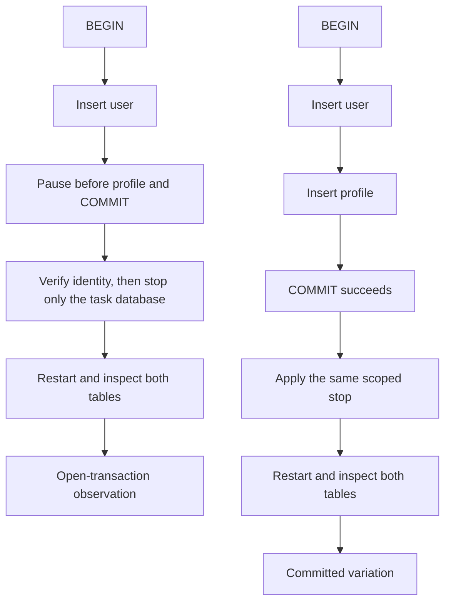

# SD-BEG-050-T01 — Model a social network and crash an open transaction

> Instructor-assigned task from `SD-BEG-050`. Attempt before opening `reference/SOLUTION.md`.

## Source and fidelity

- Source timestamp/slide: approximately `00:17:05-00:19:20`, final exercise page.
- Faithful paraphrase: set up a relational database, model a social-network schema with relationships and constraints, then insert a user and its profile in one transaction. Interrupt the process/database before commit and inspect whether the database retains a partial state.
- Short exact excerpt, only if needed: Not needed.
- Source ambiguity: PostgreSQL or MySQL is allowed. The schema depth is deliberately open; users and profiles are the minimum pair for the transaction. The narration mentions killing a process, then specifically describes killing the database. This pack chooses a disposable PostgreSQL server crash and records a client interruption as a smaller variation.

## Exact requirement checklist

- [ ] Set up a SQL database using PostgreSQL or MySQL.
- [ ] Create a social-network schema. The instructor suggests users, posts, profiles, photos, following relationships, and similar entities, while leaving final depth to the learner.
- [ ] Model meaningful relationships between the chosen tables.
- [ ] Add constraints that protect the rules you intend.
- [ ] Include at least a user table and a separate profile table for the transaction experiment.
- [ ] Begin one transaction and insert the user and matching profile within it.
- [ ] Interrupt execution before commit and inspect the recovered database state for inconsistency.
- [ ] Explain why the observed state did or did not contain a partial result.

## Codex-added safety or verification

These are additions, not instructor wording:

- Use the task-local PostgreSQL 18.6 Compose project; never point the scripts at an existing database or another Compose project.
- Use only synthetic identities and schema `sd_beg_050_t01` in task-owned database `sd_beg_050_t01`.
- Before failure injection, verify the local Docker endpoint, exact Compose project, service label, loopback port, database, schema, and volume.
- Use a deterministic interruption point: the first insert is open and the session is sleeping before the second insert and commit.
- Capture two observations: the interrupted open transaction should recover with equal zero counts, and the changed condition—successful commit before the same crash—should recover with equal one counts.
- Keep `learner_status` independent of the verified reference path. A green reference run does not complete Rahul's attempt.

## Inputs, constraints, and expected artifact

| Item | Contract |
|---|---|
| Input | A small social-network domain with, at minimum, user identity and profile details |
| Constraints | State each relationship, optionality, uniqueness rule, delete behavior, and transaction invariant; use synthetic local data only |
| Output | Rahul's schema SQL, transaction/crash run, genuine before/after evidence, and explanation in `ATTEMPT.md` |
| Completion evidence | Reviewable schema, safety preflight, open-transaction crash observation, committed variation, invariant check, and spoken explanation |

## Before you start: predict

Write in `ATTEMPT.md` before running anything:

1. expected user/profile counts after the open transaction is interrupted;
2. the invariant those counts represent;
3. one likely schema error, failure, or bottleneck;
4. the exact query or state that would prove or disprove the prediction;
5. the new prediction when commit succeeds before the same crash.

### Question this visual answers

Where must the interruption happen, and which two outcomes should the learner compare?

### How to read this visual

The top path is the instructor's failure case. The lower path changes only one condition: commit completes before the failure. Record both outcomes separately.

### Key insight

The deciding condition is not merely "a crash happened." It is whether the transaction had a committed outcome before the crash.

### Simplification or limitation

The local container stop exercises PostgreSQL process crash recovery with a retained task volume. It does not simulate physical disk destruction, a remote replica, or a whole-region outage.

## Setup

Use [`lab/README.md`](lab/README.md). It pins `postgres:18.6`, publishes only `127.0.0.1:55450`, uses project `sd-beg-050-t01`, and retains a uniquely labeled disposable volume. Expected active use is roughly 0.5 CPU, 256–512 MB memory, less than 20 MB of task data, plus the PostgreSQL image and volume. Startup is normally 5–30 seconds after the image is present.

The supplied automated command verifies the **reference path** only. Build and record Rahul's learner path separately; never copy reference SQL into `starter/` or `ATTEMPT.md`.

## Learner steps

1. Read the safety preflight and inspect `starter/schema.sql` without opening the reference folder.
2. State table ownership, cardinality, optionality, keys, delete behavior, and at least one invalid state each constraint prevents.
3. Complete your schema and transaction files under `starter/`; preserve your own naming and comments.
4. Start the task-local service and verify project, service, port, database, schema, and volume identities.
5. Load your schema and open a transaction that inserts a synthetic user, then pauses before the profile insert and commit.
6. Confirm the open transaction from another session, apply the exact task-scoped server interruption, restart, and query both counts.
7. Explain the observed state from transaction and recovery mechanisms, not from expected behavior alone.
8. Vary one condition: commit the matching user/profile pair before applying the same interruption. Predict first, then record the new result.
9. Cleanly stop only this task's service and report whether the retained volume makes the state recoverable.

## Progressive hints

Hint 1 — requirement

Write one sentence beginning "A successful signup must leave..." and make every table/transaction decision serve that sentence.

Hint 2 — invariant

For the one-pair experiment, compare the two table counts and ask which count combinations are valid.

Hint 3 — mechanism

The database cannot commit half of a transaction, but a crash test proves that only if both statements share one still-open transaction and recovery uses the same task-owned storage.

## Acceptance criteria

- [ ] The schema expresses the intended user/profile relationship with keys and constraints, and explains any optionality.
- [ ] Additional social entities, if chosen, have defended cardinality and delete behavior rather than decorative tables.
- [ ] The two inserts use one transaction on one connection.
- [ ] The preflight proves local context, exact project/service, loopback port, database/schema, and labeled volume before failure injection.
- [ ] Observed evidence is genuine and keeps prediction separate from output.
- [ ] After the pre-commit crash, the learner explains why neither a partial nor complete new pair is committed.
- [ ] After the post-commit variation, the learner explains why the complete pair survives under the tested configuration.
- [ ] The answer names at least one remaining proof gap, such as disk loss, replica durability, or ambiguous client response.
- [ ] Rahul can explain atomicity versus durability naturally without reading the reference solution.

## Cleanup/reset

Follow the exact commands in [`lab/README.md`](lab/README.md). `lab/05_reset.sql` refuses to run outside database `sd_beg_050_t01` and drops only schema `sd_beg_050_t01`. `docker compose ... stop postgres` stops only the task service and retains the task volume, so the last state remains recoverable. Never use a broad Docker prune or a volume-deleting Compose command.

## Reference answer boundary

After committing to your attempt, open [`reference/SOLUTION.md`](reference/SOLUTION.md). Reference verification status is recorded in `task.json`; it does not imply learner completion.
