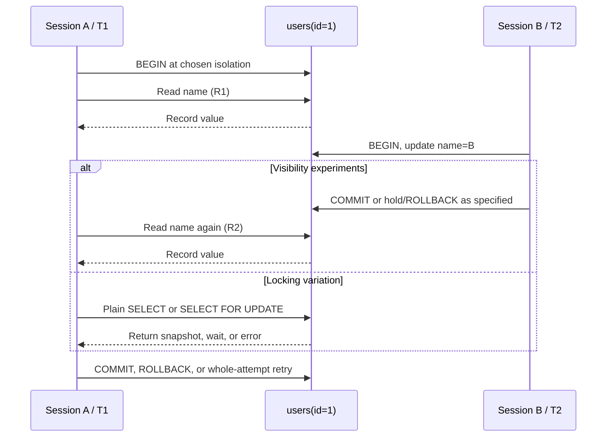

# SD-BEG-060-T01 — Observe isolation with one row and two sessions

> Instructor-assigned task from `SD-BEG-060`. Attempt before opening `reference/SOLUTION.md`.

## Source and fidelity

- Source timestamp/slide: `00:17:02-00:17:24`, after the four demonstrations; both slide pages summarize the levels and the engine caveat.
- Faithful paraphrase: inspect the isolation levels offered by the database you use. With one basic table and one row, run concurrent transactions, change the isolation level, and explain what happens behind the scenes.
- Short exact excerpt, only if needed: Not needed.
- Source ambiguity: the recommendation does not require one database product, output format, or exact set of schedules. The lecture itself demonstrates MySQL. This pack uses the repository's disposable PostgreSQL profile and preserves differences as evidence rather than forcing MySQL-shaped output.

## Exact requirement checklist

- [ ] Identify the isolation levels and default offered by the database under test.
- [ ] Create one small table with one deterministic row.
- [ ] Use two concurrent database sessions and explicit transaction boundaries.
- [ ] Change the transaction isolation level deliberately rather than assuming it.
- [ ] Read and update the row in an interleaved order.
- [ ] Observe the returned value, commit/rollback result, wait, or error in each schedule.
- [ ] Explain the behavior from the database's isolation/locking rules.

## Codex-added safety or verification

These are additions, not instructor wording:

- Use only the root loopback PostgreSQL 18.6 learning service, database `sd_learning`, user `sd_learner`, and task-owned schema `sd_beg_060_t01`.
- Before mutation, verify Docker context, Compose project `system-design-learning`, service/container labels, `127.0.0.1:55434`, database, user, and exact schema.
- Run four controlled observations: Read Committed, Repeatable Read, PostgreSQL's Read Uncommitted mapping, and a Serializable conflict/retry.
- Keep the course's MySQL result separate from PostgreSQL evidence. A different trace is correct when current PostgreSQL documentation predicts it.
- Change one condition: compare a Serializable plain `SELECT` with `SELECT ... FOR UPDATE` while another transaction holds an uncommitted row update.
- Capture genuine values, SQLSTATE, wait state, blocker PID, and final committed state. Do not copy the reference output into `ATTEMPT.md`.
- Reset only schema `sd_beg_060_t01`. Do not stop the shared service while another lab may be using it, and never delete the root PostgreSQL volume for this task.

## Inputs, constraints, and expected artifact

| Item | Contract |
|---|---|
| Input | One synthetic row `users(id=1, name='A')`, two sessions, and one isolation level per schedule |
| Constraints | Explicit `BEGIN`/`COMMIT`/`ROLLBACK`; reset to `A` between schedules; no external or existing database; distinguish plain and locking reads |
| Output | Rahul's prediction, ordered session trace, actual values/waits/errors, mechanism explanation, and one changed-condition result in `ATTEMPT.md` |
| Completion evidence | PostgreSQL identity/version, isolation shown inside each transaction, observed RC/RR/RU traces, Serializable SQLSTATE/retry, real blocker evidence, reset result, and spoken explanation |

## Before you start: predict

Write in `ATTEMPT.md` before running:

1. the two values `T1` will read when `T2` commits `B` between the reads at Read Committed;
2. the same two values at Repeatable Read;
3. whether PostgreSQL will expose `T2`'s uncommitted `B` when Read Uncommitted is requested;
4. what can happen when a Serializable transaction tries to update a row changed after its snapshot;
5. whether a plain Serializable read and a `FOR UPDATE` read wait behind the same uncommitted writer;
6. the exact query/error/wait evidence that would falsify each prediction.

### Question this visual answers

Which event must be placed between `T1`'s two reads, and where can a wait or abort appear?

### How to read this visual

Run downward and record `R1`, `T2`'s exact outcome, `R2`, and `T1`'s final outcome. Reset the row before changing the level so one observation does not leak into the next.

### Key insight

The level name alone is not the result. Commit position, snapshot scope, plain versus locking read, and the database implementation determine the trace.

### Simplification or limitation

One row demonstrates visibility, a concurrent-update failure, and a row-lock wait. It does not prove predicate/range behavior, phantoms, write skew, replica visibility, or performance at scale.

## Setup

Use [`lab/README.md`](lab/README.md). It reuses the root `postgres:18.6` service on `127.0.0.1:55434` and owns only schema `sd_beg_060_t01`. Expected task activity is below 0.25 CPU, roughly 20–80 MB incremental memory in the already-running PostgreSQL container, less than 1 MB of task data, and about 5–30 seconds for verification after the image is present.

Start from the repository root. The task's automated verifier runs the **reference path**. Rahul's learner trace belongs in `ATTEMPT.md` and remains `not_started` even when the reference verifier passes.

## Learner steps

1. Run the read-only preflight and verify the exact service identity described in `lab/README.md`.
2. Inspect and load `starter/00_schema.sql`; confirm exactly one row with value `A`.
3. Open two interactive `psql` sessions with distinct application names.
4. Complete `starter/session_a.sql` and `starter/session_b.sql` one schedule at a time without opening `reference/`.
5. For Read Committed, place `T2`'s committed update between `T1`'s two reads and record both values.
6. Reset, repeat at Repeatable Read, and compare only after recording the result.
7. Reset, hold `T2`'s update uncommitted, request Read Uncommitted in `T1`, read, then roll `T2` back.
8. Reset, create a Serializable stale-snapshot update conflict, capture the SQLSTATE, then retry the whole transaction from the beginning.
9. Reset and vary one condition: behind an uncommitted writer, compare a plain Serializable `SELECT` with `SELECT ... FOR UPDATE`. Prove any wait with `pg_stat_activity` and `pg_blocking_pids` from a third inspection command.
10. Reset only the task schema and explain the contract/mechanism boundary aloud.

## Progressive hints

Hint 1 — requirement

Write a three-column schedule: Session A, committed database state, Session B. Every claim must point to one row in that schedule.

Hint 2 — invariant

For visibility tests, the deciding facts are whether B committed and whether A reuses a transaction snapshot or gets a new statement snapshot.

Hint 3 — mechanism

PostgreSQL can expose an old committed row version without waiting. Add an explicit locking clause only for the changed-condition experiment, then inspect the database's wait event rather than timing by eye.

## Acceptance criteria

- [ ] The preflight proves local Docker context, exact Compose project/service, loopback port, synthetic database/user, task schema, and labeled shared volume.
- [ ] Each schedule sets and displays its isolation level before the first data statement.
- [ ] Prediction and observed output remain in separate `ATTEMPT.md` sections.
- [ ] Read Committed and Repeatable Read traces contain two reads and one deliberately placed concurrent commit.
- [ ] The Read Uncommitted trace includes an uncommitted write and rollback and explains PostgreSQL's documented mapping.
- [ ] The Serializable trace captures the transaction outcome/SQLSTATE and demonstrates a full retry from a fresh snapshot.
- [ ] The locking variation captures an actual `Lock` wait and blocker relationship, then releases it safely.
- [ ] The explanation distinguishes the SQL contract, MVCC visibility, explicit row locking, and engine-specific behavior.
- [ ] One remaining proof gap is named.
- [ ] Rahul explains the experiment naturally without opening the reference solution.

## Cleanup/reset

Follow [`lab/README.md`](lab/README.md). `lab/05_reset.sql` refuses to run outside the expected synthetic database/user and drops only schema `sd_beg_060_t01`. The shared PostgreSQL service and volume remain intact because another lecture lab may own other schemas. The task data is not recoverable after the scoped schema reset; unrelated schemas remain untouched.

## Reference answer boundary

After committing to your attempt, open [`reference/SOLUTION.md`](reference/SOLUTION.md). Reference verification status in `task.json` proves only the supplied reference path, never Rahul's learner completion.
