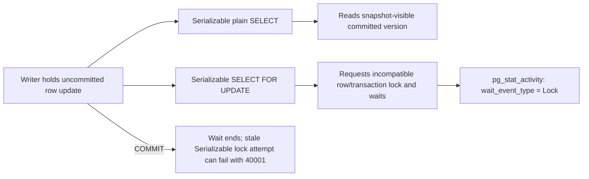

# Runtime lab — SD-BEG-060-T01

## Question this lab answers

Given one row and a fixed two-session schedule, which value, wait, or abort does PostgreSQL 18.6 produce at each requested isolation level—and why does that differ from part of the course's MySQL trace?

## Tool-selection justification

- Selected profile: `postgres-root`
- Why a real runtime is needed: snapshot visibility, transaction aborts, SQLSTATEs, and lock waits are database semantics. A simulated table cannot prove PostgreSQL's implementation.
- Why a smaller simulation is insufficient: the assignment explicitly asks the learner to use the database they work with and observe what happens behind the scenes.
- Version and primary source checked on: PostgreSQL `18.6`, checked 2026-09-01 against the [PostgreSQL 18.6 release](https://www.postgresql.org/docs/release/18.6/), the [Docker Official Image registry](https://github.com/docker-library/postgres/blob/master/versions.json), and [PostgreSQL 18 transaction isolation](https://www.postgresql.org/docs/18/transaction-iso.html).

## Resource budget

| Resource | Estimate |
|---|---|
| CPU | Below 0.25 CPU during this small task; no load generation |
| Memory | Roughly 20–80 MB incremental activity inside the shared PostgreSQL container |
| Disk/images | Less than 1 MB task data; `postgres:18.6` image is shared with the repository profile |
| Startup | Usually 5–30 seconds when the image exists; image download depends on network if absent |
| Verification | Usually 10–30 seconds, including an observed lock wait |

## Safety preflight

Run from the repository root:

```bash
python scripts/lab_preflight.py \
  --compose-file compose.yaml \
  --project system-design-learning \
  --service postgres
docker context show
docker compose --profile postgres config
```

Before any write, verify all of these:

| Boundary | Required identity |
|---|---|
| Docker context | `default` or another explicitly local context; never a remote/production endpoint |
| Compose project | `system-design-learning` |
| Service | `postgres` |
| Image | `postgres:18.6` |
| Published port | exactly `127.0.0.1:55434 -> 5432/tcp` |
| Database/user | `sd_learning` / `sd_learner` |
| Task state | schema `sd_beg_060_t01` only |
| Shared volume | `system-design-learning-postgres-18` with learning/disposable labels |
| Reset | `lab/05_reset.sql`; drops only the exact task schema |

Stop if any identity differs. The automated verifier repeats and asserts these checks before loading the reference schema.

## Start and health check

```bash
docker compose --profile postgres up -d postgres
docker compose ps postgres
docker compose exec -T postgres sh -lc \
  'pg_isready -U "$POSTGRES_USER" -d "$POSTGRES_DB"'
docker compose exec -T postgres sh -lc \
  'psql -XAt -U "$POSTGRES_USER" -d "$POSTGRES_DB" \
    -c "SELECT current_database(), current_user, current_setting('"'"'server_version'"'"');"'
```

Expected identity is database `sd_learning`, user `sd_learner`, and server version `18.6`. Do not proceed merely because readiness says “accepting connections”; verify identity too.

## Deterministic setup

For Rahul's learner path:

```bash
docker compose exec -T postgres sh -lc \
  'psql -X -v ON_ERROR_STOP=1 -U "$POSTGRES_USER" -d "$POSTGRES_DB"' \
  < courses/beginner/SD-BEG-060-database-isolation-levels/tasks/SD-BEG-060-T01/starter/00_schema.sql
```

Confirm exactly one row:

```bash
docker compose exec -T postgres sh -lc \
  'psql -XAt -v ON_ERROR_STOP=1 -U "$POSTGRES_USER" -d "$POSTGRES_DB" \
    -c "TABLE sd_beg_060_t01.users;"'
```

## Predict before running

Record all five predictions in `../ATTEMPT.md` before opening the sessions. Expected behavior in the reference solution is not observed evidence.

## Run manually

Open Session A:

```bash
docker compose exec -e PGAPPNAME=sd_beg_060_t01_a postgres sh -lc \
  'psql -X -v ON_ERROR_STOP=1 -U "$POSTGRES_USER" -d "$POSTGRES_DB"'
```

Open Session B in another terminal:

```bash
docker compose exec -e PGAPPNAME=sd_beg_060_t01_b postgres sh -lc \
  'psql -X -v ON_ERROR_STOP=1 -U "$POSTGRES_USER" -d "$POSTGRES_DB"'
```

Complete and run `starter/session_a.sql` and `starter/session_b.sql` in the order specified by the task README. Use `SHOW transaction_isolation` inside every transaction before its first table statement.

For a third inspection terminal during the locking variation:

```sql
SELECT pid,
       application_name,
       state,
       wait_event_type,
       wait_event,
       pg_blocking_pids(pid) AS blocking_pids
FROM pg_stat_activity
WHERE application_name LIKE 'sd_beg_060_t01_%'
ORDER BY application_name;
```

A human-visible delay is not proof of a lock. Capture `wait_event_type='Lock'` and a non-empty blocker list.

## Run the supplied reference verifier

This command uses only the root service and exact task schema. It resets that schema before and after execution, never imports learner files, and leaves the shared service running:

```bash
python courses/beginner/SD-BEG-060-database-isolation-levels/tasks/SD-BEG-060-T01/lab/verify_reference.py
```

The unique success marker appears only after all runtime assertions and the final scoped reset pass:

```text
SD-BEG-060-T01_REFERENCE_VERIFIED
```

This verifies the supplied reference path, not Rahul's attempt.

## Inspect what happened

Keep evidence narrow:

```sql
SELECT current_setting('server_version') AS server_version,
       current_setting('transaction_isolation') AS isolation;

SELECT id, name FROM sd_beg_060_t01.users ORDER BY id;

SELECT pid, application_name, state, wait_event_type, wait_event,
       pg_blocking_pids(pid) AS blocking_pids
FROM pg_stat_activity
WHERE application_name LIKE 'sd_beg_060_t01_%';
```

For an expected error, preserve SQLSTATE by running `\set VERBOSITY verbose` in `psql`. Do not present a guessed error string as actual output.

## Vary one condition

Keep the writer, row, level, and uncommitted update unchanged. In the reader, first use a plain Serializable `SELECT`; after a reset, change only the read to `SELECT ... FOR UPDATE`. Predict each result before execution. Inspect the wait graph for the locking read, release it by committing the verified writer, and record whether PostgreSQL returns a value or rejects the now-stale Serializable attempt with `40001`.

### Question this visual answers

Why can the same isolation level return immediately for one query and wait for another?



### How to read this visual

Both branches use Serializable and the same row. Only the query's locking clause changes. Follow the plain-read branch to an MVCC-visible version and the locking branch to an observed wait.

### Key insight

Isolation level and lock mode are separate dimensions. PostgreSQL Serializable does not turn every plain read into a blocking row lock. A locking read can first wait and then abort because its snapshot became stale while waiting.

### Simplification or limitation

The wait may be represented internally through a transaction-ID lock rather than a tuple row in `pg_locks`. The inspection uses `pg_blocking_pids` because it exposes the effective blocker relationship.

## Reset and cleanup

First print the exact target, then run the guarded reset:

```bash
docker compose exec -T postgres sh -lc \
  'psql -X -v ON_ERROR_STOP=1 -U "$POSTGRES_USER" -d "$POSTGRES_DB"' \
  < courses/beginner/SD-BEG-060-database-isolation-levels/tasks/SD-BEG-060-T01/lab/05_reset.sql
```

The reset deletes task schema `sd_beg_060_t01` and is not recoverable for that schema. It does not touch other schemas, databases, services, containers, or volumes.

Leave the shared PostgreSQL service running unless you have separately confirmed no other lab uses it. If it is safe to stop, `docker compose stop postgres` is scoped and retains the shared volume. Never use broad Compose teardown with volume deletion, a broad volume-pruning command, or a system-wide Docker prune for this task.

## Troubleshooting

| Symptom | Check | Likely cause | Safe repair |
|---|---|---|---|
| Docker preflight fails | `docker context show` and `docker compose ... config` | Non-local context or wrong repository root | Switch only after verifying the intended local context; rerun preflight |
| Port is not `127.0.0.1:55434` | `docker compose ps postgres` and container inspect | Environment override or another Compose definition | Stop; do not mutate until exact identity is understood |
| Setup guard refuses | Query `current_database(), current_user` | Non-default or non-learning database identity | Stop; use the documented synthetic root profile rather than weakening the guard |
| Second read surprises you | `SHOW transaction_isolation`; inspect commit order | Level set too late, autocommit/transaction boundary differs, or schedule changed | Roll back both sessions, scoped reset, predict again, rerun one schedule |
| Locking read never releases | Inspect blocker PID and both sessions | Writer is still open | Commit or roll back only the verified task writer; do not terminate unrelated PIDs |
| `40001` leaves commands failing | Inspect prompt/error and transaction state | Transaction is aborted | Roll back and retry the whole transaction from `BEGIN` |
| Verifier times out | `pg_stat_activity` filtered by task application names | Previous task session is open or expected wait was not formed | Roll back only task-named sessions, run scoped reset, retry |

Record genuine results in [`evidence.md`](evidence.md).
