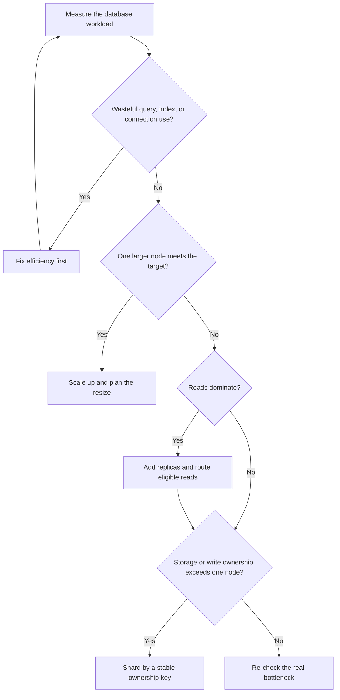
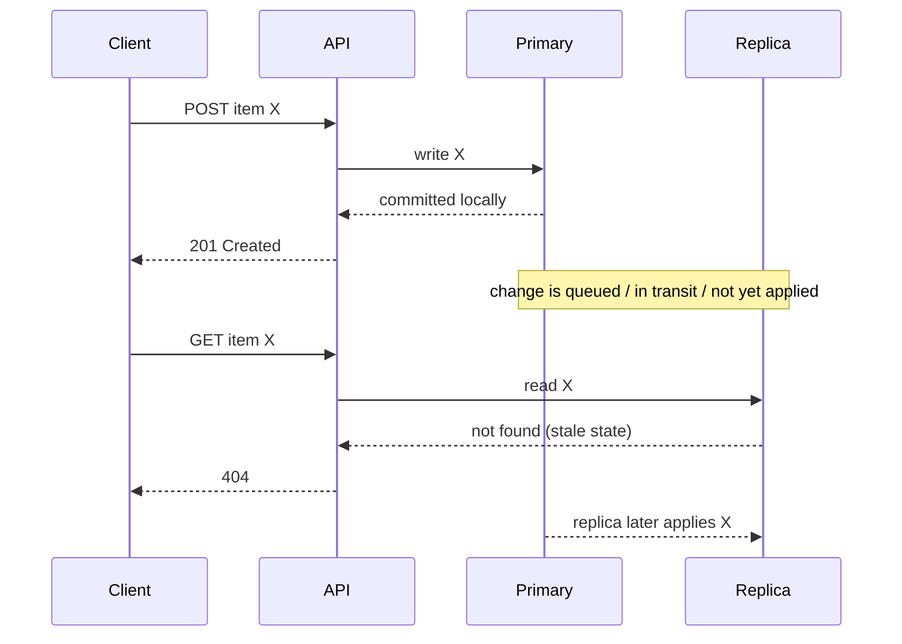
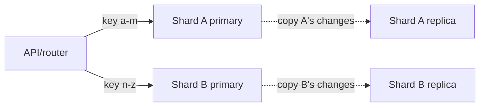

# SD-BEG-070 — Scaling Databases

> **Track:** Beginner
>
> **Artifact state:** Ready
>
> **Learning state:** Not started
>
> **Last updated:** 2026-09-01

## Source and coverage check

- Inspected: the complete timestamped transcript, all three supplied slide pages, the complete 17:05 video timeline, the routing and replication animations, and the final 20% in detail.
- Coverage: complete from `00:00:00` through `00:17:05`; no source gap was found.
- Unclear source points: the automatic transcript mislabels the second replication mode, but the slide and described fast-acknowledgment mechanism resolve it as **asynchronous**. The source also leaves the API contract and sharding database engine open; the tasks label the chosen details as additions.
- Instructor-task scan: complete; two exercises were reconstructed from the spoken recommendations and the final slide checklist: [replication plus read/write routing](tasks/SD-BEG-070-T01/README.md) and [range-shard routing](tasks/SD-BEG-070-T02/README.md).

## What I should be able to do

- Diagnose whether a database is limited by CPU, memory, storage, I/O, connections, reads, writes, or one hot data range before choosing a scaling method.
- Explain vertical scaling, read replicas, replication lag, and sharding in plain language and then trace each mechanism in order.
- Route ordinary reads, read-after-write operations, and writes to the correct database and state the consistency consequence.
- Choose a shard key, define its ownership invariant, and explain why two shards do not automatically double useful capacity.
- Use metrics and failure evidence to distinguish an overloaded primary, a lagging replica, a bad router, and a hot shard.
- Defend a simple scaling sequence in an SDE-2/SDE-3 interview without reaching for distributed complexity too early.

## Small bridge from earlier ideas

A database request consumes several finite resources: CPU to execute operators, RAM for caches and working data, disk capacity for stored bytes, storage I/O for reads and durability, network bandwidth, locks, and connection slots. “The database is slow” is therefore not yet a diagnosis.

Two workload directions matter here:

- **Scale up:** give one database node more resources.
- **Scale out:** use multiple nodes and decide whether they hold copies of the same data or mutually exclusive subsets.

Replication and sharding solve different problems. A replica usually holds another copy of data; a shard owns a different subset. This lecture can be studied independently—no earlier lecture is a prerequisite.

## The 60-second story

Start with one database because it gives the simplest correctness and operational model. When evidence shows that node is close to a resource limit, first remove waste and, when economical, give it more CPU, RAM, or I/O capacity. That is vertical scaling: simple, but bounded by the largest useful machine and sometimes disruptive to resize.

If reads dominate, keep writes on the primary and send eligible reads to replicas. This increases read capacity, but asynchronous replication can make a replica stale, so not every read belongs there. If one primary still cannot hold the data or process the writes, partition ownership across shards. Sharding can scale storage and writes, but now routing, skew, cross-shard work, resharding, and failure recovery become application concerns. The right progression follows the measured bottleneck, not a fashionable architecture.

## Why the terms matter

| Term | Simple meaning | Why it matters here | Common confusion |
|---|---|---|---|
| Vertical scaling | Make one node bigger | Usually the lowest-complexity next step | It is not unlimited and does not remove the failure domain |
| Horizontal scaling | Add nodes and divide work | Enables capacity beyond one machine | Adding replicas and adding shards divide different kinds of work |
| Primary/source | The node that accepts the authoritative writes in this model | It defines the ordered change stream | “Primary” does not mean it can never fail or change |
| Read replica | Another node that applies the primary’s changes and serves reads | It can remove read work from the primary | It is not automatically current or automatically routed to |
| Replication lag | Distance between the primary’s progress and the replica’s applied progress | It predicts stale-read risk and failover data risk | Network delay is only one cause; apply backlog also matters |
| Synchronous acknowledgment | A write waits for a configured remote acknowledgment condition | Trades write latency/availability for stronger durability or visibility guarantees | An acknowledgment may mean received, flushed, or applied—these are not equivalent |
| Shard | One owner of a mutually exclusive data subset | It divides storage and write ownership | A shard is not simply a backup copy |
| Shard key | The field used to choose a shard | It determines balance and query locality | A high-cardinality key can still produce hot tenants or ranges |
| Routing logic | The rule that chooses a database target | A wrong route becomes a correctness failure | A proxy may own routing; it need not live in every API handler |
| Skew | Uneven traffic or data distribution | One hot shard can limit the whole system | Equal row counts do not imply equal query cost |

## Big picture

### Question this visual answers

Which scaling move follows from the bottleneck that measurements actually show?

### How to read this visual

Follow the arrows from measurement. Each branch asks a deciding question, not “Which technology should I add?” Optimization and vertical scaling stay available even when replicas or shards later exist.

### Key insight

Read replicas are a response to read pressure; sharding is a response to data or write ownership that one node cannot handle. Neither fixes an unmeasured slow query automatically.

### Simplification or limitation

Production systems may combine all of these, use caches, archive cold data, split services, or use a database with built-in placement. The diagram intentionally omits vendor-specific failover and migration mechanics.

## Core concepts

### 1. Scale a measured bottleneck, not the word “database”

**Simple meaning:** Find the exhausted resource or violated objective before changing topology.

**Why it matters:** A read replica does not repair a write lock convoy. A larger CPU does not repair a full connection pool. Sharding does not repair a missing index and can multiply that mistake across nodes.

**Problem it solves:** It prevents expensive architecture changes that leave the real constraint untouched.

**How it works:**

1. State a target such as p99 read latency below 80 ms at 12,000 operations/s.
2. Separate reads from writes and foreground traffic from maintenance work.
3. inspect query latency, CPU, memory/cache hit rate, I/O latency and queue depth, locks, connection saturation, storage growth, and replication state.
4. Form one bottleneck hypothesis and predict which metric should move after a change.
5. Change one condition, measure again, and keep or reject the hypothesis.

**Small example:** CPU is 35%, storage latency is 2 ms, but all 200 connections are occupied and API requests wait 300 ms for a pool slot. Adding a read replica without changing connection ownership may add more connections and make the situation worse.

**Invariant or deciding condition:** The chosen intervention must reduce the resource or correctness pressure that evidence identifies.

**Trade-off and alternatives:** Measurement costs engineering time, but topology changes cost more. Query/index changes, admission control, caching, batching, archiving, or a larger node may be sufficient.

**Failure and observability:** Watch for saturation (high utilization plus rising queue/latency), not utilization alone. Correlate database wait events with API traces and pool metrics.

**When not to use a distributed answer:** When the target still fits comfortably on one well-tuned node or the limiting work is avoidable.

**Changed requirement:** If durability, consistency, or availability tightens, capacity is no longer the only deciding axis; the write and failover acknowledgment policy also matters.

### 2. Vertical scaling

**Simple meaning:** Replace or resize one database node with more CPU, RAM, storage, or I/O capability.

**Why it exists:** One-node semantics are easy to reason about. A bigger buffer cache, more execution cores, or faster storage may meet the next growth stage without distributing ownership.

**How it works:**

1. Identify the limiting resource and select an instance/storage change that addresses it.
2. Check engine, operating-system, licensing, and cloud limits.
3. Estimate migration or reboot behavior and choose a maintenance or failover plan.
4. Resize, warm caches, restore traffic gradually, and compare the predicted metric with the observed one.

**Small example:** A 4 GiB node repeatedly evicts an 8 GiB hot working set. Moving to 16 GiB may let the hot set remain cached and sharply reduce disk reads. It will not help if one serialized lock is the bottleneck.

**Invariant or deciding condition:** The workload and required headroom must fit on one supported failure domain after the resize.

**Trade-off:** The topology stays simple, but the largest useful machine is finite, larger tiers may have poor price/performance, and the node remains a concentrated failure and maintenance boundary.

**Failure/observability:** A resize can cause reboot, failover, cache coldness, longer recovery, or connection storms. Observe availability, connection errors, recovery/failover time, buffer-cache hit rate, CPU, I/O latency, and p95/p99 latency before and after.

**When not to use it:** When the data or sustained write rate cannot fit the largest supported node with headroom, or when the availability objective cannot tolerate its failure boundary.

**Interview change:** With a strict cost cap, compare a larger tier’s monthly price and headroom with the engineering and on-call cost of replicas or shards; machine cost alone is incomplete.

### 3. Read replicas and explicit request routing

**Simple meaning:** Keep authoritative writes on the primary and serve selected reads from copied data on other nodes.

**Why it matters:** Read-heavy workloads can consume CPU, buffer-cache space, I/O, and connections. Replicas let that work execute elsewhere.

**Problem it solves:** It raises aggregate read capacity and can isolate analytical or background reads from the primary.

**How it works:**

1. A client sends a write to the API.
2. The API uses its primary connection/pool.
3. The database records the change and exposes it to the replication stream.
4. Each replica receives and applies the change.
5. The API or a database-aware proxy sends eligible reads to a replica.
6. Reads requiring the newest committed value remain on the primary or wait for a known replication position.

**Small example:** Out of 100 database operations, 90 are reads and 10 are writes. Moving 80 ordinary reads to replicas can free primary capacity, while the 10 writes and 10 consistency-sensitive reads remain on the primary.

**Invariant or deciding condition:** Exactly one authoritative write path owns each item in this simple topology. A read may use a replica only if the endpoint tolerates the replica’s freshness bound.

**Trade-off:** More read throughput and isolation come with extra nodes, connection pools, lag, routing policy, failover coordination, monitoring, and cost.

**Failure/observability:** A broken receiver thread, slow apply, long transaction, schema error, network partition, or overloaded replica creates lag. Measure byte/log-position distance, apply delay, receiver/applier state, replica query latency, errors, and oldest pending transaction—not only a single “seconds behind” gauge.

**When not to use it:** If writes dominate, every read must observe the newest write, the primary is blocked on writes/locks, or replica cost exceeds the saved primary capacity.

**Interview change:** If the product adds “show the item immediately after creation,” route that session’s follow-up read to the primary, use a short primary stickiness window, or wait for the replica to reach the write’s log position. Do not merely say “eventual consistency.”

### 4. Replication mode is an acknowledgment contract

**Simple meaning:** Replication copies an ordered change stream, and the system chooses how much remote progress a write waits for before returning success.

**Course model:** In the synchronous picture, the user waits for the primary and replica, gaining stronger consistency at higher write latency. In the asynchronous picture, the primary returns first and the replica catches up later, giving faster writes but possible stale reads.

**Verified extension:** Real products expose more than a two-value switch. An acknowledgment can mean that another node received bytes, durably flushed them, or fully applied the transaction. MySQL’s ordinary source/replica replication is asynchronous; its semisynchronous mode waits for at least one replica to receive and log events, not necessarily to apply them. Fully synchronous behavior is a stronger contract.

| Mode/ack point | Client can return when… | Main benefit | Main cost/risk |
|---|---|---|---|
| Asynchronous | the primary commits locally | low write latency and better tolerance of a slow replica | acknowledged writes may be missing on a promoted lagging replica; reads may be stale |
| Receive/log acknowledgment | a configured replica has received and logged the change | an acknowledged change exists in another place | extra network latency; the replica may still not have applied it for reads |
| Apply/commit acknowledgment | the configured replica set has applied/committed to the required threshold | stronger visibility/failover point | higher tail latency and lower write availability when replicas are slow or unreachable |

**Invariant or deciding condition:** State precisely what “success” proves. “Replicated” without an acknowledgment point is not a guarantee.

**Trade-off:** Waiting for more remote progress usually improves durability or visibility but couples write latency and availability to more nodes and network paths.

**Failure/observability:** Monitor commit latency by phase, acknowledgment timeouts/fallbacks, receiver and applier queues, log retention, replica errors, and whether a write mode silently degraded.

**When not to require synchronous progress:** When the latency/availability cost is unacceptable and the product can tolerate bounded stale reads or recover acknowledged writes from another durable log. The tolerance must be explicit.

### What happens during a stale read?

#### Question this visual answers

How can a successful write be followed by a missing read when the API chooses a replica?

#### How to read this visual

Time runs downward. The client’s write acknowledgment occurs before the replica applies the change. The later read is correctly answered from the replica’s current state, but that state is older than the client expects.

#### Key insight

The router participates in the consistency contract. “Send reads to replicas” needs endpoint- or session-level exceptions.

#### Simplification or limitation

The diagram omits multiple replicas, retries, transaction IDs, network failures, and acknowledgement variants. A real system may wait on a log sequence number instead of routing to the primary.

### 5. Sharding divides ownership

**Simple meaning:** Split the dataset into mutually exclusive subsets and place each subset on a different database node.

**Why it exists:** Replicas copy writes; they do not remove the primary’s authoritative write work or total dataset. Sharding can divide storage, indexes, and write execution.

**How it works:**

1. Choose a stable shard key that is available on every routed operation.
2. Define a deterministic mapping from key to shard.
3. Make the router and data owners agree on the same mapping version.
4. Send reads and writes for that key to its owner.
5. Monitor balance and plan how ownership moves when a shard becomes hot or full.

**Small example:** The course first illustrates three owners for `a`–`j`, `k`–`t`, and `u`–`z`. Its exercise then uses the simpler two-owner boundary below: keys beginning `a` through `m` belong to shard A; `n` through `z` belong to shard B. `mango` maps to A and `nectar` maps to B. A key beginning `9` has no owner under this rule and must be rejected or handled by an explicitly defined fallback.

| Key | Normalized first letter | Owner | Other shard must contain it? |
|---|---:|---|---|
| `apple` | `a` | A–M | No |
| `mango` | `m` | A–M | No |
| `nectar` | `n` | N–Z | No |
| `zebra` | `z` | N–Z | No |

**Invariant or deciding condition:** For every valid key and mapping version, exactly one shard is the authoritative owner. No key maps to zero or multiple owners.

**Trade-off:** Sharding raises aggregate storage/write capacity, but cross-shard joins and transactions, global uniqueness, secondary indexes, backups, migrations, rebalancing, and incident response become harder.

**Failure/observability:** A wrong mapping can create missing reads, duplicate ownership, or writes to the wrong node. Monitor per-shard traffic, bytes, rows, CPU/I/O, latency, errors, connection pools, hot keys/tenants, router mapping version, and cross-shard fan-out.

**When not to use it:** When one tuned node still fits with headroom, reads are the only pressure, or the workload needs frequent global joins/transactions that would dominate the design.

**Interview change:** If one enterprise tenant produces 40% of writes, `tenant_id % N` may still make one tenant hot. Consider sub-sharding that tenant, a compound key, dedicated placement, or workload-specific isolation.

### Where do replication and sharding sit together?

#### Question this visual answers

Does adding shards remove the need for replicas?

#### How to read this visual

Solid arrows select an owner by key. Dotted arrows copy each owner’s changes to a replica. Shard A and shard B do not replicate each other’s mutually exclusive data.

#### Key insight

Sharding answers “who owns this key?” Replication answers “where else is this owner’s state copied?” They are orthogonal and often combined.

#### Simplification or limitation

The diagram omits replica routing, failover leaders, mapping metadata, resharding, multi-region policy, and cross-shard requests.

## Worked example and calculations

### Example A — a read-heavy workload

#### Assumptions

- Peak database workload: `12,000 operations/second`.
- Mix: `90% reads`, `10% writes`.
- Consistency-sensitive reads: `5% of all reads` and remain on the primary.
- One primary can safely sustain `6,000 operations/second` at the latency target.
- Each replica can safely sustain `4,000 reads/second`.

#### Steps

1. Reads: `12,000 × 0.90 = 10,800 reads/s`.
2. Writes: `12,000 × 0.10 = 1,200 writes/s`.
3. Reads kept on primary: `10,800 × 0.05 = 540 reads/s`.
4. Primary work after routing: `1,200 + 540 = 1,740 ops/s`.
5. Replica-eligible reads: `10,800 - 540 = 10,260 reads/s`.
6. Three evenly loaded replicas: `10,260 ÷ 3 = 3,420 reads/s per replica`.
7. Replica headroom: `4,000 - 3,420 = 580 reads/s`, or `580 ÷ 4,000 = 14.5%`.

#### Result and sanity check

The primary falls below its 6,000 ops/s limit, and three replicas fit under 4,000 reads/s each. The 14.5% replica headroom is modest; losing one replica would require `10,260 ÷ 2 = 5,130 reads/s` on each survivor, above the target. The design therefore needs load shedding, primary fallback capacity, or a fourth replica if one-replica failure must preserve full traffic.

### Example B — why two shards may not double useful capacity

#### Assumptions

- Peak writes: `30,000 writes/s`.
- Each shard safely sustains `20,000 writes/s`.
- The chosen range puts `80%` of writes on shard A and `20%` on shard B.

#### Steps

- Shard A: `30,000 × 0.80 = 24,000 writes/s`.
- Shard B: `30,000 × 0.20 = 6,000 writes/s`.
- Total nominal capacity: `2 × 20,000 = 40,000 writes/s`.
- Actual limiting shard: A exceeds its safe limit by `24,000 - 20,000 = 4,000 writes/s`.

#### Result and sanity check

The cluster has enough aggregate capacity on paper, but the hot ownership range makes the system miss its target. Useful capacity is constrained by the busiest shard, not the sum printed on a capacity spreadsheet.

## Deep mechanism

### Components, ownership, and boundaries

| Component | Owns/decides | Must not silently assume |
|---|---|---|
| API router | primary vs replica or shard target for a request | every read tolerates lag; every key is valid |
| Primary | authoritative write order for its shard | a replica has received/applied an acknowledged write |
| Replica receiver | fetching/receiving source log positions | received means applied and query-visible |
| Replica applier | replaying changes into queryable state | it can always keep up with source write rate |
| Shard map | exactly one owner for each valid key and mapping version | uniform load or immutable ownership forever |
| Connection pools | bounded sessions to each target | more pools mean unlimited database connections |

The guarantee changes at each boundary. A local primary commit, remote log receipt, remote durable flush, remote apply, and successful query are distinct states.

### Ordering, concurrency, and stale state

- Two clients may write different rows concurrently, but replicas must apply a source-consistent order for dependent changes.
- A long transaction can delay visibility and increase retained log volume even when network latency is low.
- Load balancing reads across replicas with different progress can make a user observe time moving backward.
- A transaction should not switch databases midway unless the database/product explicitly provides a distributed transaction protocol.
- During resharding, old and new routers can disagree. A mapping version, forwarding layer, or controlled dual-read/write migration is needed; blind dual writes risk divergence.
- Cross-shard uniqueness such as a globally unique username needs a dedicated owner, globally unique identifier scheme, or reservation workflow.

### Failure and recovery

| Failure | Observable symptom | Mechanism | Protection/recovery | Remaining risk |
|---|---|---|---|---|
| Primary CPU/I/O saturation | rising p99, queues, timeouts | authoritative work exceeds capacity | optimize, admit less work, scale up, then repartition if needed | retries can amplify overload |
| Replica receiver stops | receiver state/error, growing log distance | network/auth/config/source-log problem | repair channel, preserve required logs, rebuild if necessary | stale reads and failover data gap |
| Replica applier slows/stops | receiver healthy but applied position stalls | expensive replay, conflict, schema error, long transaction | fix error/capacity, resume or rebuild | received data may still be invisible |
| Replica promoted while behind | missing recently acknowledged writes | asynchronous failover chooses stale state | compare positions, fence old primary, choose most advanced safe candidate | data reconciliation may be required |
| Router sends a write to replica | read-only error or divergent local write | wrong request classification/config | enforce read-only replica and test routes | privileged sessions may bypass weak controls |
| Hot shard | one shard saturated while others idle | skewed key or tenant workload | split/move hot range, isolate tenant, change mapping | migration itself adds load and risk |
| Shard unavailable | only one key range fails | owner is a failure domain | replica/failover per shard, bounded retry, degrade affected range | cross-shard operations may partially fail |
| Mapping-version mismatch | not-found, duplicate, or wrong-owner errors | routers disagree during resharding | versioned map, fencing, redirect/forwarding, audit | stale clients can keep bad routes alive |

### Observability

At minimum, build dashboards and alerts for:

- request rate, error rate, and p50/p95/p99 latency split by operation and database role;
- primary/replica/shard CPU, memory pressure, storage latency/queue depth, space, and connection saturation;
- slow-query fingerprints, rows examined, locks, deadlocks, and transaction age;
- source log position versus received and applied replica positions, plus receiver/applier state and last error;
- read-after-write fallback/wait rate and consistency-related user errors;
- per-shard bytes, rows, reads, writes, hot keys/tenants, and fan-out count;
- router decisions and mapping version in traces without logging sensitive key values;
- failover, promotion, rebuild, and resharding duration against an explicit recovery objective.

An alert should connect symptom to action. “Replica lag > 10 seconds” is incomplete unless the product’s tolerated staleness, failover risk, traffic policy, and runbook are known.

## Design choices

| Choice | Benefits | Costs/risks | Prefer when | Avoid when |
|---|---|---|---|---|
| Tune and scale one node | simplest correctness and operations | finite ceiling; concentrated failure domain | workload fits with planned headroom | largest supported node still misses target |
| Application-owned read routing | endpoint-level consistency control; explicit in code | duplicated policy and multiple pools | a small service can classify reads clearly | many services will drift without shared policy |
| Database-aware proxy | central routing and failover policy | another hop/control plane; transaction semantics can surprise | many clients need one policy | proxy cannot infer business freshness needs |
| Asynchronous replicas | fast primary acknowledgment; independent apply | stale reads and possible failover gap | bounded staleness is acceptable | every success must exist remotely before return |
| Stronger remote acknowledgment | better remote durability/visibility boundary | higher tail latency and lower write availability | loss tolerance is low and replicas are close/healthy | latency or partition availability dominates |
| Range sharding | natural range scans and explainable ownership | hot ranges; moving boundaries | workload and access are range-local | monotonically growing or celebrity ranges dominate |
| Hash sharding | often better distribution | poor range locality; resharding/map complexity | point access dominates | range scans and tenant locality are central |
| Directory/lookup sharding | flexible tenant placement and moves | metadata dependency and cache consistency | large tenants need controlled placement | lookup control plane cannot meet availability target |

## Misconceptions

| Claim/confusion | What is actually true | Evidence or counterexample |
|---|---|---|
| “Horizontal scaling is always better.” | It buys capacity by adding coordination and failure modes. | One larger node may meet the target with far less operational risk. |
| “Cloud resize is always zero downtime.” | The exact operation may reboot, fail over, or cause connection and cache disruption. | Treat provider behavior and measured interruption as part of the plan. |
| “The framework automatically sends reads to replicas.” | Routing needs explicit application, driver, proxy, or database support. | Two connection pools do nothing until a policy selects one. |
| “Synchronous replication means zero lag.” | The acknowledgment point may precede apply/query visibility. | MySQL semisynchronous acknowledgment requires received/logged events, not full apply. |
| “A replica is a backup.” | Replicas can copy accidental deletes and corruption quickly. | Backups need independent history and tested restore. |
| “Three replicas triple all database capacity.” | They can add read capacity, not remove the primary’s authoritative write path. | Every primary write still enters the replication stream. |
| “Three balanced shards cut load to exactly one third.” | Only a balanced workload with local queries approaches that. | An 80/20 distribution overloads one shard despite aggregate headroom. |
| “Sharding and replication are alternatives.” | They answer ownership and copying questions respectively. | Each shard can have its own replicas. |
| “Eventual consistency means unpredictable forever.” | It should have an observable convergence mechanism and an operational freshness bound. | Log positions and apply state can prove whether a replica caught up. |

## Real backend connection

For a Python/FastAPI-style service, keep separate database pools behind a small repository boundary rather than scattering target selection across handlers:

- mutations and transactions use the primary pool;
- ordinary catalog/search reads may use a replica pool;
- read-after-write, permission checks, inventory decrements, and other freshness-sensitive reads use the primary or wait for a replication position;
- tracing records the chosen role, shard, and mapping version;
- pool sizes are budgeted across every API process so `processes × pools × pool_size` stays below each database’s connection limit.

For AWS or another managed database, verify the service’s actual endpoint, failover, replica-lag, resize, and acknowledgment semantics. A managed control plane removes some setup work; it does not remove consistency policy or capacity reasoning.

During a PostgreSQL/MySQL schema migration, remember that replicas replay DDL and shards may run different mapping/migration phases. Use backward-compatible application changes, observe apply lag, and prevent routers from sending traffic to a shard whose schema is not ready.

These are realistic examples, not claims about Rahul’s past production experience.

## Instructor-assigned tasks

| Task | Faithful purpose | Tools | Reference verified? | Learner status |
|---|---|---|---|---|
| [`SD-BEG-070-T01`](tasks/SD-BEG-070-T01/README.md) | Configure MySQL replication, observe a copied write, and route API writes/reads through separate connections | Docker Compose, MySQL 8.4.11, Node.js, mysql2 | Passed | Not started |
| [`SD-BEG-070-T02`](tasks/SD-BEG-070-T02/README.md) | Split a–m and n–z keys across two databases and route an API request to the owner | Docker Compose, MySQL 8.4.11, Node.js, mysql2 | Passed | Not started |

Reference verification proves only the supplied reference paths. It does not mark Rahul’s learner attempts complete.

### Codex-added practice

1. **Predict:** A user creates an order, then immediately opens it. Which path should the read use, and what evidence would let a replica serve it safely?
2. **Draw:** Show primary log position, replica received position, and replica applied position during a 10-second applier pause.
3. **Explain:** Why can adding a third replica lower reliability if the application opens too many new database connections?
4. **Change:** The hottest tenant produces 45% of writes. Revise a simple `tenant_id % 4` shard design without requiring every tenant to move.

## Useful English and technical phrases

### Bottleneck

- Pronunciation: **BOT-ul-nek**
- Simple meaning: the narrowest point limiting the whole flow.
- Hindi cue: **sabse badi rukavat**
- Why it matters here: the correct database scaling move depends on what is actually limiting throughput or latency.
- Common misuse: calling any slow component “the bottleneck” without evidence that improving it changes the system target.

Examples:

1. Simple: “The checkout line is the bottleneck.”
2. Engineering: “Storage latency, not CPU, is the current database bottleneck.”
3. Engineering: “After adding replicas, the primary write lock became the bottleneck.”
4. Interview: “I would identify the bottleneck before choosing between replicas and sharding.”
5. Professional/design review: “Our evidence shows connection acquisition is the bottleneck, so another replica is not yet justified.”

### Replication lag

- Pronunciation: **rep-li-KAY-shun lag**
- Simple meaning: how far a copy is behind its source.
- Hindi cue: **copy ka pichhadna**
- Why it matters here: lag determines stale-read and failover risk.
- Common misuse: treating lag as only wall-clock seconds or assuming received data is already query-visible.

Examples:

1. Simple: “The copy has a small lag.”
2. Engineering: “Replication lag rose when the applier hit a long transaction.”
3. Engineering: “We route read-after-write traffic to the primary while lag is above the product bound.”
4. Interview: “I would monitor received and applied log positions, not only a single lag gauge.”
5. Professional/design review: “The launch plan needs a response for replication lag beyond five seconds.”

### Skew

- Pronunciation: **skyoo**
- Simple meaning: an uneven distribution.
- Hindi cue: **asamaan bantwara**
- Why it matters here: skew can overload one shard while aggregate capacity looks healthy.
- Common misuse: using “skew” only for row count; query frequency and cost can also be skewed.

Examples:

1. Simple: “The votes show a strong skew toward one option.”
2. Engineering: “A celebrity account created write skew on one shard.”
3. Engineering: “Equal storage did not prevent traffic skew.”
4. Interview: “I would test the shard key against tenant and time-based skew.”
5. Professional/design review: “The proposed range boundary needs a resharding plan if skew crosses 70/30.”

## Interview practice

### Foundation

**Question:** What is the difference between a read replica and a shard?

**Strong answer covers:** A replica copies an owner’s data and can add read capacity or recovery options; a shard owns a mutually exclusive subset and can divide storage/writes. Give one example, name lag for replicas and skew/cross-shard work for shards, and note that each shard may have replicas.

**Weak-answer trap:** “Both add more databases, so both scale horizontally.” That names a category but misses ownership and guarantees.

### SDE-2 working engineer

**Question:** An API returns `201 Created`, but an immediate `GET` sometimes returns `404`. CPU is normal and the GET trace says `db.role=replica`. Diagnose and repair it.

**Reasoning checkpoints:** Confirm the write committed on the primary; compare source, received, and applied positions; inspect receiver/applier state and error; verify route selection; reproduce with one correlation ID; choose primary stickiness or position waiting for the endpoint; test recovery and degraded behavior; alert on freshness relative to the product bound.

**Follow-up:** The replica is caught up but the item is still missing. Now inspect key normalization, shard/tenant routing, transaction commit, filters, schema version, and whether the trace targeted the expected environment rather than blaming lag automatically.

### SDE-3 senior design

**Prompt:** Design the database scaling path for a regional marketplace growing from 2,000 to 80,000 operations/s, with a 92:8 read/write ratio, p99 reads under 100 ms, read-after-write for sellers, no more than 5 seconds of catalog staleness for buyers, and an RPO of zero for accepted payments.

**Clarify first:** Peak versus average and growth horizon; operation/query mix and row sizes; hot sellers/products; transactional boundaries; buyer versus seller consistency; payment source of truth; availability and recovery objectives; regions; retention/backup; connection budget; cost/on-call constraints; current bottleneck evidence.

**Answer outline:**

1. Estimate `73,600 reads/s` and `6,400 writes/s` at peak, then separate endpoints and query cost.
2. Tune and vertically scale the primary while it meets the target with headroom.
3. Add replicas for buyer catalog reads, with measured lag below five seconds and load-shedding/fallback behavior.
4. Keep seller read-after-write paths on the primary or gate them on a replication position.
5. Give payment acceptance a stronger durability/replication contract than ordinary catalog updates; define exactly what success proves.
6. Shard only when one owner cannot handle storage/write work; prefer a key that preserves seller/order locality while addressing hot tenants.
7. Put replicas, backups, failover, and recovery objectives around each shard.
8. Trace route/role/shard/mapping version and operate lag, skew, connection, and resharding alerts.
9. Compare the cost and failure surface with keeping a larger managed database longer.

**Requirement change:** A global buyer launch requires 50 ms reads on three continents. Add regional read copies/caches with an explicit staleness contract; do not move payment writes multi-primary without resolving conflict, ordering, and regulatory requirements.

### Natural 3–5 minute explanation outline

1. Define the target and measure the limiting resource.
2. Explain why one tuned/larger node is the simplest first capacity move.
3. Separate read scaling from authoritative write scaling.
4. Trace one write through primary log, replica receive, replica apply, and a routed read.
5. State the acknowledgment and freshness invariants.
6. Introduce sharding only when one owner cannot hold/process the work.
7. Defend the shard key against balance, locality, skew, and resharding.
8. Close with failure domains, metrics, recovery, cost, and the condition that would change the choice.

## Course, verified extensions, and uncertainty

### Course model

- Database scaling strategies are broadly applicable to relational and non-relational stateful systems.
- Vertical scaling adds CPU, RAM, or disk, is operationally simple, may cause a reboot/downtime window, and has a physical ceiling.
- Read replicas move read work away from the write-handling primary; the API can keep separate connections and choose the target.
- Synchronous replication trades slower writes for stronger coordination; asynchronous replication returns faster but allows lag and stale reads.
- Sharding splits data into mutually exclusive subsets and uses routing logic to choose the owner. Each shard can independently have replicas.

### Verified extensions

- [MySQL 8.4 replication](https://dev.mysql.com/doc/refman/8.4/en/replication.html) is asynchronous by default and is based on source binary-log events.
- [MySQL replication implementation](https://dev.mysql.com/doc/refman/8.4/en/replication-implementation.html) separates receiving the source log into a relay log from applying those events, which is why receipt and query visibility differ.
- [MySQL semisynchronous replication](https://dev.mysql.com/doc/refman/8.4/en/replication-semisync.html) waits for at least one configured replica acknowledgment of received/logged events, not necessarily full apply; this qualifies the course’s “zero lag” simplification.
- Read replicas are not independent backups, and shard capacity depends on distribution, query fan-out, and the busiest owner.

### Inferences and practical connections

- **Inference:** The source’s two-connection API prototype is the smallest way to make consistency policy visible; a production proxy or data-access layer may own the same decision centrally.
- **Inference:** The a–m/n–z exercise is intentionally easy to inspect, but alphabetical ranges are likely to skew and are rarely a final general-purpose shard key.

### Unresolved source points

- None that blocks the lecture or either task. Framework, schema, non-letter key behavior, security, and exact replication mode were not specified by the source and are explicitly chosen in the lab contracts.

## Final revision card

### Five facts

1. Scaling begins with a measured target and bottleneck.
2. Vertical scaling preserves simple ownership but has a cost/physical ceiling and a maintenance boundary.
3. Replicas copy data and mainly add read capacity; asynchronous apply creates freshness and failover risk.
4. A replication acknowledgment must name the remote state it proves: received, flushed, or applied.
5. Shards divide ownership; useful capacity is limited by the hottest shard and cross-shard work.

### Three decisions

1. Keep one node while it meets latency, capacity, durability, availability, and cost targets with headroom.
2. Send a read to a replica only when its endpoint can tolerate the measured freshness bound.
3. Shard only when one owner cannot meet storage/write targets, and choose the key using balance, locality, resharding, and failure evidence.

### One failure

`201` followed by replica `404` → the primary acknowledged before replica apply → compare source/received/applied positions and route trace → use primary stickiness or position waiting, repair the applier if unhealthy, and retest the freshness objective.

### Natural 60-second explanation

“I would first quantify the workload and find the limiting resource. If a tuned larger node meets the target, I prefer that simple ownership model. If reads dominate, I add replicas and explicitly route only stale-tolerant reads to them; writes and read-after-write paths remain on the primary or wait for an apply position. If storage or authoritative write work no longer fits one node, I shard by a stable key so every item has exactly one owner. Then I plan for skew, cross-shard operations, replicas per shard, failover, resharding, and route observability. Each step is justified by the target it improves and the failure modes it introduces.”

See [review.md](review.md) for closed-book retrieval.
