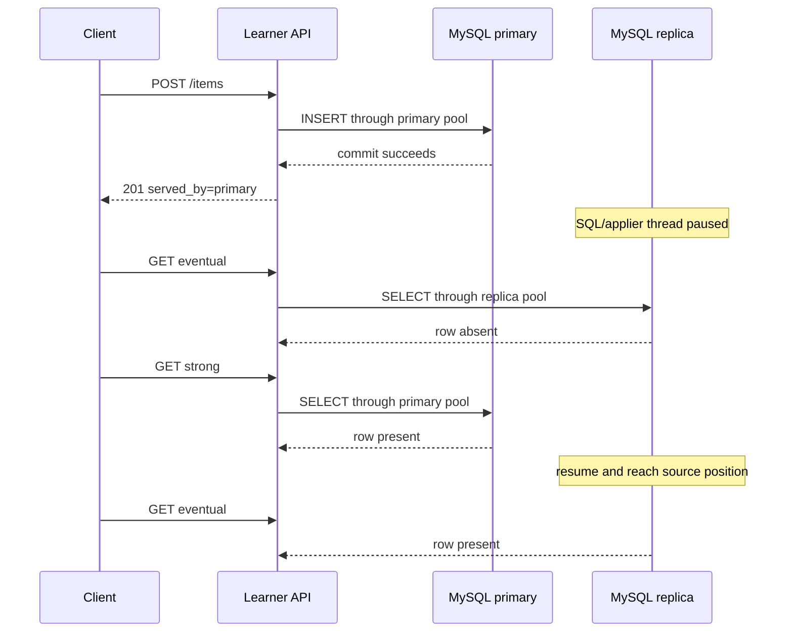

# SD-BEG-070-T01 — Observe MySQL replication and route API reads and writes

> Instructor-assigned task from `SD-BEG-070`. Attempt before opening `reference/SOLUTION.md`.

## Source and fidelity

- Source timestamp/slide: `00:07:29-00:08:07`, reiterated at `00:16:08-00:17:05`; final slide exercise items 1–4.
- Faithful paraphrase: configure one MySQL database as a replica of another, write data and observe it appear through replication, then build a small API with two database connection objects so each request goes to the primary or replica as appropriate.
- Short exact excerpt: Not needed; the requirement is unambiguous when the spoken recommendation and slide checklist are combined.
- Source ambiguity: the source does not define endpoints, schema, API language/framework, authentication, whether a read needs the newest write, or the exact MySQL replication mode. The source uses historical “master” wording; this pack uses **primary/source** and **replica** for the same intended roles.

## Exact requirement checklist

- [ ] Run two MySQL database servers.
- [ ] Configure one server as the replica of the other.
- [ ] Put data on the primary and observe replication to the replica.
- [ ] Write a small API service with two separate database connection objects/pools: one for the primary and one for the replica.
- [ ] Route write requests to the primary.
- [ ] Route eligible read requests to the replica.
- [ ] Explain how the request type determines the selected connection.

## Codex-added safety or verification

These are additions, not instructor wording:

- Use isolated `mysql:8.4.11` containers, synthetic credentials, named task-only volumes, and loopback-only ports `55701` and `55702`.
- Use asynchronous binary-log replication because it is MySQL’s ordinary source/replica mode and makes lag observable.
- Keep the replica `read_only` and `super_read_only` during the experiment.
- Use a tiny Node.js HTTP service with `mysql2@3.24.2`; no framework is required.
- Define `POST /items` as a write, `GET /items/:id?consistency=eventual` as a replica read, and `consistency=strong` as a primary read.
- Pause only the replica SQL/applier thread for the variation. Do not stop the receiver, source, Docker daemon, or any unrelated service.
- Capture direct database identity and row evidence; a response label alone does not prove routing.

## Inputs, constraints, and expected artifact

| Item | Contract |
|---|---|
| Input | Synthetic item `{id: positive integer, name: 1–120 characters}` and HTTP POST/GET requests |
| Constraints | One authoritative primary; one asynchronous replica; two explicit connection pools; no cloud account; all host ports bind to `127.0.0.1` |
| Output | Learner API implementation plus observed primary/replica state and an explanation of routing and lag |
| Completion evidence | A primary write appears on the replica; direct server IDs prove target identity; writes never use the replica; a paused applier causes an expected stale replica read; catch-up restores visibility |

## Required visual

### Question this visual answers

What state change should the experiment expose when the replica applier is paused?



### How to read this visual

Time runs downward. The changed condition affects only application on the replica. The same committed row is visible through the primary connection while temporarily absent through the replica connection.

### Key insight

Routing is part of the consistency contract. A successful primary write does not guarantee immediate query visibility on an asynchronous replica.

### Simplification or limitation

The task uses one replica, one table, one API process, and file/position replication. It does not model automatic failover, TLS, secrets management, connection proxies, multiple replicas, or production authentication.

## Before you start: predict

Write in `ATTEMPT.md`:

1. which server ID should handle POST, eventual GET, and strong GET;
2. what an immediate eventual GET should return while the applier is paused;
3. the invariant that prevents a write from going to the replica;
4. the exact database and API evidence that would prove or disprove your routing;
5. what condition must be true before the replica read returns the new row.

## Setup

The lab uses two task-local MySQL containers and a host Node.js process. Expected peak resources are about 1–1.5 CPU cores, 1.2 GiB RAM, 750 MiB shared image/download plus two small volumes, 30–90 seconds for a cold image/start, and under 10 seconds for fixtures.

From this task directory:

```bash
python3 lab/preflight.py
docker compose -f lab/compose.yaml --project-name sd-beg-070-t01 --profile lab up -d source replica
docker compose -f lab/compose.yaml --project-name sd-beg-070-t01 --profile lab ps
npm ci --prefix starter --ignore-scripts
```

The learner service is intentionally incomplete. Implement it before running `node starter/server.mjs`. The reference verifier is separate and does not mark the learner implementation as complete.

## Learner steps

1. Run the read-only preflight and confirm the local Docker endpoint, exact project, images, loopback ports, labels, database, and named volumes.
2. Start both MySQL services and wait for their health checks.
3. Configure the replica using the source host, replication user, current binary-log file, and current position; start the replica threads.
4. Create one deterministic table on the primary. Insert a row there and prove it becomes query-visible on the replica.
5. Implement two actual `mysql2` pools in `starter/server.mjs` and classify the three endpoint paths.
6. Include the queried `@@server_id` in each response and independently inspect both databases.
7. Pause only the replica SQL thread, write a new row through the API, and compare eventual versus strong GET.
8. Resume the SQL thread, wait for the replica to reach the recorded source position, and repeat the eventual GET.
9. Explain the acknowledgment, receive, apply, and query-visible states in your own words.

## Progressive hints

<details><summary>Hint 1 — requirement</summary><p>List every request type and the freshness it promises before writing routing code.</p></details>

<details><summary>Hint 2 — invariant</summary><p>In this topology, one pool is the only legal mutation target. Enforce that in one small boundary rather than trusting each handler.</p></details>

<details><summary>Hint 3 — mechanism</summary><p>The replica has separate receiver and SQL/applier progress. Pausing the latter should leave the primary commit successful while delaying query visibility.</p></details>

<details><summary>Hint 4 — observation</summary><p>A response field can lie. Query `@@server_id` and the table on each target, then compare the replica’s source/applied positions.</p></details>

## Acceptance criteria

- [ ] Both connection objects point to different loopback ports and return different expected server IDs.
- [ ] The replica receiver and applier are healthy before the baseline.
- [ ] A baseline primary write is observed on the replica at or beyond the captured source position.
- [ ] POST uses only the primary; an attempted application-user write on the replica is rejected.
- [ ] Eventual GET uses the replica and strong GET uses the primary.
- [ ] With the replica applier paused, a new primary row is present through strong GET and absent through eventual GET.
- [ ] After resume and catch-up, eventual GET returns the row.
- [ ] Evidence separates prediction, expected behavior, actual commands, observed output, explanation, and variation.
- [ ] The spoken explanation covers latency, stale reads, failover risk, monitoring, and when not to use a replica.

## Cleanup/reset

Run `python3 lab/preflight.py` before either operation.

Reset only the task table by deleting rows on the primary; the delete itself replicates:

```bash
docker compose -f lab/compose.yaml --project-name sd-beg-070-t01 --profile lab exec -T source mysql -uapp -psd_beg_070_t01_app_local -D sd_beg_070_t01 -e "DELETE FROM items;"
```

Stop only these services and retain the two labeled volumes so the state is recoverable:

```bash
docker compose -f lab/compose.yaml --project-name sd-beg-070-t01 --profile lab stop source replica
```

Do not remove any volume unless its exact name and `SD-BEG-070-T01` label have been inspected. The reference run deliberately stops the services and retains both volumes.

## Reference answer boundary

After committing to your attempt, open [`reference/SOLUTION.md`](reference/SOLUTION.md). Reference verification status is recorded in `task.json`; it does not imply learner completion.
