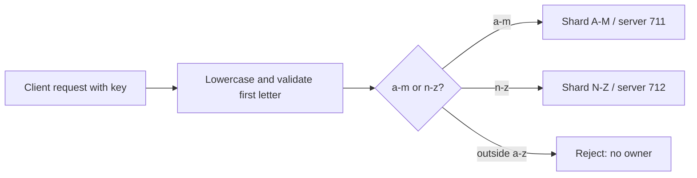

# SD-BEG-070-T02 — Route a-z keys across two range shards

> Instructor-assigned task from `SD-BEG-070`. Attempt before opening `reference/SOLUTION.md`.

## Source and fidelity

- Source timestamp/slide: sharding mechanism at `00:13:24-00:16:06`, implementation recommendation at `00:16:46-00:17:05`, and final slide exercise items 5–6.
- Faithful paraphrase: run two databases, assign keys beginning `a` through `m` to the first and `n` through `z` to the second, then write an API service that routes each request to the correct database according to the key.
- Short exact excerpt: Not needed; the range boundaries and routing requirement are explicit.
- Source ambiguity: the sharding exercise does not name a database engine, schema, endpoints, case-normalization rule, behavior for non-letter keys, or migration strategy. This pack uses MySQL to align with the preceding exercise and labels every added contract below.

## Exact requirement checklist

- [ ] Run two database servers.
- [ ] Make the first database responsible for keys beginning `a` through `m`.
- [ ] Make the second database responsible for keys beginning `n` through `z`.
- [ ] Write an API service that inspects the key and chooses one database.
- [ ] Demonstrate writes and reads on both sides of the `m`/`n` boundary.
- [ ] Explain the routing rule and why the two subsets are mutually exclusive.

## Codex-added safety or verification

These are additions, not instructor wording:

- Use two isolated `mysql:8.4.11` containers, synthetic credentials, named task-only volumes, and loopback-only ports `55711` and `55712`.
- Normalize keys to lowercase and accept only `^[a-z][a-z0-9_-]{0,63}$`; reject keys that have no owner instead of choosing silently.
- Use one identical `records` schema on both shards and a tiny Node.js HTTP API with `mysql2@3.24.2`.
- Define `POST /records` and `GET /records/:key`; each response includes the directly queried `@@server_id` and shard name.
- Prove exact ownership with direct queries on both physical databases, not only response metadata.
- Vary traffic distribution by writing 20 `a-hot-*` keys and two `z-cold-*` keys. This tests skew, not throughput performance.

## Inputs, constraints, and expected artifact

| Item | Contract |
|---|---|
| Input | Synthetic `{key, value}` records; valid keys begin with ASCII a–z after lowercase normalization |
| Constraints | `a`–`m` has one authoritative owner; `n`–`z` has one authoritative owner; no replication between the shards; loopback-only local runtime |
| Output | Learner API implementation, ownership table/evidence, routing explanation, and skew variation |
| Completion evidence | Boundary keys route correctly; each row exists only on its owner; wrong-shard reads miss; invalid keys are rejected without writes; controlled skew is measured per shard |

## Required visual

### Question this visual answers

How does one deterministic routing rule create two mutually exclusive ownership sets?



### How to read this visual

Every request passes through the same normalization and boundary decision. A valid key follows exactly one outgoing owner arrow. An invalid key is rejected before either connection pool executes SQL.

### Key insight

The routing function is a correctness function, not merely load balancing. If writers and readers disagree on it, data appears missing or duplicated.

### Simplification or limitation

The ranges are fixed and stored in code. Production sharding normally needs mapping versions, resharding, failover, hot-key controls, discovery, and often a proxy or directory rather than a permanent alphabet split.

## Before you start: predict

Write in `ATTEMPT.md`:

1. the owners and expected server IDs for `apple`, `mango`, `nectar`, and `zebra`;
2. the exact one-owner invariant;
3. how uppercase keys and keys beginning with a digit should behave;
4. direct database evidence that proves both correct placement and wrong-shard absence;
5. what a 20-to-2 key distribution predicts about per-shard load.

## Setup

The lab uses two task-local MySQL containers and one host Node.js process. Expected peak resources are about 1–1.5 CPU cores, 1.2 GiB RAM, 750 MiB shared image/download plus two small volumes, 30–90 seconds for a cold start, and under 15 seconds for the deterministic fixture.

From this task directory:

```bash
python3 lab/preflight.py
docker compose -f lab/compose.yaml --project-name sd-beg-070-t02 --profile lab up -d shard_am shard_nz
docker compose -f lab/compose.yaml --project-name sd-beg-070-t02 --profile lab ps
npm ci --prefix starter --ignore-scripts
```

The starter service is deliberately incomplete. Implement it before `node starter/server.mjs`. The physically separate reference path never marks the learner attempt complete.

## Learner steps

1. Run the read-only preflight and verify project, services, exact image, loopback ports, labels, database, and volumes.
2. Start the two shards and confirm expected server IDs `711` and `712`.
3. Create the same `records` table independently on both shards.
4. Implement one `ownerForKey`/routing boundary and two actual `mysql2` connection pools.
5. POST `apple`, `mango`, `nectar`, and `zebra`; GET each through the API.
6. Query both physical databases and prove each row exists on exactly one expected owner.
7. Test an uppercase key and one invalid key. State whether normalization changes stored identity.
8. Insert 20 `a-hot-*` and two `z-cold-*` keys, then compare per-shard counts. Do not call this a performance benchmark.
9. Explain what must change when one range is hot or the system adds a third shard.

## Progressive hints

<details><summary>Hint 1 — requirement</summary><p>Write a four-row boundary table before code: a, m, n, and z.</p></details>

<details><summary>Hint 2 — invariant</summary><p>For one normalized valid key and one mapping version, the set of authoritative owners must have cardinality exactly one.</p></details>

<details><summary>Hint 3 — mechanism</summary><p>Centralize normalization and comparison. Both POST and GET must call the same routing function before selecting a pool.</p></details>

<details><summary>Hint 4 — observation</summary><p>Query the expected shard and the wrong shard. An API response alone does not prove physical exclusivity.</p></details>

## Acceptance criteria

- [ ] The pools point to different loopback ports and report server IDs `711` and `712`.
- [ ] `a` and `m` boundary keys use shard A–M; `n` and `z` use shard N–Z.
- [ ] POST and GET use the same centralized mapping rule.
- [ ] Direct queries prove every baseline row exists only on its expected owner.
- [ ] An invalid leading character returns a validation error and creates no row on either shard.
- [ ] Key normalization behavior is explicit and tested.
- [ ] The 20:2 variation produces a measured 10:1 ownership count and a correct explanation of skew.
- [ ] Evidence separates prediction, expected behavior, actual commands, observed output, explanation, and variation.
- [ ] The spoken explanation covers balance, cross-shard work, resharding, failure, metrics, and when not to shard.

## Cleanup/reset

Run `python3 lab/preflight.py` first. Clear only the task table on each exact shard:

```bash
docker compose -f lab/compose.yaml --project-name sd-beg-070-t02 --profile lab exec -T shard_am mysql -uapp -psd_beg_070_t02_app_local -D sd_beg_070_t02 -e "DELETE FROM records;"
docker compose -f lab/compose.yaml --project-name sd-beg-070-t02 --profile lab exec -T shard_nz mysql -uapp -psd_beg_070_t02_app_local -D sd_beg_070_t02 -e "DELETE FROM records;"
```

Stop only the two task services and retain labeled volumes:

```bash
docker compose -f lab/compose.yaml --project-name sd-beg-070-t02 --profile lab stop shard_am shard_nz
```

Do not remove volumes through a broad Docker cleanup. The retained state is recoverable by restarting this exact project.

## Reference answer boundary

After committing to your attempt, open [`reference/SOLUTION.md`](reference/SOLUTION.md). Reference verification status is recorded in `task.json`; it does not imply learner completion.
