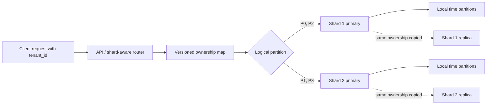

# SD-BEG-080 — Sharding and Partitioning

> **Track:** Beginner
>
> **Artifact state:** Ready
>
> **Learning state:** Not started
>
> **Last updated:** 2026-09-01

## Source and coverage check

- Inspected: all five supplied slide pages, including every definition, topology, number, ownership drawing, comparison, advantage, disadvantage, and the complete supplied ending.
- Coverage: complete for all supplied source material. No transcript or video was supplied, so this pack does not claim coverage of spoken wording, emphasis, demonstrations, or timestamps.
- Unclear source points: `WPS` is not expanded; the calculations below explicitly assume **writes per second**. The source also marks its own sharding/partitioning wording as an oversimplification, and one matrix cell depicts a read replica where precise industry terminology says replication rather than sharding.
- Instructor-task scan: complete across all supplied pages and the final 20% of the supplied source; zero assignments were found.

## What I should be able to do

- Explain partition, shard, shard key, router, replica, horizontal partitioning, and vertical partitioning without using the terms interchangeably.
- Reconstruct the course's path from vertical scaling to two shards and show every arithmetic assumption behind the stated throughput gain.
- Choose a partition key from actual access patterns, then state the one-owner and complete-routing invariants.
- Predict targeted versus scatter-gather query behavior and identify when joins, transactions, uniqueness, or ordering cross a shard boundary.
- Diagnose a hot shard, stale shard map, unavailable shard, or unsafe rebalance from metrics and request evidence.
- Explain why replication and sharding solve different problems and why either may be combined with local table partitioning.
- Defend when *not* to shard, even if horizontal scaling sounds attractive.

## Small bridge from earlier ideas

A database server is software such as `mysqld`, `mongod`, or PostgreSQL running as one or more processes on a machine or managed instance. That machine contributes finite CPU, memory, storage capacity, storage I/O, network bandwidth, and connection slots.

When one node approaches a measured limit, there are three different moves that are easy to blur together:

- **Scale up:** give the same node more resources.
- **Replicate:** keep another copy of the same ownership set, commonly for availability or eligible reads.
- **Partition ownership:** divide the data or work into subsets. If those subsets live on independent database nodes, the system is usually called **sharded**.

This lecture can be studied independently. The only bridge needed is that every capacity decision must start with the resource, workload, and service objective that are actually constrained.

## The 60-second story

Begin with one database because one ownership boundary is simple. The course illustrates that node handling 100 writes/s, then serving 200 and eventually 1,000 writes/s after vertical scaling. A machine has a ceiling, so when demand reaches 1,500 writes/s the course divides the dataset and routes half to each of two database servers. With perfectly even traffic and no distribution overhead, each server receives 750 writes/s.

The data division creates **partitions**; the independent owners that host those subsets are **shards**. Partitioning can also stay inside one database instance, while sharding normally crosses independently operated nodes. A routing rule must map every key to exactly one current write owner. That rule is the heart of correctness.

The gain is not free. Uneven keys create hot shards, queries without the shard key fan out, cross-shard joins and transactions become coordination problems, and moving ownership safely is an online migration. Replicas may be added *inside each shard* for availability, but a replica is a copy, not another ownership subset.

## Why the terms matter

| Term | Simple meaning | Why it matters here | Common confusion |
|---|---|---|---|
| Database instance/node | A running database service with its own resource and failure boundary | It is the physical or managed place that bears load | A process, VM, instance, node, and shard are related but not identical |
| Partition | One mutually exclusive subset created by a partition rule | It makes ownership, pruning, placement, or maintenance smaller | A partition does not have to live on another machine |
| Shard | An independently routed owner of one data subset | It can divide storage and authoritative writes across nodes | A read replica holds a copy; it is not a new subset owner |
| Shard key | Field or fields used to decide ownership | Its distribution and presence in queries control balance and routing | High cardinality alone does not prevent hot tenants or monotonic hotspots |
| Logical partition | A small routing unit independent of a particular machine | Many logical units make rebalancing less disruptive | One logical partition need not equal one physical shard |
| Horizontal partitioning | Split rows by key or range | It is the usual mechanism behind database sharding | “Horizontal” here is not merely adding servers |
| Vertical partitioning | Split columns or related data groups | It separates wide, cold, sensitive, or differently accessed data | It is not vertical scaling of CPU/RAM |
| Partition pruning | Skip partitions proven unable to contain matching rows | Local partitioning can reduce scanned data | It is not the same as routing a request to a remote shard |
| Router | Component that maps an operation to its owner or owners | A wrong or stale route becomes a correctness fault | The router may be in the client, API, proxy, or database product |
| Scatter-gather | Send one query to several shards and merge responses | It raises work, tail latency, and partial-failure exposure | Parallel execution does not make the total cost disappear |
| Skew | Uneven data, traffic, or expensive work | The busiest shard limits useful cluster capacity | Equal bytes or row counts do not imply equal load |
| Rebalancing/resharding | Move ownership while the system remains usable | Growth eventually changes the partition-to-shard mapping | Copying rows is only one step; routing cutover is the dangerous boundary |
| Replica | Another copy of one shard's ownership set | It may improve availability and eligible read capacity | Replication and sharding are independent axes |

## Big picture

### Question this visual answers

How does a key become one owned record, and where do local partitions and replicas fit?



### How to read this visual

Follow the solid arrows for ownership. The router applies one versioned rule to `tenant_id`, obtains a logical partition, and then selects its current shard. Inside that shard, the database may further partition a table by time. The dotted arrows copy each shard's data to replicas; they do not create new ownership subsets.

### Key insight

There are three mappings, not one vague “split”: request key → logical partition → shard, followed optionally by local table partitioning. Replication sits beside ownership rather than replacing it.

### Simplification or limitation

The diagram shows one primary per shard and omits failover elections, cache invalidation, cross-shard operations, migration states, and regional placement. A database-native sharding product may hide the router and map behind one endpoint, but the same decisions still exist.

## Core concepts

### 1. Vertical scaling buys time, not infinity

**Simple meaning:** Give one database node more CPU, RAM, storage, or I/O capability.

**Formal meaning:** Capacity is increased without changing authoritative data ownership or the number of write-owning nodes.

**Why it matters:** It preserves the simplest transaction, query, backup, and operational boundary. The course deliberately starts here before introducing distributed ownership.

**Problem it solves:** A measurable single-node resource limit that a supported larger configuration can remove economically.

**How it works:**

1. State the violated target, such as p99 write latency or required sustained write rate.
2. Identify the limiting resource rather than assuming “the database” is full.
3. Choose a larger instance or storage profile that addresses that resource.
4. Resize or fail over, warm the workload, and compare measured results with the prediction.
5. Keep headroom for bursts, maintenance, and failure recovery.

**Small example:** If an 8 GiB hot index repeatedly falls out of a 4 GiB cache, increasing memory may sharply reduce I/O. More memory will not repair a serialized lock or a bad query plan.

**Invariant or deciding condition:** The workload plus required headroom must fit inside one supported failure boundary after the change.

**Trade-off and alternatives:** Scaling up avoids distributed coordination, but larger tiers have finite ceilings, possible downtime/failover, concentrated risk, and sometimes poor price/performance. Query/index repair, admission control, caching, archiving, or batching may be better.

**Failure/observability:** Watch CPU saturation, memory/cache hit rate, I/O latency and queue depth, lock waits, connection wait time, storage growth, and p95/p99 request latency before and after the resize.

**When not to use it:** When the data or sustained authoritative write rate cannot fit the largest practical node with failure headroom, or when one-node availability cannot meet the objective.

**Requirement change:** A stricter cost ceiling may make a bigger node unattractive; a stricter consistency requirement may make it preferable to premature sharding.

### 2. Partitioning describes division; sharding describes distributed ownership

**Simple meaning:** A partition is a piece. A shard is an independently routed owner of one or more pieces.

**Formal meaning:** A partitioning function divides a domain into mutually exclusive, collectively complete subsets. Sharding places those subsets behind distinct database ownership or routing boundaries, usually on multiple nodes or clusters.

**Why it matters:** The course correctly warns that industry usage is loose. Precise vocabulary prevents an engineer from treating pruning, replication, and distributed writes as the same mechanism.

**Problem it solves:** It separates the logical question “How is data divided?” from the physical/operational question “Who owns and serves each division?”

**How it works:**

1. Define the valid key domain.
2. Define a partition function over that domain.
3. Confirm no valid key belongs to zero or multiple partitions.
4. Place one or more partitions on each shard.
5. Publish the mapping to every routing component.

**Small example:** Five partitions of 30, 10, 30, 20, and 10 GB can remain inside one instance or be assigned across two shards. The partition boundaries do not themselves require five machines.

**Invariant or deciding condition:** For a given mapping version, every valid record belongs to exactly one logical partition and that partition has exactly one current authoritative write owner.

**Trade-off and alternatives:** More partitions create smaller placement units and easier targeted maintenance, but also more metadata, planning, routing, and migration overhead. A single unpartitioned table may still be best at modest scale.

**Failure/observability:** Missing or overlapping ranges can reject writes or create duplicate authority. Observe routing misses, multiple-owner checks, mapping version, partition counts, per-partition bytes/operations, and unexpected records on the wrong shard.

**When not to use distributed placement:** When local table partitioning or one well-sized node already meets capacity, latency, availability, and cost goals.

**Requirement change:** If a tenant must remain in one legal region, placement becomes a policy constraint in addition to a balancing choice.

### 3. Horizontal partitioning splits rows

**Simple meaning:** Different rows go to different partitions according to a key.

**Formal meaning:** All partitions retain a compatible row shape, while disjoint key predicates determine which tuples each partition owns.

**Why it exists:** Row ownership can be divided by tenant, user, geography, date, order ID, or a hash so that one operation often touches only one subset.

**How it works:**

1. Choose a key available when requests are routed.
2. Choose range, list, hash, or lookup-based boundaries.
3. Create a complete mapping including invalid/default behavior.
4. Route writes to one owner and queries to the minimum known owners.
5. Revisit the mapping as traffic and data distributions change.

**Small example:** Orders with `tenant_id` hash remainders 0–31 are logical partitions. Shard A owns 0–15 and shard B owns 16–31. All rows keep the same columns.

**Invariant or deciding condition:** The chosen key must be stable enough to route an item for its full lifecycle, or a supported move protocol must update all dependent references.

**Trade-off:** Hashing usually improves balance; ranges preserve locality and efficient range scans. A directory provides flexible placement but becomes another highly available metadata dependency.

**Failure/observability:** A monotonic range can focus all new writes on the newest partition. A hot tenant can dominate one hash bucket. Measure per-key heavy hitters, per-partition QPS/bytes, max-to-mean skew, and routed versus broadcast queries.

**When not to use it:** When common transactions and joins span many candidate keys, or the key is absent from the dominant API/query paths.

**Requirement change:** If the product adds global time-range analytics, a tenant-based shard key still supports tenant-local reads but may require an analytical copy or fan-out path for global scans.

### 4. Vertical partitioning splits columns or functional groups

**Simple meaning:** Keep frequently used fields together and move other fields into a related structure.

**Formal meaning:** A logical entity's attributes are decomposed into tables or services connected by a stable identifier, rather than dividing rows by key range.

**Why it exists:** Wide, cold, sensitive, or large fields can inflate hot-row I/O, cache use, and security exposure even when most requests do not need them.

**How it works:**

1. Measure which columns are read or updated together.
2. Keep the hot path and stable identifier in the primary relation.
3. Move cold or independently governed attributes to another relation/storage boundary.
4. Fetch or join the secondary data only when required.
5. Define transaction and deletion behavior across the split.

**Small example:** `users(id, display_name, status)` serves most requests, while `user_profiles(user_id, biography, avatar_blob)` stores large rarely read fields. Both are joined by `user_id`.

**Invariant or deciding condition:** The identifier and lifecycle rule must keep the separated pieces associated; deleting or moving the primary entity cannot silently orphan governed data.

**Trade-off:** Smaller hot rows and clearer security/retention boundaries come with extra joins, round trips, migration work, and possibly cross-service consistency.

**Failure/observability:** Look for N+1 profile fetches, orphan counts, join/round-trip latency, inconsistent deletion state, and access-control drift.

**When not to use it:** When almost every operation needs the full row and the extra boundary only adds work.

**Requirement change:** A new privacy rule may justify separating encrypted or region-bound columns even if it is not a performance win.

### 5. The shard key is a workload decision

**Simple meaning:** Choose a key that both spreads work and appears in important requests.

**Formal meaning:** The shard key is the input to a deterministic placement function; its cardinality, frequency distribution, monotonicity, mutability, and query presence determine routing quality.

**Why it matters:** The cluster cannot be more useful than its hottest ownership unit or its most common scatter-gather query.

**Problem it solves:** It makes ordinary reads and writes targetable while distributing data and expensive work with acceptable skew.

**How it works:**

1. List the dominant API/query paths and their predicates.
2. Estimate data volume, read/write rate, and expensive operations per candidate key.
3. Identify heavy hitters and future growth, not just today's average.
4. Test range, hash, compound, and directory options against locality and balance.
5. Define how large tenants or changing requirements will be handled before launch.

**Small example:** `tenant_id` gives excellent tenant-locality and easy deletion, but one enterprise tenant may become 35% of writes. A compound scheme such as `(tenant_id, bucket)` can split that tenant, at the cost of tenant-wide fan-out.

**Invariant or deciding condition:** The key must let the router find all authoritative records needed by the operation, or the operation must explicitly accept multi-shard coordination.

**Trade-off:** Locality and evenness often conflict. Range keys help ordered scans; hashed keys spread writes but destroy natural adjacency. Compound keys can balance one path while complicating another.

**Failure/observability:** Measure the top keys by QPS, bytes, CPU time, lock time, and storage—not merely row count. Alert on per-shard saturation and the ratio of the busiest shard to the mean.

**When not to choose a candidate:** When it changes frequently, is absent during creation/routing, has a dominant value, or makes the critical query broadcast.

**Requirement change:** If a previously small tenant becomes huge, add sub-sharding or dedicated placement for that tenant rather than randomly moving unrelated tenants.

### 6. Logical partitions make physical growth manageable

**Simple meaning:** Create more small ownership buckets than machines, then assign buckets to machines.

**Formal meaning:** Placement is a two-level function: `key → logical partition → physical shard`. The second mapping can change without changing the first function for every key.

**Why it exists:** If one physical shard equals one hard-coded key range, adding a shard may require rewriting a large fraction of the keyspace and every router rule.

**How it works:**

1. Create a stable set of logical partitions or ranges.
2. Assign several to each physical shard.
3. Monitor their individual size and load.
4. Move selected units to a new shard when balance or capacity changes.
5. Advance the mapping version only through a safe cutover protocol.

**Source-based example:** The supplied drawing divides 100 GB into five logical partitions and places two on one shard and three on another. This is already a two-level model even though it does not use that phrase.

**Invariant or deciding condition:** At each routing epoch, every logical partition has one authoritative write owner and every accepted router can resolve that epoch.

**Trade-off:** More, smaller units improve placement flexibility; too many units increase routing metadata, monitoring cardinality, planning time, and migration churn.

**Failure/observability:** A stale map can send a write to the old owner. Observe map epoch, redirect/stale-route rate, per-partition state, copy lag, and old-owner traffic after cutover.

**When not to add the extra level:** In a small static system where a database-native partitioner already provides safe chunk placement.

**Requirement change:** A new shard should receive selected logical units; avoid changing `hash(key) % N` blindly because changing `N` remaps most keys.

### 7. Routing determines whether sharding saves work

**Simple meaning:** A query with the ownership key can usually go to one shard; a query without it may need all shards.

**Formal meaning:** A router uses key predicates and placement metadata to compute a target set. A singleton set is targeted; a set containing many owners is scatter-gather.

**Why it matters:** Storage may be evenly distributed while a common query still multiplies work across the cluster.

**How it works:**

1. Parse or receive the shard-key value with the request.
2. Resolve the logical partition and current owner.
3. Execute on the smallest safe target set.
4. For multiple targets, establish deadlines and partial-failure policy.
5. Merge, sort, aggregate, or deduplicate results before responding.

**Small example:** `GET /tenants/t7/orders/o9` can target tenant `t7`'s shard. `GET /orders?status=pending` without tenant scope may contact every shard and merge results.

**Invariant or deciding condition:** The target set must include every possible owner and no stale owner may accept authoritative writes for the same epoch.

**Trade-off:** Targeted requests scale with one shard. Scatter-gather can offer parallelism, but total CPU/network work, merge memory, slowest-shard latency, and partial-failure exposure grow with fan-out.

**Failure/observability:** Trace target shard IDs, map epoch, fan-out count, per-shard latency, merge time, timeout/cancellation, partial-result policy, and rows examined versus returned.

**When not to shard the serving path:** When the dominant product query has no targetable key and an index, search system, or analytical projection would serve it more naturally.

**Requirement change:** Adding globally sorted pagination requires a stable global ordering and continuation token across shards, not independent `OFFSET` values.

### 8. Replication and sharding are independent axes

**Simple meaning:** Sharding divides data; replication copies each divided piece.

**Formal meaning:** Shard placement defines authoritative subsets. A replication group maintains redundant members for one subset and elects or designates a write authority according to its consistency protocol.

**Why it matters:** The source lists higher availability as a sharding advantage, but distribution alone does not make an individual shard redundant.

**Problem it solves:** Sharding addresses storage/write ownership scale; replication addresses copy redundancy, failover, and sometimes eligible read scale.

**How it works:**

1. Route a key to its shard.
2. Send the authoritative write to that shard's primary/leader.
3. Replicate the change within that shard's replication group.
4. Apply the shard's acknowledgment and read-consistency policy.
5. Fail over only within the same ownership set.

**Small example:** Two shards without replicas have two independent single points of failure. Two shards with three members each have six database nodes but still only two ownership subsets.

**Invariant or deciding condition:** Replicas for shard A must never silently become owners of shard B; failover changes the serving member, not the shard-key mapping.

**Trade-off:** Per-shard replication raises durability and availability but multiplies node cost, replication traffic, lag monitoring, backup coordination, and failover complexity.

**Failure/observability:** A shard outage makes its keys unavailable; a scatter-gather request may fail even when all other shards are healthy. Observe quorum/member health, replication lag, failover epoch, per-shard error rate, and recovery point/time objectives.

**When not to claim high availability:** When any shard has one copy, the router/map is a single point of failure, or the request requires all shards and has no degradation policy.

**Requirement change:** A strict availability target may require each shard to span failure domains, but a strict latency target constrains how far synchronous acknowledgments can travel.

### 9. Rebalancing is an online ownership migration

**Simple meaning:** Copying bytes is not enough; the system must change who may accept reads and writes without losing or duplicating authoritative updates.

**Formal meaning:** Resharding transitions a partition from source owner to target owner through versioned states while preserving a defined consistency and availability contract.

**Why it exists:** Traffic skew, storage growth, hardware replacement, tenant isolation, or a new shard eventually changes placement.

**How it works:**

1. **Plan:** choose the partition, source, target, capacity budget, epoch, and abort condition.
2. **Backfill:** copy a consistent snapshot while the old owner still serves traffic.
3. **Catch up:** stream changes after the snapshot and measure lag.
4. **Verify:** compare counts/checksums or a database-native verifier.
5. **Cut over reads, then writes:** advance routing with fencing so only one write owner exists.
6. **Observe and drain:** keep rollback or reverse replication for a defined window.
7. **Retire old data:** only after no old-epoch traffic remains and recovery is proven.

**Small example:** Move logical partition P2 from shard 1 to shard 3. Copying P2 while both accept uncoordinated writes would create divergent truth; a fenced epoch or product-native workflow prevents that.

**Invariant or deciding condition:** At no externally visible epoch may two independent owners accept conflicting authoritative writes for the same keyspace.

**Trade-off:** Online migration protects availability but consumes source/target I/O, network, log retention, and operational attention. A maintenance-window move can be simpler if downtime is acceptable.

**Failure/observability:** Watch snapshot progress, change-stream lag, verification mismatches, source/target error rate, stale-route redirects, duplicate/missing key checks, and resource impact. Abort before cutover if catch-up cannot converge.

**When not to hand-roll it:** When the database platform already has a supported balancer or resharding workflow. Prefer its fencing, verification, and rollback semantics.

**Requirement change:** If zero downtime is mandatory, budget capacity for concurrent source/target serving and test rollback. If a short outage is acceptable, a stop-copy-switch procedure may be safer.

## Worked example and calculations

### Assumptions

- The source's `WPS` means writes per second; this is an explicit inference because the abbreviation is not expanded.
- One vertically scaled database sustains at most 1,000 writes/s at the stated latency objective.
- Incoming demand is a sustained 1,500 writes/s.
- The first calculation assumes perfect 50/50 routing, no cross-shard work, identical nodes, and no routing or replication overhead.
- A second capacity plan uses 30% operational headroom, so planned utilization is at most 70%.

### Steps

**1. Reproduce the course's ideal split**

```text
raw capacity with two shards = 2 × 1,000 = 2,000 writes/s
average load per shard         = 1,500 ÷ 2 = 750 writes/s
utilization per shard          = 750 ÷ 1,000 = 0.75 = 75%
raw unused capacity            = 2,000 - 1,500 = 500 writes/s
```

The arithmetic is correct under the stated ideal assumptions. It demonstrates the mechanism, not a universal scaling law.

**2. Add a 30% headroom target**

```text
planned capacity per shard = 1,000 × 0.70 = 700 writes/s
required shard count        = ceil(1,500 ÷ 700)
                            = ceil(2.142857...)
                            = 3 shards
average with three shards   = 1,500 ÷ 3 = 500 writes/s
planned utilization         = 500 ÷ 1,000 = 50%
```

Two shards carry the baseline but violate the chosen 70% utilization ceiling. Three provide room for bursts, maintenance, and unevenness. This is a planning choice, not a claim that all systems require 30% headroom.

**3. Change only the distribution to 70/30**

```text
hot shard load  = 1,500 × 0.70 = 1,050 writes/s
cold shard load = 1,500 × 0.30 =   450 writes/s
```

The cluster has 2,000 writes/s of nominal aggregate capacity, yet the hot shard exceeds its 1,000 writes/s limit. Useful capacity is bounded by the busiest ownership unit.

**4. Reconstruct the supplied 100 GB placement**

| Logical partition | Size | Supplied placement |
|---|---:|---|
| A | 30 GB | Shard 1 |
| B | 10 GB | Shard 2 |
| C | 30 GB | Shard 1 |
| D | 20 GB | Shard 2 |
| E | 10 GB | Shard 2 |
| **Total** | **100 GB** | **Shard 1 = 60 GB; Shard 2 = 40 GB** |

```text
storage ratio, largest : smallest = 60 : 40 = 1.5 : 1
mean storage per shard            = 100 ÷ 2 = 50 GB
largest-to-mean skew               = 60 ÷ 50 = 1.2
```

If write traffic were proportional to bytes, loads would be 900 and 600 writes/s. Both fit the 1,000 limit, but shard 1 has only 100 writes/s of raw margin. Real traffic is rarely proportional to bytes, so measure operation cost separately.

**5. See how fan-out changes availability exposure**

Assume, only for this calculation, that each targeted shard independently succeeds with probability `0.999` during the request window.

```text
one-shard request success  = 0.999                       = 99.9%
ten-shard request success  = 0.999^10                    ≈ 0.990045
ten-shard request failure  = 1 - 0.990045                ≈ 0.9955%
```

The exact production probability will not be independent and the system may return partial results or retry, but the calculation shows why “all shards must respond” is a stronger failure condition than a targeted request.

### Result and sanity check

The course's 750/750 split is a valid teaching baseline. It is safe to use operationally only after checking skew, overhead, replication, failure headroom, and query fan-out. A cluster with twice the nominal capacity can still overload when one key or range receives more than half the work.

## Deep mechanism

### Components, ownership, and boundaries

| Component | Owns | Must not silently own |
|---|---|---|
| API/client | Request semantics, tenant/user identity, deadline | A private hard-coded shard map with no versioning |
| Router/proxy | Key normalization, target calculation, map epoch, fan-out/merge policy | Record truth or arbitrary fallback on an unmapped key |
| Metadata service/map | Partition bounds and partition-to-shard placement | Application data rows |
| Logical partition | Mutually exclusive key subset | A second overlapping key subset in the same epoch |
| Shard primary/leader | Authoritative writes for its assigned partitions | Writes for another shard or a retired epoch |
| Shard replicas | Copies and failover/read roles for that same shard | New partition ownership merely because they are on another machine |
| Local table partitions | Physical pieces within one database boundary | Cross-machine routing by themselves |
| Migration controller | Copy, catch-up, verification, fencing, cutover state | Unreviewed destructive cleanup |

The critical boundary is authority, not the number of cylinders in a diagram. One shard may be a replication group; one machine may host several logical partitions; one partitioned PostgreSQL table may still be one database ownership boundary.

### Ordering, concurrency, and stale state

For a normal write, the order is:

1. Validate and normalize the shard key.
2. Read or use a cached placement map with epoch `E`.
3. Resolve key → logical partition → shard.
4. Send the operation with enough identity/epoch information to detect a stale route.
5. The current shard commits according to its local replication/durability policy.
6. Return success only after the chosen acknowledgment condition.

During a move, old and new routers coexist. Therefore a router cache is correctness-sensitive. Safe systems use database-native routing, redirects with bounded retries, fencing tokens/epochs, or another mechanism that prevents the old owner from accepting authoritative writes after cutover.

Retries add another concurrency problem: a timed-out write may have committed. Use an idempotency key or a database constraint so retrying at the new route does not create a duplicate logical operation.

### Failure and recovery

| Failure | Observable symptom | Mechanism | Protection/recovery | Remaining risk |
|---|---|---|---|---|
| Hot shard | One shard has high p99/CPU/queue while others are idle | Uneven key frequency or expensive tenant/range | Rate-limit, cache, split hot key, move partitions, add capacity | Moving cold data does not cool the hot key |
| Stale shard map | Wrong-owner/redirect errors; old-shard traffic after cutover | Router uses old epoch | Version maps, redirect/retry, fencing, drain old epoch | Retry storms or duplicate effects without idempotency |
| Missing/overlapping range | Routing miss or two owners contain the same key | Bad boundary/configuration | Validate collective completeness and exclusivity before publish | Historical bad rows may require repair |
| One shard unavailable | Only its keys fail; fan-out operations may fail globally | Node/group failure inside one ownership set | Replicate per shard, fail over, degrade partial features | Recovery can expose lag or lost acknowledgments |
| Scatter-gather timeout | Global query p99 tracks slowest shard | Query lacks targetable key; merge waits for many responses | Deadline, cancellation, partial policy, analytical projection | Partial data may be unacceptable |
| Cross-shard partial write | One shard commits and another aborts/times out | No single local transaction spans owners | Redesign ownership, saga/outbox, or supported distributed transaction | Compensation is not atomic rollback |
| Rebalance divergence | Source and target counts/checksums differ | Copy and concurrent changes not synchronized | Snapshot + change stream + verification + fenced cutover | Latent semantic mismatches beyond row counts |
| Storage imbalance | One shard fills much sooner | Partitions differ in growth or placement | Move logical partitions, tier storage, split large partition | Traffic balance may worsen after a storage-only move |
| Replica mistaken for shard | Writes still bottleneck on one primary | Same data was copied instead of ownership divided | Clarify topology and measure write authority | Replica reads may also be stale |
| Router/metadata outage | Many or all keys become unroutable | Central routing dependency unavailable | Replicated metadata, cached validated maps, safe fallback | Stale cache cannot safely serve every migration state |

### Observability

Collect the following with `shard_id`, logical partition, route epoch, and operation type as bounded labels or trace attributes:

- per-shard read/write QPS, p50/p95/p99 latency, errors, timeouts, retries, CPU, memory, I/O, connections, locks, and storage headroom;
- top shard keys/tenants by requests, bytes, CPU time, rows scanned, and storage growth;
- balance ratios: maximum-to-mean and p95-to-median for traffic, data, and expensive work;
- targeted versus scatter-gather count, fan-out width, per-target latency, merge time, rows examined/returned, and partial-result rate;
- routing misses, redirects, stale-epoch rejections, retry loops, and map propagation age;
- migration snapshot progress, catch-up lag, verification mismatches, cutover state, old-owner traffic, and rollback readiness;
- per-shard replication lag, member health, failover epoch, last successful backup, restore-test age, and recovery objectives;
- cross-shard transaction/saga count, compensation failures, idempotency conflicts, and unresolved workflow age.

Useful alerts describe a decision. “Shard 3 p99 > 120 ms for 10 minutes while its queue grows and cluster median stays below 30 ms” points to skew; “all shards slow with router merge time high” suggests a different bottleneck.

## Design choices

| Choice | Benefits | Costs/risks | Prefer when | Avoid when |
|---|---|---|---|---|
| One unpartitioned node | Simplest transactions, joins, uniqueness, backup, and operations | Finite single-node scale/failure boundary | Workload fits with headroom | Proven storage/write ceiling is near |
| Local range partitions | Pruning, retention, smaller indexes/maintenance units | More schema/plan metadata; no automatic cross-machine write scale | Time-based queries and retention align | Queries cannot prune or partition count explodes |
| Local hash/list partitions | Smaller physical pieces and controlled placement inside one database | Local ownership still shares one instance | Maintenance or local parallelism needs pieces | Goal is independent machine capacity |
| Range sharding | Locality and efficient range queries | Hot monotonic edge; uneven ranges | Range access and explicit boundaries dominate | New writes concentrate at one end |
| Hash sharding | Usually smoother point-write distribution | Poor range locality; naive modulo resizes badly | Point operations dominate and key distribution is suitable | Ordered/range access is critical |
| Directory/lookup sharding | Flexible tenant placement and special cases | Metadata lookup/cache becomes critical | Tenants move or need dedicated placement | Extra routing dependency is unjustified |
| Tenant-based sharding | Strong locality, deletion, and isolation | Large tenant can become a shard-sized hotspot | Most operations are tenant-scoped | Global queries dominate or one tenant is unbounded |
| Client-side routing | Low extra hop and application-specific control | Many deploys/caches must agree; harder migrations | Few controlled clients and stable map protocol | Many languages/clients or rapid resharding |
| Proxy/database-native routing | Centralized policy and transparent placement | Additional component and product coupling | Many clients need one contract | Proxy is unreplicated or hides vital evidence |
| Sharding plus per-shard replication | Storage/write scale plus redundancy | Node and operational cost multiply | Availability/durability require redundant owners | Budget and operations cannot support it safely |
| Analytical/search projection | Efficient global queries without serving-cluster fan-out | Freshness and pipeline complexity | Global scans/search are important | Strict synchronous truth is required for every query |

## Misconceptions

| Claim/confusion | What is actually true | Evidence or counterexample |
|---|---|---|
| “Partitioning means same instance; sharding means multiple machines.” | Useful beginner shorthand, but partition is the logical/physical split and shard is distributed ownership. Database products may place partitions differently. | A PostgreSQL partitioned table can remain one database; a sharded database distributes subsets to owners. |
| “Sharding and partitioning are exact synonyms.” | Sharding normally uses horizontal partitioning, but local partitioning and vertical partitioning are not necessarily sharding. | One instance can contain monthly partitions without a shard router. |
| “A read replica is a shard.” | A replica copies one owner's data; a shard owns a different subset. | Two identical copies still send authoritative writes to one ownership group. |
| “Two shards double throughput.” | Only under balanced, independent work with low overhead and sufficient headroom. | A 70/30 split sends 1,050 of 1,500 writes/s to a 1,000-writes/s shard. |
| “Equal storage means equal load.” | Bytes, rows, reads, writes, CPU, locks, and growth can have different distributions. | One 1 GB tenant can issue more writes than 100 GB of cold history. |
| “Sharding automatically increases availability.” | It can reduce blast radius for targeted operations, but each shard needs redundancy and global operations depend on more components. | One unavailable unreplicated shard makes its keys unavailable. |
| “High-cardinality shard key means even load.” | Frequency and cost distribution matter as much as cardinality. | Millions of possible tenants do not help if one tenant generates 40% of writes. |
| “Queries without a shard key are impossible.” | They are often possible through broadcast/scatter-gather, but can be costly and failure-prone. | The router may ask all shards and merge results. |
| “Local table partitioning scales writes across machines.” | It can improve pruning and maintenance within one database boundary; independent write capacity requires distributed placement or a product that provides it. | Monthly PostgreSQL partitions on one node still share that node's resources. |
| “`hash(key) % N` makes adding shards easy.” | Changing `N` changes the result for most keys, causing massive movement unless another indirection/consistent placement method exists. | A partition-to-shard map moves selected logical units instead. |
| “Cross-shard transactions are always forbidden.” | Some systems support them, but latency, availability, recovery, and operational costs cross more failure boundaries. | A local transaction is simpler; distributed coordination must be justified. |

## Real backend connection

Consider a synthetic multi-tenant audit-event API built with FastAPI and PostgreSQL:

- Every event carries immutable `tenant_id`, unique `event_id`, `created_at`, actor, action, and payload reference.
- The API routes `tenant_id` through a directory or stable logical partition map to one PostgreSQL shard.
- The primary key or uniqueness rule includes enough tenant context to enforce uniqueness locally, or `event_id` uses a collision-resistant globally generated identifier.
- Inside each shard, `audit_events` is range-partitioned by month on `created_at` for pruning and retention.
- `GET /tenants/{tenant_id}/events?from=...&to=...` targets one shard, then PostgreSQL prunes irrelevant months.
- A global compliance report reads from an asynchronous analytical projection instead of broadcasting every interactive request to all serving shards.
- Each shard has its own replicas/backups and independent saturation/restore evidence.

This combines two useful keys for two different jobs: `tenant_id` decides the remote owner, while `created_at` organizes local storage. It also makes the constraint visible: a global chronological query no longer matches the serving shard key.

The official PostgreSQL documentation describes local declarative partitioning as splitting one logical table into smaller physical pieces, with `RANGE`, `LIST`, and `HASH` methods and partition pruning when predicates match bounds: [PostgreSQL table partitioning](https://www.postgresql.org/docs/current/ddl-partitioning.html). That is not by itself an application-level sharding layer.

## Instructor-assigned tasks

> No instructor-assigned task found in the supplied source. The complete supplied source and ending were scanned; see `source_manifest.json`. No `tasks/` directory is created because inventing course homework would violate the source boundary.

### Codex-added practice

These are optional retrieval drills, not instructor assignments:

1. **Predict:** Two 1,000-writes/s shards receive 1,500 writes/s, but one tenant produces 800 writes/s and all other tenants split evenly. Can the system meet the target if that tenant cannot be divided? Show the deciding inequality.
2. **Draw:** Recreate `key → logical partition → shard → replica`, and circle the boundary that changes during failover versus resharding.
3. **Explain:** Why can a locally partitioned PostgreSQL table prune a query yet still hit one machine's write ceiling?
4. **Map:** Reassign source partitions A–E across three shards while keeping storage as balanced as possible. Then explain why your byte balance may not balance WPS.
5. **Change:** The dominant endpoint changes from tenant-local reads to a globally sorted activity feed. Keep the shard key or change the serving architecture? Defend one choice and one alternative.
6. **Incident:** Router traces show `map_epoch=41`, shard logs reject writes as `stale_epoch`, and retries triple API traffic. State the likely cause, immediate mitigation, and safe recovery evidence.

## Useful English and technical phrases

### Mutually exclusive

- Pronunciation: `MYOO-choo-uh-lee eks-KLOO-siv`
- Simple meaning: two groups cannot contain the same item at the same time.
- Hindi cue: ek item sirf ek group mein.
- Why it matters here: overlapping partition ownership can create conflicting writers or duplicate truth.
- Common misuse: saying “different” when the stronger claim of non-overlap has not been proven.

Examples:

1. Simple: These two choices are mutually exclusive.
2. Engineering: The key ranges must be mutually exclusive.
3. Engineering: A record cannot have two mutually exclusive write owners in one epoch.
4. Interview: I would validate that the shard ranges are collectively complete and mutually exclusive.
5. Professional/design review: Before cutover, let us prove that the old and new ownership states remain mutually exclusive for writes.

### Skew

- Pronunciation: `skyoo`
- Simple meaning: an uneven distribution.
- Hindi cue: load ka asamaan bantwara.
- Why it matters here: one busy shard limits the useful capacity of otherwise idle machines.
- Common misuse: using `skew` only for storage while ignoring request cost, locks, or growth rate.

Examples:

1. Simple: The results are skewed toward one group.
2. Engineering: Tenant traffic creates severe write skew on shard 4.
3. Engineering: Storage is balanced, but CPU skew remains because one partition runs expensive queries.
4. Interview: I would estimate key frequency and monitor max-to-mean skew before selecting the shard key.
5. Professional/design review: The proposal needs a mitigation for heavy-tenant skew, not only an average-throughput calculation.

### Scatter-gather

- Pronunciation: `SKAT-er GATH-er`
- Simple meaning: ask many places and combine their answers.
- Hindi cue: sab jagah poochkar result jodna.
- Why it matters here: a missing shard key can multiply work and make the slowest or failed shard visible to one request.
- Common misuse: treating parallel requests as free or assuming partial answers are always acceptable.

Examples:

1. Simple: We asked every group and gathered the answers.
2. Engineering: This endpoint becomes a scatter-gather query because it lacks `tenant_id`.
3. Engineering: The router cancels the remaining scatter-gather requests after the deadline.
4. Interview: I would avoid routine scatter-gather on the synchronous serving path and build a query projection.
5. Professional/design review: Please quantify fan-out width, merge memory, tail latency, and partial-failure behavior for this scatter-gather design.

### Rebalance

- Pronunciation: `ree-BAL-uhns`
- Simple meaning: move work or data so owners carry a better distribution.
- Hindi cue: load ko phir se barabar baantna.
- Why it matters here: adding a shard helps only after selected ownership moves safely to it.
- Common misuse: describing only the copy and omitting catch-up, verification, fencing, cutover, and cleanup.

Examples:

1. Simple: We rebalanced the teams after one became too large.
2. Engineering: The controller rebalances two logical partitions onto the new shard.
3. Engineering: Rebalancing is paused because replication lag exceeds the abort threshold.
4. Interview: I would backfill, stream changes, verify, fence the old owner, and then rebalance traffic.
5. Professional/design review: The rebalance plan must state how stale routers are rejected and how rollback is verified.

## Interview practice

### Foundation

**Question:** What is the difference between partitioning, sharding, and replication?

**Strong answer covers:** A partition is a mutually exclusive subset; sharding distributes subset ownership across independent routing/database boundaries; replication keeps additional copies of one ownership set. Give one-node monthly partitions, two tenant shards, and replicas inside each shard as examples. State the one-owner invariant and explain that terminology varies by product.

**Weak-answer trap:** “Partitioning is vertical and sharding is horizontal,” or “any second database is a shard.” Both erase the logical-versus-physical and copy-versus-ownership distinctions.

### SDE-2 working engineer

**Question:** A multi-tenant write service reaches 1,500 writes/s. One node meets the latency objective up to 1,000 writes/s. How would you decide whether and how to shard?

**Reasoning checkpoints:**

1. Clarify whether 1,500 is average, peak, or sustained and define p99 latency, durability, availability, growth, and cost targets.
2. Prove the limiting resource and rule out query/index/connection fixes or a practical larger node.
3. Examine the dominant APIs and candidate keys, including tenant heavy hitters and transactions.
4. Reproduce the two-shard 750/750 ideal, then add headroom and skew scenarios.
5. Define key → logical partition → shard routing and the complete, exclusive, one-write-owner invariant.
6. State how requests missing the key behave, how global queries are served, and how uniqueness/transactions are scoped.
7. Add per-shard replication only if availability/durability requires it.
8. Explain rollout, backfill/cutover, metrics, rollback, and on-call evidence.

**Follow-up:** One tenant becomes 45% of all writes. Moving that tenant to an empty shard still leaves it near the single-shard ceiling. Discuss tenant sub-buckets, dedicated capacity, rate control, or redesigning that tenant's write path.

### SDE-3 senior design

**Prompt:** Design the storage ownership for an audit-event platform serving 80,000 sustained writes/s, 500 million new rows/day, tenant-local p99 reads below 100 ms, regional residency, and 99.99% write availability. A small number of tenants are 100 times larger than the median.

**Clarify first:**

- Are writes append-only, idempotent, ordered per tenant, or ordered globally?
- What are peak/average ratios, event size, retention, annual growth, and backfill traffic?
- Which reads are tenant-local, time-range, global search, or compliance export?
- What does write success prove, and what recovery point is acceptable?
- Can a tenant span regions or shards? Can data move after residency assignment?
- What is the partial-degradation policy when one shard or region is unavailable?
- What cost and operational complexity can the team own?

**Estimation path:** Define bytes/event, replication factor, index overhead, compression, peak writes/s, planned utilization, logical partitions per shard, network replication, and rebalance reserve. Show intermediate arithmetic and compare the busiest-tenant rate with one shard's tested capacity.

**API/data model:** Carry immutable `tenant_id` and idempotency/event ID on every write. Use a tenant directory with optional sub-buckets for large tenants, plus local time partitions for retention. Make pagination tokens encode tenant, time/order position, and mapping-safe state rather than global offsets.

**High-level design:** Regional ingestion validates residency, shard-aware routing resolves tenant/bucket ownership, each shard is a replicated write group, and an outbox/change stream builds search/analytical projections. The metadata plane is replicated and versioned; the data plane can continue safely from validated cached maps within defined migration states.

**Bottlenecks and reliability:** Heavy tenants, shard-primary write limits, index amplification, replica lag, router/map propagation, global search fan-out, backup/restore time, and rebalancing I/O. Define idempotent retries, fencing epochs, per-shard failover, load shedding, and tenant-scoped degradation.

**Observability:** Per-tenant/shard WPS, bytes, p99, skew, storage-growth slope, route fan-out, stale epochs, migration lag, replica acknowledgment/lag, restore-test age, projection lag, and availability by tenant—not only cluster averages.

**Trade-off statement:** Tenant locality and residency favor tenant-based placement; large tenants require sub-sharding or dedicated placement. A global analytical projection accepts freshness lag to avoid synchronous scatter-gather. More logical partitions ease movement but enlarge metadata and monitoring scope.

**Requirement change:** If the product now requires globally ordered reads within 200 ms of a write, explain why the serving shard topology cannot cheaply provide one total order. Propose a separate sequenced stream/index, define its freshness/availability boundary, and reject claiming both global synchronization and unchanged latency/availability without evidence.

## Course, verified extensions, and uncertainty

### Course model

- A database server is a database process running on a machine/instance and is commonly drawn as a cylinder.
- Vertical scaling gives one database more CPU, RAM, or storage, but has a limit.
- Once one node cannot handle the workload, data can be split and placed on multiple database servers for horizontal scale.
- In the supplied numerical example, a 1,500-WPS load is divided 50/50, giving two shards 750 WPS each.
- The supplied 100 GB dataset becomes five mutually exclusive partitions, and multiple partitions can share a shard.
- Horizontal partitioning and vertical partitioning are different ways to split data; load, use case, and access pattern decide which is useful.
- Sharding can increase aggregate read/write and storage capacity, while adding operational complexity and expensive cross-shard queries.

### Verified extensions

- PostgreSQL defines table partitioning as splitting one logical table into smaller physical pieces, supports range/list/hash declarative methods, and can prune partitions whose bounds cannot match a predicate. It also warns that poor keys or too many partitions can increase planning and memory cost: [PostgreSQL table partitioning](https://www.postgresql.org/docs/current/ddl-partitioning.html).
- MongoDB's router uses shard-key metadata for targeted operations and broadcasts queries when it cannot determine a smaller target set; it then merges results. This is a concrete product example of the routing and scatter-gather mechanism: [MongoDB routing with `mongos`](https://www.mongodb.com/docs/manual/core/sharded-cluster-query-router/).
- MongoDB separately describes replica sets as copying a primary's operation log and sharded clusters as partitioning a dataset among shards. It also documents the monotonic-key hotspot where one shard limits insert capacity: [MongoDB distributed queries](https://www.mongodb.com/docs/manual/core/distributed-queries/).
- A current Vitess resharding walkthrough demonstrates the broader migration pattern: copy from the source, keep targets current with replication, verify the copy, then switch read and write traffic: [Vitess region-based sharding and resharding](https://vitess.io/docs/25.0/user-guides/configuration-advanced/region-sharding/).
- “Higher availability” is conditional. A sharded topology can isolate targeted failures, but each shard, routing/metadata plane, and required cross-shard operation needs its own redundancy and degradation policy.

### Inferences and practical connections

- `WPS` is treated as writes per second for the calculations because the source does not expand it.
- The same-data multi-node cell in the supplied matrix is interpreted as replication. This correction preserves the depicted mechanism while using precise operational terminology.
- The five supplied partitions are treated as logical placement units. The source shows their placement on two shards but does not specify a routing algorithm, migration protocol, database engine, replication policy, or consistency model.
- The FastAPI/PostgreSQL audit-event example and every optional drill are Codex-added learning material, not claims about the course or Rahul's experience.

### Unresolved source points

- [ ] No transcript or video was supplied, so spoken wording, emphasis, demonstrations, timestamps, and any assignment delivered only in speech cannot be cross-checked.
- [ ] The source does not define `WPS`; the worked example labels its writes-per-second assumption.
- [ ] The source does not specify whether the illustrated databases are single nodes or replicated groups, nor how routing and resharding are implemented.

## Final revision card

### Five facts

1. Partitioning divides data; sharding distributes subset ownership; replication copies an ownership set.
2. Every valid key must map to exactly one logical partition and one current authoritative write owner for a mapping epoch.
3. Two 1,000-writes/s shards handling 1,500 writes/s average 750 each only under a balanced, low-overhead split.
4. The busiest shard, not nominal aggregate capacity, determines whether a skewed workload fits.
5. Queries with a shard key can be targeted; queries without it may scatter-gather and inherit more work, tail latency, and failure exposure.

### Three decisions

1. Stay on one node or use local partitions while measured capacity, availability, and cost targets fit with headroom.
2. Choose the shard key from dominant access paths, distribution, stability, locality, and growth—not cardinality alone.
3. Add replication per shard for availability/durability, and use an online verified migration protocol when ownership moves.

### One failure

One shard's p99 and queue rise while others remain idle → a heavy key/range creates skew → confirm top-key and per-shard load plus routing traces → rate-limit or isolate the heavy key, split/move the right logical unit, restore headroom, and verify the new distribution.

### Natural 60-second explanation

Start with the capacity problem and the one-node ceiling. Define a partition as a mutually exclusive subset, a shard as its independent owner, and a replica as a copy. Trace key → partition → shard. Reproduce 1,500 ÷ 2 = 750 writes/s, then state the balance/headroom assumptions and the 70/30 hot-shard counterexample. Close with targeted versus scatter-gather queries, one-owner correctness, per-shard replication, and the fact that sharding is justified only when simpler options no longer meet the requirement.

### Natural 3–5 minute explanation

1. Clarify throughput, latency, durability, availability, growth, access patterns, and cost.
2. Show why query repair, caching, archiving, or vertical scaling is insufficient.
3. Separate logical partitioning, physical shard placement, and replication.
4. Choose a shard key and state complete, exclusive, one-owner routing invariants.
5. Estimate capacity with headroom and skew, not averages alone.
6. Explain targeted queries, scatter-gather, joins, transactions, uniqueness, and global-query alternatives.
7. Describe per-shard failure, router/map failure, idempotent retries, backup/restore, and degradation.
8. Walk through backfill → catch-up → verify → fenced cutover → drain during resharding.
9. Finish with per-shard/tenant observability, the rejected alternatives, and how one changed requirement alters the design.

See [review.md](review.md) for closed-book retrieval.
