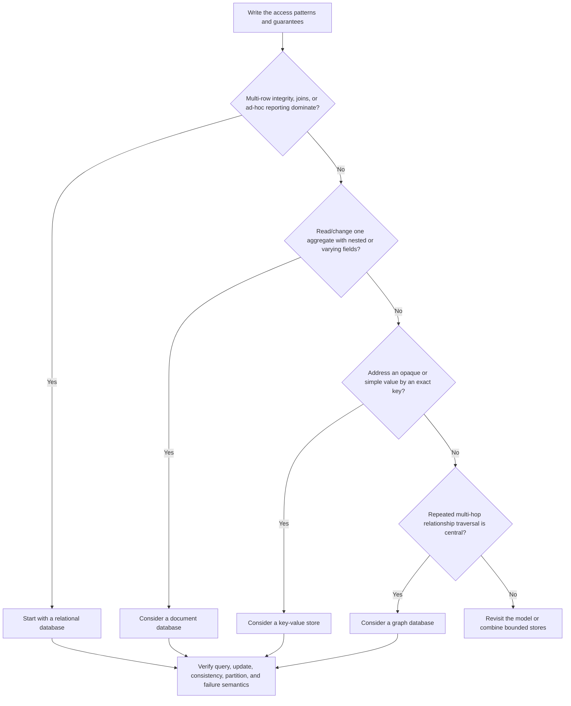
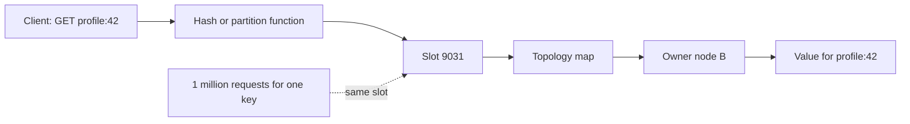

# SD-BEG-090 - Non-Relational Databases

> **Track:** Beginner
>
> **Artifact state:** Ready
>
> **Learning state:** Not started
>
> **Last updated:** 2026-09-01

## Source and coverage check

- Inspected: the complete timestamped transcript, all three supplied slide pages, the complete `14:31.166` video timeline at regular intervals, every visual transition, and the final `01:21` at five-second intervals.
- Coverage: complete from `00:00:01` through `00:14:31`; no missing ending or source gap was found.
- Unclear source points: the slides resolve automatic-caption errors for **PostgreSQL** and **Redis**. Broad claims about sharding, updates, queries, and transactions are teaching generalizations rather than guarantees shared by every non-relational product; verified boundaries appear below.
- Instructor-task scan: complete; one exercise was reconstructed from `00:13:40-00:14:22` and the final supplied slide: [explore MongoDB, Redis, and Neo4j locally](tasks/SD-BEG-090-T01/README.md).

## What I should be able to do

- Explain why “NoSQL” is an umbrella label, not one data model or one consistency/scaling contract.
- Start from concrete read, write, update, traversal, consistency, and failure requirements and choose among relational, document, key-value, and graph models.
- Trace a document field update, a key lookup through a partition router, and a graph traversal in mechanism order.
- Quantify the application-network cost of a read-modify-replace update and distinguish it from the storage engine’s internal write cost.
- Recognize hot keys, scatter/gather queries, lost updates, stale replicas, unbounded traversals, and dual-write drift from their evidence.
- Defend a database choice at SDE-2/SDE-3 level, including when a relational database remains the simpler answer.
- Use MongoDB, Redis, and Neo4j locally and capture evidence that demonstrates a capability instead of merely proving that a container started.

## Small bridge from earlier ideas

An **access pattern** is a specific question or mutation the application must execute, including its key, filter, ordering, result size, frequency, and correctness requirement. Examples are “get profile by user ID,” “increment unread count,” and “find the shortest follow path between two users.”

A **partition** or **shard** owns only part of a dataset. A **replica** holds another copy of some owner’s data. These are topology choices, not definitions of SQL or NoSQL. Relational systems can be sharded; a standalone NoSQL server is not sharded merely because its product supports a cluster mode.

That is enough background to study this lecture independently.

## The 60-second story

“Non-relational database” means a database that does not center the relational table-and-SQL model. It does **not** identify one uniform family. A document database stores self-contained records with nested fields and supports queries and field-level update operations. A key-value store optimizes operations addressed by a key; restricting the lookup contract makes routing and partitioning easier. A graph database stores nodes and relationships so multi-hop connectivity questions can follow edges directly.

The course’s central decision is sound: use the specialized model when its access pattern earns the specialization. Do not choose NoSQL because of the slogan “SQL does not scale,” and do not choose a graph database merely because almost anything can be drawn as a graph. State the required operations and guarantees first, then choose the least complex database that serves them reliably.

## Why the terms matter

| Term | Simple meaning | Why it matters here | Common confusion |
|---|---|---|---|
| NoSQL / non-relational | A broad label for databases not centered on the relational model | It starts a classification, not a design decision | It does not imply “no schema,” weak consistency, or automatic scale |
| Access pattern | One exact way the application reads or changes data | It determines useful keys, indexes, document boundaries, and graph paths | “We need CRUD” is too vague to be an access pattern |
| Document | A self-contained field/value record, often nested | Related fields can be read and updated as one aggregate | MongoDB stores BSON, not literal JSON text |
| Flexible schema | Documents in one collection may differ unless validation restricts them | Optional product or notification fields can evolve easily | Flexible does not mean structure-free or validation-free |
| Partial update | Ask the server to change selected fields instead of sending a replacement document | It reduces client round trips and can provide atomic field operations | The storage engine may still rewrite or reindex internal bytes |
| Key-value store | A database whose primary contract addresses a value by key | Direct key ownership supports predictable routing | Real products may also expose hashes, sets, indexes, scans, or transactions |
| Partition key | The input used to choose an owner shard | Its distribution controls balance and locality | A unique key can still create hot tenants or hot individual keys |
| Hot key | One key receives disproportionate traffic | One owner can saturate while average load looks healthy | More nodes do not split one indivisible key automatically |
| Node / relationship | An entity and a typed connection in a graph | They preserve adjacency for traversal queries | A relational foreign key also represents a relationship; the execution model differs |
| Traversal | Following relationships hop by hop | It answers reachability, path, neighborhood, and pattern questions | An unrestricted traversal can explode in work |
| Polyglot persistence | Use different stores for distinct bounded needs | One product need not serve every access pattern | It creates synchronization and operational costs, not free specialization |

## Big picture

### Question this visual answers

Which data model best matches the dominant operation without assuming that “NoSQL” is one thing?



### How to read this visual

Begin with operations and guarantees, then follow the first branch that describes the dominant workload. Reaching a model is only a candidate decision; the final box requires product-specific verification.

### Key insight

The deciding condition is not whether the data *can* be represented in a model. It is whether the important operations become simpler, safer, and economical in that model.

### Simplification or limitation

Production systems often have several important access patterns, managed-service constraints, compliance rules, migration costs, and team expertise. The diagram omits column-family, time-series, search, vector, and wide-column databases and does not imply that one service must own only one physical store.

## Core concepts

### 1. NoSQL is a negative label, not a shared contract

**Simple meaning:** “Non-relational” tells us what the database is not centered on; it does not tell us exactly what it is.

**Formal meaning:** The category includes products with different data models, query languages, transaction boundaries, consistency controls, indexing, durability, replication, and partitioning topologies. A product name plus deployment configuration is needed before making a guarantee.

**Why it exists:** Teams needed language for systems whose main interface was not normalized relations plus SQL. The label is convenient for a course map, but too broad for a production claim.

**How it works as a decision boundary:**

1. Name the logical model: document, key-value, graph, wide-column, time-series, search, or another model.
2. Name the product and exact deployment topology.
3. State the operation and guarantee being discussed.
4. Verify its transaction, consistency, durability, partition, and failure behavior.
5. Compare it with the simplest relational alternative.

**Small example:** “NoSQL scales” is untestable. “A six-node Redis Cluster assigns 16,384 hash slots across three primaries and routes `user:{42}:profile` by its hash slot” is a mechanism that can be inspected.

**Invariant or deciding condition:** Never transfer a guarantee from one non-relational product or topology to the whole category.

**Trade-off:** Specialized systems can expose a clean, efficient contract, but learning and operating several contracts costs more than operating one general-purpose database.

**Failure/observability:** Category-level thinking produces missing metrics. A useful runbook names owners, replicas, acknowledgment points, lag, key/partition distribution, query plans, locks, and recovery state for the actual product.

**When not to use the category as an answer:** In an interview or design document. Say “document model in MongoDB 8.0 on a three-member replica set,” not simply “use NoSQL.”

### 2. Choose by access pattern and correctness boundary

**Simple meaning:** Write down the questions the application asks before choosing how data is stored.

**Why it matters:** The same user data may need exact lookup by ID, filtering by city, transactional balance changes, full-text search, and friend-of-friend traversal. These operations reward different layouts and indexes.

**Problem it solves:** It prevents choosing a fashionable database and then forcing every operation through its weakest path.

**How it works:**

1. List reads with keys/filters, sort order, maximum result size, rate, and latency target.
2. List writes with fields changed, contention, idempotency, and atomicity scope.
3. State freshness, durability, availability, and recovery targets.
4. Model growth and skew, not only average record count.
5. Choose a candidate model and prove every critical path.

**Small example:** A session service needs `get(token)`, `put(token, session, ttl)`, and `delete(token)` at 100,000 operations/s; it never searches by a field inside the session. An exact-key store fits. If support staff must find sessions by email, that new access pattern needs an index, a second mapping, or a different store.

**Invariant or deciding condition:** Every required access pattern must have an owned execution path with a bounded cost and a stated correctness contract.

**Trade-off and alternatives:** Denormalizing for known patterns speeds reads but duplicates data and makes updates harder. A relational database with the right indexes may remain simpler when queries are varied.

**Failure/observability:** Record per-pattern latency, result cardinality, scanned-to-returned ratio, partition/key distribution, conflict/retry rate, and timeout/error cause.

**Changed requirement:** When an interviewer adds ad-hoc filtering, multi-entity atomicity, or strict read-after-write behavior, revisit the model rather than adding hand-waving.

### 3. Document databases store aggregates, not “schema-free blobs”

**Simple meaning:** A document keeps related fields and nested values together as one addressable record.

**Course model:** Document databases are the closest of the three covered categories to relational databases because they commonly provide rich filters, aggregations, and field-level update commands. The course names MongoDB and Elasticsearch and uses in-app notifications and product catalogs as examples.

**Precise boundary:** MongoDB stores BSON documents. Documents in one collection can have different fields, but applications still depend on a schema, and MongoDB can enforce collection validation. Elasticsearch accepts JSON documents and partial update requests, but it is primarily a search and analytics engine; its update API still indexes the resulting document internally.

**How a MongoDB field update works conceptually:**

1. The client targets one document with a predicate such as `_id = "book-1"`.
2. The client sends an update expression such as `$inc: {stock: 1}`.
3. The server locates the document and applies the operator atomically within that document.
4. The server persists/replicates according to configured write concern.
5. The response reports match and modification state; a later read verifies the value.

**Small example:** Two product documents both require `title` and `stock`; a shirt also has `size`, while a book has `author`. This flexibility avoids a single table containing many irrelevant nullable columns, but validation may still require `title` and non-negative `stock`.

**Invariant or deciding condition:** Fields that must change atomically together should usually live inside the same document boundary, within size and contention limits.

**Trade-off:** Embedding improves locality and single-document atomicity. Large or frequently changing embedded arrays can create hot, growing documents; referencing separates lifecycle but adds queries or application joins.

**Failure/observability:** Watch document size, update conflicts/retries, write concern errors, replication lag, slow queries, scanned/returned ratio, index usage, cache behavior, and shard-key targeting.

**When not to use it:** When many independent entities require cross-record constraints and joins, ad-hoc relational queries dominate, or document duplication creates unsafe write fan-out.

**Changed requirement:** If one catalog update must atomically adjust inventory, ledger, payment, and shipment rows across boundaries, a relational transaction or carefully designed saga/outbox may be safer than expanding one document indefinitely.

### 4. Key-value stores trade query freedom for a narrow fast path

**Simple meaning:** Supply a key; the database finds the owner and performs an operation on the associated value.

**Course model:** The minimal interface is like `GET(k)`, `PUT(k,v)`, and `DELETE(k)`. Redis calls its write command `SET`, not `PUT`. The course names Redis, DynamoDB, and Aerospike and gives profile, order, authentication, and message lookup examples.

**How exact-key routing works:**

1. The client or cluster computes a partition/slot from the key.
2. A topology map identifies the node that owns that partition.
3. The request goes to that owner; no value-field search is needed.
4. The owner performs the product-specific command and acknowledgment.
5. Replicas receive changes according to the configured topology.

**Small example:** `session:9f2a -> {user_id: 42, expires_at: ...}` supports get/delete by token. It does not automatically support “find every active session for user 42.” Add a user-to-session mapping or choose a queryable model if that operation is required.

**Invariant or deciding condition:** The key must be known or derivable for every critical lookup, and its owner must be uniquely resolvable at a given topology version.

**Trade-off:** A narrow path makes latency and horizontal placement predictable. Secondary access, multi-key atomicity, range scans, and large values may be limited or expensive.

**Product-specific correction:** “Key-value stores require read-whole-value and replace-whole-value” is not universal. Redis has atomic commands such as `INCR`; DynamoDB `UpdateItem` can change attributes conditionally. Conversely, some blob-style stores expose only whole-value replacement.

**Failure/observability:** Watch p50/p99 command latency, hit/miss rate, evictions, memory fragmentation, expired keys, replication/cluster health, redirections, per-key/slot traffic, rejected connections, and persistence errors.

**When not to use it:** When the application cannot name keys, needs many unpredictable filters/aggregations, or depends on broad multi-entity transactions.

**Changed requirement:** If one celebrity account creates a hot key, adding shards will not divide that key automatically. Split counters, cache copies, batch updates, or redesign ownership while preserving a reconciliation invariant.

### Question this visual answers

How does a key become a shard decision, and where can scale fail?



### How to read this visual

The routing path is left to right. Many different keys can distribute over many slots, but repeated requests for the same key always converge on the same ownership point unless the application adds another layer.

### Key insight

Partitionability gives aggregate scale across keys; it does not guarantee that one key or one tenant can use the whole cluster.

### Simplification or limitation

The picture omits replicas, topology changes, client caches, quorum rules, hash tags, virtual nodes, migration, and multi-key restrictions. Products use different partition functions and routing layers.

### 5. Graph databases optimize relationship traversal

**Simple meaning:** Store entities as nodes and connections as first-class relationships, then match or traverse relationship patterns.

**Course model:** Graph databases bundle graph data structures and graph-oriented operations. The lecture names Neo4j, Amazon Neptune, and Dgraph; examples include follows, purchases, social networks, recommendations, and fraud detection.

**Why it exists:** In highly connected domains, repeatedly joining edge tables can make multi-hop queries hard to express, plan, and keep predictable. A graph engine preserves adjacency and provides a graph query language and traversal operators.

**How a traversal works conceptually:**

1. An indexed predicate binds a small start set, such as user `Asha`.
2. The query specifies allowed relationship types, direction, depth, and predicates.
3. The engine expands adjacent relationships and tracks candidate paths.
4. A path selector such as shortest-by-hops prunes or ranks candidates.
5. The query returns nodes, relationships, paths, or aggregates.

**Small example:** `Asha -> Ben -> Chen` through `FOLLOWS` has two hops. Adding `Asha -> Chen` changes the shortest path to one hop. That change is the controlled variation in the instructor task.

**Invariant or deciding condition:** Use a graph model when relationship traversal or graph algorithms are a central, repeated requirement—not merely because the domain can be drawn as boxes and arrows.

**Trade-off:** Traversals and relationship patterns become direct. High-volume tabular aggregates, bulk scans, simple key lookups, and cross-system transactions may be cheaper elsewhere; graph expertise and operations are additional costs.

**Transaction boundary correction:** Neo4j database operations execute in ACID transactions. The course warning is best understood as workload fit: a graph store is not automatically the best system of record for ordinary relational OLTP merely because transactions contain relationships.

**Failure/observability:** Watch starting-node cardinality, rows expanded per operator, path length, query memory, transaction/lock waits, page-cache hit rate, heap/GC, checkpoint and transaction-log health, cluster role, and query timeouts.

**When not to use it:** For exact-key retrieval, straightforward CRUD, simple one-hop joins already handled efficiently by a relational index, or workloads with no bounded traversal predicate.

**Changed requirement:** If the interviewer asks for weighted recommendations over billions of edges, distinguish online neighborhood queries from offline graph analytics. The latter may require projections, batch processing, or a dedicated graph-data-science engine.

## Worked example and calculations

### Assumptions

- Course example document size: `1 KiB = 1,024 bytes`.
- Client-side read-modify-replace: one 1 KiB response plus one 1 KiB replacement request; protocol headers and acknowledgments are excluded.
- Server-side field command: assume `64 bytes` request plus `32 bytes` response as an illustrative wire estimate, not a vendor measurement.
- Workload: `50,000 increments/second` sustained.

### Steps

Client-side read-modify-replace payload per increment:

```text
1,024-byte read response + 1,024-byte replacement request
= 2,048 bytes/increment
```

At 50,000 increments/second:

```text
2,048 bytes/increment x 50,000 increments/second
= 102,400,000 bytes/second
≈ 97.7 MiB/second
```

Illustrative server-side command payload:

```text
(64 + 32) bytes/increment x 50,000 increments/second
= 4,800,000 bytes/second
≈ 4.58 MiB/second
```

Illustrative application-wire reduction:

```text
1 - (96 / 2,048) = 0.953125 ≈ 95.3%
```

Concurrency also changes. If clients A and B both read `270`, both compute `271`, and both replace the document, one increment is lost. A product-supported atomic increment serializes the update at the owning record/key and ends at `272`.

### Result and sanity check

The course’s “2 KiB for one small update” intuition is correct for the simplified application payload. The exact savings depend on compression, framing, response shape, retries, and document size. It does **not** prove that only a few bytes reach storage: MongoDB must persist and replicate the logical change, and Elasticsearch’s partial update API still indexes the resulting document internally.

### Capacity extension: partitions do not remove replication cost

Suppose `300 million` profiles average `2 KiB`:

```text
300,000,000 x 2 KiB = 600,000,000 KiB ≈ 572 GiB raw
572 GiB / 6 primary shards ≈ 95.4 GiB per primary on average
572 GiB x replication factor 3 ≈ 1.68 TiB before indexes and overhead
```

Six shards divide primary ownership, but a three-copy durability plan still stores about three times the raw logical bytes. “Average 95 GiB” also hides skew; one hot tenant can dominate a shard.

## Deep mechanism

### Components, ownership, and boundaries

| Model | Logical ownership unit | Efficient primary path | Typical boundary that changes guarantees |
|---|---|---|---|
| Document | document / shard-key range | ID lookup, indexed filter, document update/aggregation | single document vs multi-document transaction; one shard vs many |
| Key-value | key / hash slot / partition | exact-key command | one key vs multiple keys; one slot vs cross-slot operation |
| Graph | node/relationship subgraph plus transaction | bounded pattern/traversal from selective anchors | one transaction, one database/cluster, online traversal vs offline analytics |

The public API, driver, router, storage engine, replication layer, and control plane may be separate components. A client acknowledgment proves only the configured write contract—not universal durability or replica visibility.

### Ordering, concurrency, and stale state

- **Document lost update:** read `stock=2`, compute `3`, replace the document while another client does the same. Protect with an atomic operator, version predicate, transaction, or compare-and-set.
- **Atomic scope:** MongoDB single-document operations are atomic. Multi-document work has a different transaction and performance boundary.
- **Key command scope:** Redis `INCR` is atomic as one command. `GET`, application arithmetic, and `SET` are three steps and can lose concurrent updates unless guarded.
- **Multi-key placement:** A clustered key-value product may restrict atomic operations to co-located keys. Redis Cluster hash tags can deliberately co-locate related keys, trading distribution for multi-key locality.
- **Graph expansion:** Two concurrent graph transactions can contend on the same nodes/relationships. A traversal also sees a transactionally defined snapshot/state according to the product and query.
- **Replica staleness:** Document, key-value, and graph systems can all use replication. Reading a lagging replica may return older state even after a successful primary write.

### Failure and recovery

| Failure | Observable symptom | Mechanism | Protection/recovery | Remaining risk |
|---|---|---|---|---|
| Bad partition key | one shard’s CPU/latency rises while others idle | traffic or storage is skewed | tenant bucketing, salting, split hot state, reshard, admission control | extra reads/reconciliation and migration risk |
| Scatter/gather query | high fan-out, scanned/returned ratio, tail latency | filter does not target an owner/index | redesign key/index, precompute, route to search/analytics | duplicated data and freshness lag |
| Lost update | final counter lower than accepted operations | client read-modify-write races | atomic update, version check, transaction, idempotent event log | retries and contention remain |
| Oversized/hot document | write latency, conflicts, growth, relocation pressure | too much mutable state shares one document | cap/split arrays, separate lifecycle, bucket by time | more queries and consistency work |
| Key eviction/expiry | miss rate jumps; value disappears | memory policy or TTL removes key | treat cache as disposable, rebuild, alert on eviction/expiry | stampede against source of truth |
| Replica lag/failover | stale reads or missing recent acknowledged writes | replica has not received/applied changes | choose acknowledgment/read concern, measure lag, fence promotion | latency/availability trade-off |
| Unbounded graph traversal | query memory/CPU and latency explode | broad start set or depth/predicate is unconstrained | index anchors, bound type/direction/depth, timeout, precompute | legitimate deep queries remain costly |
| Dual-write drift | source and secondary store disagree | one write succeeds and the other fails/reorders | outbox/CDC, idempotent consumers, replay and reconciliation | temporary staleness and repair ownership |

### Observability

For every database, start with request rate, p50/p95/p99 latency, errors/timeouts, saturation, storage growth, connection/transaction pressure, and replication/backup state. Then add model-specific evidence:

- document: matched/modified counts, document and array size, index usage, keys/docs examined, shard targeting, write conflicts;
- key-value: hit/miss, keyspace size, memory/eviction/expiry, hot keys/slots, command mix, redirections, persistence state;
- graph: starting cardinality, rows/relationships expanded, path depth, plan operators, transaction/lock waits, heap/page cache, query timeouts;
- polyglot pipeline: outbox backlog, consumer lag, duplicate/retry count, source-to-index freshness, reconciliation mismatches.

An alert is actionable when it points to a violated service objective and an owner action. “NoSQL CPU > 80%” without the product, role, workload, and queue/latency state is not enough.

## Design choices

| Choice | Benefits | Costs/risks | Prefer when | Avoid when |
|---|---|---|---|---|
| Relational tables | constraints, joins, mature transactions, flexible SQL | object/graph impedance; manual sharding can be complex | cross-entity integrity and varied queries dominate | the model repeatedly fights one specialized high-scale access path |
| Document database | aggregate locality, nested data, rich queries, atomic document updates | duplication, document growth, cross-document coordination | one aggregate owns related mutable fields; fields vary | broad joins and multi-entity invariants dominate |
| Key-value store | direct lookup, simple partition routing, low latency | limited secondary access; hot keys; product-specific multi-key limits | key is known for nearly every critical operation | unpredictable filters/aggregations are core |
| Graph database | direct relationship patterns and multi-hop traversal | specialized query/ops skills; traversal explosion risk | bounded connectivity/path questions dominate | simple CRUD or one-hop relations already fit ordinary indexes |
| Elasticsearch as secondary index | powerful text/filter/aggregation search | eventual sync, reindexing, duplicate state | search is derived and rebuildable from a source of truth | it would become an accidental transactional system of record |
| One database for everything | simplest operations and consistency boundary | some access paths may be inefficient | scale and SLOs fit a general-purpose store | evidence shows one specialized workload cannot meet its target |
| Polyglot persistence | each workload gets a fitting model | CDC/outbox, drift, cost, on-call surface | specialization produces a measured, material benefit | the team cannot own synchronization and recovery |

## Misconceptions

| Claim/confusion | What is actually true | Evidence or counterexample |
|---|---|---|
| “Relational databases do not scale; NoSQL databases do.” | Both can scale vertically and horizontally. Some NoSQL products package partition routing more directly; topology and workload determine results. | PostgreSQL/MySQL can be sharded; standalone MongoDB/Redis/Neo4j is one node. |
| “All NoSQL databases are similar.” | Document, key-value, graph, search, and wide-column products expose different models and guarantees. | A shortest-path query and an exact-key GET are different mechanisms. |
| “NoSQL means no schema.” | Schema moves into documents, validation, indexes, drivers, and application contracts; it does not disappear. | MongoDB supports collection schema validation. |
| “A partial update writes only the changed bytes everywhere.” | It reduces client work and can be atomic at the logical record; internal storage/replication behavior varies. | Elasticsearch explicitly gets the document, runs the update, and indexes the result. |
| “Key-value stores cannot update part of a value.” | Some opaque-value stores replace values, while products such as Redis and DynamoDB expose atomic field/counter commands. | `INCR` and `UpdateItem` are counterexamples. |
| “Key-value means exactly three commands.” | GET/SET/DELETE is the conceptual core, not a universal product limit. | Redis exposes strings, hashes, sets, streams, scripts, transactions, and more. |
| “Anything representable as a graph belongs in a graph database.” | Representation is cheap; repeated multi-hop traversal/algorithms must justify the specialization. | An order lookup by ID remains an exact-key or indexed-row problem. |
| “Graph databases do not support ACID transactions.” | Neo4j documents ACID transactions; the design question is workload fit and transaction boundary. | Graph traversal strength does not erase transactional capability. |
| “Adding shards fixes a hot key.” | One key still maps to one ownership point unless the logical key is split or replicated at another layer. | One million requests for `celebrity:1` converge on its owner. |

## Real backend connection

Consider an e-commerce backend with four bounded needs:

1. **Orders and payments:** PostgreSQL remains the source of truth because cross-row constraints, ledgers, and transactions matter.
2. **Catalog:** MongoDB can hold a product aggregate with category-specific attributes and field-level stock or metadata updates, provided inventory correctness boundaries are explicit.
3. **Session/cache:** Redis can serve `session_token -> session` and short-lived product cache entries by exact key and TTL.
4. **Recommendations/fraud exploration:** Neo4j can represent users, products, devices, and typed relationships for bounded path/pattern queries.
5. **Text search:** Elasticsearch can index a derived catalog projection for relevance and facets.

A FastAPI request should not write all five systems synchronously and hope. Commit the authoritative change once, record an outbox event in the same transaction, publish idempotently, update projections, and measure lag. Each consumer owns a replayable, versioned projection. A reconciliation job compares authoritative versions with derived versions.

Example catalog document (illustrative, not Rahul’s production experience):

```json
{
  "_id": "product-42",
  "title": "Travel Mug",
  "category": "kitchen",
  "stock": 270,
  "attributes": {
    "capacity_ml": 450,
    "colour": "blue"
  },
  "version": 18
}
```

Useful APIs and access patterns:

| API | Access pattern | Likely owner |
|---|---|---|
| `GET /products/{id}` | exact ID, optional cached projection | catalog document store / Redis cache |
| `GET /products?query=&category=` | text, filters, facets | search index |
| `PATCH /products/{id}/stock` | atomic conditional field update | authoritative inventory boundary |
| `GET /users/{id}/recommendations` | bounded relationship traversal or offline-ranked result | graph/analytics pipeline plus cache |
| `POST /orders` | multi-entity transaction and idempotency | relational order/ledger store |

The architectural invariant is explicit authority: every business fact has one canonical write owner; other stores are derived, versioned, and repairable.

## Instructor-assigned tasks

| Task | Faithful purpose | Tools | Reference verified? | Learner status |
|---|---|---|---|---|
| [`SD-BEG-090-T01`](tasks/SD-BEG-090-T01/README.md) | Run MongoDB, Redis, and Neo4j locally and explore representative capabilities | Docker Compose, MongoDB, Redis, Neo4j, Python verifier | Partial: Redis/Neo4j passed; MongoDB skipped on incompatible host kernel | Not started |

The instructor presents this as one exercise with three required database explorations. The task keeps one ID and gives each service an independent Compose profile so they can be run sequentially.

### Codex-added practice

1. **Predict:** For `GET product by ID`, `filter products by optional attribute`, and `shortest follow path`, name the cheapest model and the query that would be awkward there.
2. **Draw:** Recreate the decision flow from access patterns to a candidate database model.
3. **Explain:** Why does restricting access to a key help partition routing without guaranteeing absence of hot keys?
4. **Change:** A catalog now needs an atomic order/payment/inventory transaction. Decide whether to change the source of truth, the document boundary, or the workflow.

## Useful English and technical phrases

### Heterogeneous

- Pronunciation: `het-uh-ruh-JEE-nee-us`
- Simple meaning: made of unlike kinds
- Hindi cue: alag-alag prakaar ka
- Why it matters here: non-relational databases are a heterogeneous category.
- Common misuse: saying “heterogenous”; the standard spelling is **heterogeneous**.

Examples:

1. Simple: The box contains heterogeneous items.
2. Engineering: Our workload is heterogeneous: point reads, search, and long traversals.
3. Engineering: A single benchmark hides heterogeneous key sizes.
4. Interview: “NoSQL is heterogeneous, so I need the product and topology before stating guarantees.”
5. Design review: “We should separate these heterogeneous access patterns before choosing storage.”

### Aggregation

- Pronunciation: `ag-ri-GAY-shun`
- Simple meaning: combining many records into a summary
- Hindi cue: kai values ka saar
- Why it matters here: document/relational engines often support grouping, counts, and sums; pure exact-key access does not answer them directly.
- Common misuse: using aggregation to mean any read of several records.

Examples:

1. Simple: The report uses an aggregation to total sales.
2. Engineering: The aggregation groups products by category.
3. Engineering: This query scans ten million records to return twelve groups.
4. Interview: “I would move this aggregation off the request path or maintain a projection.”
5. Design review: “The aggregation’s freshness target determines whether precomputation is acceptable.”

### Traversal

- Pronunciation: `truh-VUR-suhl`
- Simple meaning: moving through connected items step by step
- Hindi cue: sambandhon ke raaste chalna
- Why it matters here: graph databases specialize in bounded relationship traversal.
- Common misuse: calling a direct lookup a traversal.

Examples:

1. Simple: The traversal follows the path from Asha to Chen.
2. Engineering: The query bounds traversal depth to four hops.
3. Engineering: A selective start node prevents a graph-wide traversal.
4. Interview: “The graph store is justified because multi-hop traversal is on the critical path.”
5. Design review: “We need a timeout and expansion metric for this traversal.”

### Opaque value

- Pronunciation: `oh-PAYK VAL-yoo`
- Simple meaning: a value the routing layer does not inspect
- Hindi cue: andar ka data router ko samajh nahi aata
- Why it matters here: a minimal key-value contract routes by key and may treat the value as an uninterpreted byte/string payload.
- Common misuse: assuming every key-value product treats every value as opaque.

Examples:

1. Simple: The token maps to an opaque value.
2. Engineering: The router hashes the key and never parses the opaque value.
3. Engineering: Searching one field inside the opaque value needs another index.
4. Interview: “If the value must become queryable, I would revisit the model or add an owned projection.”
5. Design review: “Encryption makes this field opaque to the database index.”

## Interview practice

### Foundation

**Question:** What is a non-relational database, and why is “NoSQL scales” an incomplete answer?

**Strong answer covers:** umbrella category; document/key-value/graph differences; relational systems can shard; NoSQL products/topologies differ; access pattern and guarantees decide; one concrete example.

**Weak-answer trap:** “NoSQL has no schema, no joins, no transactions, and scales horizontally.” Every clause is too broad.

### SDE-2 working engineer

**Question:** A profile endpoint reads by user ID at 40,000 requests/s, updates one counter at 5,000 requests/s, and occasionally filters by city. Would you choose a key-value or document database?

**Reasoning checkpoints:**

1. Clarify freshness, durability, profile size, city-filter frequency/result size, write contention, and current database evidence.
2. Exact ID reads fit both; atomic counter support must be product-specific.
3. City filtering needs a maintained secondary access path; decide whether it belongs in the request store, a projection, or analytics.
4. Select a partition key and test tenant/key skew.
5. Define conditional update/idempotency and read-after-write behavior.
6. Measure p99 latency, conflict/retry rate, hot-key distribution, replication lag, and projection freshness.

**Follow-up:** One profile receives 20% of all counter writes. Explain why adding shards may not help and propose a split-counter/reconciliation design.

### SDE-3 senior design

**Prompt:** Design storage for a marketplace catalog with flexible attributes, exact product lookup, filtered search, inventory changes, and “customers who viewed this also viewed” recommendations.

**Clarify first:**

- scale: products, average/p99 document size, reads/writes per second, attribute cardinality, relationship edges;
- latency: endpoint p95/p99 and batch deadlines;
- consistency: inventory correctness, catalog freshness, search/recommendation lag;
- durability/availability: RPO, RTO, regional failures, degraded-mode behavior;
- cost/ownership: managed services, team expertise, migration and on-call budget.

**Estimate:** At `10 million products x 2 KiB`, raw catalog data is about `19.1 GiB`; with three copies it is about `57.2 GiB` before indexes. This size alone does not force sharding. Query/write rate, working set, search indexes, and growth headroom may matter more.

**API/data model:**

- `GET /products/{id}` -> product aggregate by ID;
- `GET /search?q=&filters=` -> derived search projection;
- `PATCH /inventory/{sku}` -> authoritative conditional inventory update with idempotency key;
- `GET /products/{id}/related` -> precomputed or bounded graph result.

**High-level design:** Keep inventory/order authority in a transactional store; store the catalog aggregate in a document model if flexible fields and document queries justify it; use Redis only for disposable exact-key cache/session state; derive search and relationship projections via an outbox/CDC pipeline. A graph store is optional and must beat offline/precomputed recommendations on a measured requirement.

**Bottlenecks:** hot SKU, oversized documents, scatter/gather attribute filters, search indexing lag, high-fan-out relationships, cache stampede, and change-event backlog.

**Reliability:** idempotent consumers, versioned events, dead-letter/retry policy, reconciliation, bounded stale fallback, backup/restore tests, and explicit source-of-truth ownership.

**Observability:** per-access-pattern p99, conditional-write conflicts, shard/key skew, cache hit/eviction, outbox/consumer lag, source-to-index version difference, graph expansion/path depth, and restore/failover objectives.

**Trade-offs:** One relational database plus JSON/indexes may be enough initially and greatly simplify correctness. Add a specialized store only when evidence shows a critical access pattern cannot meet its SLO economically.

**Requirement change:** If search must reflect inventory in under `100 ms`, either keep inventory filtering at the authoritative service, push a bounded synchronous invalidation/update path with failure handling, or reject the requirement as inconsistent with the chosen asynchronous projection. State the availability and latency cost.

## Course, verified extensions, and uncertainty

### Course model

- Non-relational databases are a broad, non-uniform category.
- Many products make horizontal partitioning easier than traditional single-node relational deployments, but the slogan “NoSQL scales and SQL does not” is misleading.
- Document databases commonly support rich queries and partial document updates; MongoDB/Elasticsearch, notification feeds, and catalogs illustrate the model.
- Key-value stores restrict the main access path to a key, which enables simple partition routing and fits profiles, orders, auth objects, and messages.
- Graph databases are justified by graph traversal/algorithm needs, not merely graph-shaped representation.
- The exercise asks Rahul to run MongoDB, Redis, and Neo4j locally and explore their capabilities.

### Verified extensions

- MongoDB stores [BSON documents](https://www.mongodb.com/docs/v8.0/core/document/), `$inc` is [atomic within one document](https://www.mongodb.com/docs/manual/reference/operator/update/inc/), and sharding is an explicit [cluster topology](https://www.mongodb.com/docs/manual/sharding/), not a property of every standalone instance.
- Elasticsearch’s partial update API reduces client round trips but still [gets the document, runs the update, and indexes the result](https://www.elastic.co/docs/api/doc/elasticsearch/v8/operation/operation-update).
- Redis `INCR` is an [O(1) atomic counter command](https://redis.io/docs/latest/commands/incr/). Horizontal placement belongs to [Redis Cluster](https://redis.io/docs/latest/operate/oss_and_stack/management/scaling/), which assigns 16,384 hash slots and has explicit multi-key and consistency rules.
- DynamoDB’s [UpdateItem](https://docs.aws.amazon.com/amazondynamodb/latest/APIReference/API_UpdateItem.html) can change selected attributes conditionally, so whole-value replacement is not universal among key-value systems. The original [Dynamo paper](https://www.amazon.science/publications/dynamo-amazons-highly-available-key-value-store) motivates a highly available primary-key store; Dynamo and the managed DynamoDB service are related but not identical products.
- Neo4j operations use [ACID transactions](https://neo4j.com/docs/operations-manual/current/database-internals/transaction-management/), and modern Cypher supports explicit [shortest-path selectors](https://neo4j.com/docs/cypher-manual/current/patterns/shortest-paths/).

### Inferences and practical connections

- **Inference:** A document database is a natural notification-feed candidate when each notification is retrieved as a user-owned aggregate/projection and types carry different payload fields. Ordering, unread counts, fan-out, retention, and idempotency still need explicit design.
- **Inference:** A relational database with JSON/JSONB and suitable indexes may cover an early catalog more cheaply than a new document system. Move only after measuring a material mismatch.
- **Inference:** Search and graph stores are often derived projections rather than business authorities; this keeps specialized reads without asking every store to participate in one distributed transaction.

### Unresolved source points

- None that blocks learning or task reconstruction. Product-wide claims are intentionally bounded above rather than treated as literal universal guarantees.

## Final revision card

### Five facts

1. NoSQL is an umbrella label; the product, topology, operation, and guarantee make a claim precise.
2. Document stores optimize aggregate-shaped data and document-level queries/updates; flexible schema still needs contracts and validation.
3. Key-value stores make exact-key access and partition routing simple, but secondary access and hot keys remain design problems.
4. Graph stores earn their complexity when bounded relationship traversals or graph algorithms are central.
5. Relational databases can scale, and non-relational databases can provide transactions; slogans do not replace product-specific evidence.

### Three decisions

1. Choose a document model when related mutable fields belong to one aggregate and rich document queries matter.
2. Choose a key-value model when every critical lookup derives a key and secondary queries are explicitly owned elsewhere.
3. Choose a graph model when repeated multi-hop relationship work is critical and measurably awkward in the simpler store.

### One failure

Hot key -> one owner saturates while cluster averages look healthy -> inspect per-key/slot traffic and owner latency -> split/bucket or cache the logical key with a reconciliation invariant -> accept added complexity and possible temporary staleness.

### Natural 60-second explanation

Start with: “Non-relational is a broad category, not one guarantee.” Then compare the three access paths: document aggregate plus field/query operations; exact-key routing plus simple partition ownership; relationship traversal plus graph path operators. Give one use case for each. Correct the scale myth by separating model from topology. End with the rule: write access patterns and correctness needs first, then choose the least complex product/topology that proves them.

See [review.md](review.md) for closed-book retrieval.
