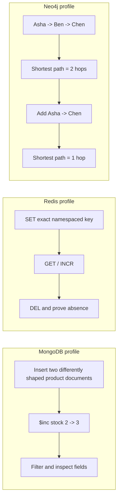

# SD-BEG-090-T01 - Explore MongoDB, Redis, and Neo4j locally

> Instructor-assigned task from `SD-BEG-090`. Attempt before opening `reference/SOLUTION.md`.

## Source and fidelity

- Source timestamp/slide: `00:13:40-00:14:22`; final supplied slide exercise.
- Faithful paraphrase: on your local machine, start MongoDB, Redis, and Neo4j (the instructor also permits another preferred graph database), interact with each, and learn the kinds of features and capabilities each database style provides.
- Short exact excerpt: Not needed; the spoken exercise and final slide agree.
- Source ambiguity: “play around” does not define commands, dataset, success evidence, versions, authentication, duration, cleanup, or which capabilities must be observed. The source names Neo4j while verbally allowing another graph database. This pack uses Neo4j because it is named explicitly and keeps all three explorations deterministic.

The source presents one exercise with three databases. This pack therefore uses one task ID and three independently runnable profiles rather than inventing three separate assignments.

## Exact requirement checklist

- [ ] Run MongoDB on the local machine.
- [ ] Interact with MongoDB and inspect representative document-database capabilities.
- [ ] Run Redis on the local machine.
- [ ] Interact with Redis and inspect representative key-value capabilities.
- [ ] Run Neo4j, or a chosen graph database, on the local machine.
- [ ] Interact with the graph database and inspect representative relationship/traversal capabilities.
- [ ] Explain what each database makes easy and where its access model becomes awkward.

## Codex-added safety or verification

These are additions, not instructor wording:

- Use exact images `mongo:8.0.29-noble`, `redis:8.10.1-alpine3.23`, and `neo4j:2026.07.1`, resolved from official sources on 2026-09-01.
- Use one exact Compose project, `sd-beg-090-t01`, and three labeled volumes owned only by this task.
- Bind only to loopback: MongoDB `127.0.0.1:55901`, Redis `127.0.0.1:55902`, Neo4j Bolt `127.0.0.1:55903`, and Neo4j HTTP `127.0.0.1:55904`.
- Use synthetic local credentials and deterministic data. Never point these commands at another database, Docker context, cloud service, or existing personal dataset.
- Run the three services sequentially unless you intentionally accept the larger combined memory cost.
- Demonstrate: heterogeneous document fields plus an atomic document increment; exact-key SET/GET/DELETE plus atomic `INCR`; nodes/relationships plus a shortest-path query.
- For the changed condition, add one direct graph relationship and predict the path length before running the query again.
- Capture product version, exact container/volume identity, command result, state, explanation, and scoped cleanup. Container startup alone is not completion evidence.

## Inputs, constraints, and expected artifact

| Item | Contract |
|---|---|
| Input | Two synthetic products, three task-namespaced Redis keys, and three synthetic people with `FOLLOWS` relationships |
| Constraints | Local Docker Unix-socket context; exact task project/labels/volumes; loopback-only ports; no real data or cloud credentials; services may run one at a time |
| Output | Rahul’s commands/queries and observed results for all three databases, followed by a comparison in his own words |
| Completion evidence | MongoDB field/schema and update evidence; Redis exact-key/delete/counter evidence; Neo4j node/edge/path evidence; one predicted path variation; versions and scoped identities; safe stop/reset evidence |

## Required visual

### Question this visual answers

What different state transition must Rahul expose in each database, and which one condition changes?



### How to read this visual

Each box group is independent and can run after the prior service is stopped. Inside a group, arrows show state changes. Only the Neo4j group contains the required variation: one new relationship changes the shortest path.

### Key insight

The useful evidence differs by model. A document field change, a key command result, and a path-length change reveal capabilities that a health check cannot.

### Simplification or limitation

These are single-node learning instances. They do not demonstrate sharding, replication, failover, backup, TLS, production authentication, or throughput. The tiny graph does not establish performance at scale.

## Before you start: predict

Write in `ATTEMPT.md` before running:

1. which field differs between the two MongoDB documents and the expected stock value after one atomic increment;
2. the exact Redis values after `SET`, `INCR`, and `DELETE`;
3. the Neo4j shortest path before and after adding a direct relationship;
4. the atomicity/ownership boundary each observation does and does not prove;
5. the identity, version, and state evidence that would falsify your prediction.

## Setup

The stack contains three isolated task services, but you can run one profile at a time. A warm sequential run normally uses less than 1.2 GiB peak memory, under 1 CPU core outside startup, less than 100 MiB of task data, and roughly 1-1.5 GiB of downloaded/unpacked images in total. A cold pull may take several minutes; fixtures take under five seconds per service.

**Observed host boundary:** this repository host reports Linux kernel `7.0.0-30-generic`. MongoDB `8.0.29` refuses to start because MongoDB documents kernels `6.19` through `7.0.13` as incompatible. The reference verifier safely records MongoDB as skipped here and continues Redis/Neo4j. Do not bypass the MongoDB safety check. Complete that sub-requirement on a host kernel outside the incompatible range (MongoDB’s release note says `7.0.14` and later resolves this specific boundary), then rerun the exact preflight and verifier.

From this task directory:

```bash
python3 lab/preflight.py

docker compose -f lab/compose.yaml --project-name sd-beg-090-t01 --profile mongo up -d mongo
docker compose -f lab/compose.yaml --project-name sd-beg-090-t01 --profile mongo ps

docker compose -f lab/compose.yaml --project-name sd-beg-090-t01 --profile redis up -d redis
docker compose -f lab/compose.yaml --project-name sd-beg-090-t01 --profile redis ps

docker compose -f lab/compose.yaml --project-name sd-beg-090-t01 --profile neo4j up -d neo4j
docker compose -f lab/compose.yaml --project-name sd-beg-090-t01 --profile neo4j ps
```

Start the next service after stopping the previous one when memory is limited. Use [the lab guide](lab/README.md) for health checks, exact clients, reset boundaries, and troubleshooting.

## Learner steps

1. Run the read-only preflight. Confirm the Unix-socket Docker context, exact project, images, loopback ports, task labels, volumes, namespaces, and recoverable stop/reset plan.
2. Start only MongoDB. Record its version and runtime identity. Create two product documents with a shared core and one different optional field.
3. Filter the documents, aggregate by category, atomically increment one stock field, and prove the other fields remain intact. Explain why this is not evidence for multi-document atomicity or cluster sharding.
4. Stop MongoDB. Start only Redis. Record its version and identity. Use namespaced keys to SET, GET, increment, delete, and prove absence.
5. Explain why `INCR` avoids a client-side GET/compute/SET race while a larger multi-command workflow needs another atomicity mechanism.
6. Stop Redis. Start only Neo4j. Record its version and identity. Create three nodes and two directed `FOLLOWS` relationships, then query the shortest path from Asha to Chen.
7. Predict the new result, add the direct Asha-to-Chen relationship, and repeat the path query.
8. Compare the three models: primary access path, atomic scope observed, awkward query, likely failure, and metric you would monitor.
9. Stop all task services, retaining only the three exact labeled volumes. Record whether cleanup ran and what remains recoverable.

## Progressive hints

<details><summary>Hint 1 - requirement</summary><p>For each database, define one observable capability. “The process is healthy” proves setup, not the data model.</p></details>

<details><summary>Hint 2 - invariant</summary><p>Keep every test value inside the task’s exact database, key prefix, or node label/property. Never use a broad delete.</p></details>

<details><summary>Hint 3 - document mechanism</summary><p>Use two documents with the same required core but one optional field, then use a server-side numeric update operator on one document.</p></details>

<details><summary>Hint 4 - key mechanism</summary><p>Redis uses `SET` for the conceptual PUT operation. A single counter command is a stronger concurrency boundary than three client operations.</p></details>

<details><summary>Hint 5 - graph mechanism</summary><p>Bind the start and end nodes by task property and name, then constrain traversal to one relationship type and a small maximum depth.</p></details>

## Acceptance criteria

- [ ] Preflight proves the expected local context, project, service images, labels, loopback ports, volumes, and reset targets before mutation.
- [ ] MongoDB version and container/volume identity are captured.
- [ ] Two differently shaped product documents are observed; a server-side increment changes stock from `2` to `3`; matched/modified state is captured.
- [ ] Redis version and identity are captured; exact-key SET/GET succeeds; one `INCR` produces the predicted integer; DELETE produces a verified absent key.
- [ ] Neo4j version and identity are captured; three nodes and two relationships exist; baseline shortest path is `2` hops.
- [ ] Rahul predicts before adding the direct relationship; the observed shortest path becomes `1` hop.
- [ ] Evidence separates prediction, expected behavior, actual commands, observed output, explanation, and variation.
- [ ] Rahul names one workload each model makes easy, one awkward access pattern, one failure mode, and one useful metric.
- [ ] Cleanup stops only `mongo`, `redis`, and `neo4j` in project `sd-beg-090-t01`; no volume or unrelated state is deleted.
- [ ] Rahul explains why this single-node exercise proves data-model behavior but not sharding, replication, availability, or production performance.

## Cleanup/reset

Re-run `python3 lab/preflight.py` before reset or cleanup.

The task-local reset targets are deliberately narrow:

- MongoDB: documents with `lab_id = "SD-BEG-090-T01"` in `sd_beg_090_t01.products`.
- Redis: exact keys `sd:beg:090:t01:profile:42`, `sd:beg:090:t01:counter`, and `sd:beg:090:t01:temporary`.
- Neo4j: nodes labeled `LabPerson` with `lab_id = "SD-BEG-090-T01"`, with only their attached task relationships.

Stop only the task services and retain the exact labeled volumes:

```bash
docker compose -f lab/compose.yaml --project-name sd-beg-090-t01 --profile lab stop --timeout 60 mongo redis neo4j
```

Stopping is recoverable by starting the same service. Do not use broad Docker cleanup or remove a volume. The lab guide contains exact scoped reset commands after the preflight identity check.

## Reference answer boundary

After committing to your attempt, open [`reference/SOLUTION.md`](reference/SOLUTION.md). Reference verification status in `task.json` means only that the supplied reference path passed its deterministic checks; it does not mean Rahul completed the exercise.
