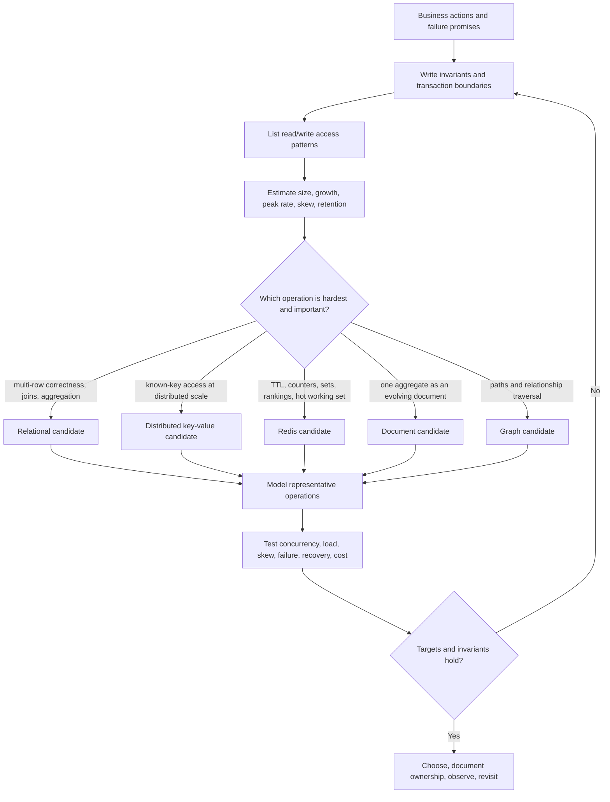

# SD-BEG-100 — Picking the Right Database

> **Track:** Beginner
>
> **Artifact state:** Ready
>
> **Learning state:** Not started
>
> **Last updated:** 2026-09-01

## Source and coverage check

- Inspected: the complete transcript (`00:00:00.880–00:12:22.560`), all three slide pages, and the complete video (`00:00:00–00:12:21.261`), including the instructor’s visual emphasis, the manual-sharding drawing, every selection branch, and the spoken ending.
- Coverage: complete for all supplied source material. The automatic captions repeatedly misheard `Redis` and `Neo4j`; the slides and video resolved both terms. No material transcript gap was observed.
- Unclear source points: the source does not define what it means by strong consistency; it groups MongoDB with key-value stores in one branch; it calls a document database a future-proof fallback; and it does not say exactly which relational guarantees may safely move into application code during manual sharding.
- Instructor-task scan: complete across the whole transcript/video, every slide, and the final 20%; one exploratory exercise was found at `00:11:56–00:12:11` and reconstructed as [`SD-BEG-100-T01`](tasks/SD-BEG-100-T01/README.md).

## What I should be able to do

- Start a database discussion with workload facts instead of a product name.
- Turn business correctness rules into explicit invariants, transaction boundaries, durability targets, and consistency requirements.
- Write the important read and write operations before selecting a data model or index strategy.
- Estimate data size, request rate, peak rate, retention, hot-key risk, and operational headroom with visible units.
- Explain when a relational, key-value, document, graph, or in-memory data-structure database is a strong candidate—and when it is not.
- Correct the claim “relational databases do not scale” without pretending distributed relational ownership is free.
- Separate data model, query model, consistency, durability, availability, and scale; none of these is determined by the label SQL or NoSQL alone.
- Defend one primary source of truth, any derived stores, their synchronization path, and the failure behavior between them.
- Validate a choice with representative queries, concurrency, skew, failure, recovery, and cost evidence before calling it right.

## Small bridge from earlier ideas

A database choice is a **requirements-to-guarantees match**. Three pieces of background make that sentence concrete:

1. An **invariant** is a rule that must remain true, such as “one idempotency key creates at most one payment.”
2. An **access pattern** is a real operation shape, such as “fetch the last 20 orders for one customer, newest first.”
3. A **service objective** is a measurable target, such as “99.9% of checkout writes complete within 300 ms and committed orders survive a zonal failure.”

Scaling, replication, partitioning, caching, and indexing are mechanisms. They can change capacity, availability, or latency, but they do not automatically change the business invariant. This lecture can be studied independently; no earlier lecture is a blocker.

## The 60-second story

Do not begin with “PostgreSQL or MongoDB?” Begin with the data, its correctness rules, its size and growth, the operations that dominate, and any special behavior such as expiration or graph traversal. Then identify the smallest database model that makes the hardest important operations natural.

Relational databases are strong candidates when several rows must change together, constraints protect correctness, or joins and aggregations are central. Redis is a candidate for very fast key-oriented access, expiration, counters, sets, sorted sets, and other server-side structures—provided its durability role is chosen deliberately. DynamoDB is a candidate for large, predictable key-oriented workloads when partition-key design and managed scale are valuable. MongoDB is a document database candidate when an aggregate is naturally read and written as one evolving document. Neo4j is a graph candidate when relationship traversal is the core query rather than an occasional join.

The course’s most important warning is that database families overlap. A relational system can partition and scale; a NoSQL system can offer strong reads or transactions; a document database can enforce validation. Therefore the answer is not a tribal label. It is a decision trail: requirements → candidate → representative model and queries → load/failure evidence → operationally owned choice.

## Why the terms matter

| Term | Simple meaning | Why it matters here | Common confusion |
|---|---|---|---|
| Workload | The real mix of reads, writes, queries, data, and failures | The same dataset can need different databases under different operations | “Large data” alone is not a workload |
| Structured / semi-structured / unstructured | How fixed and explicit the data shape is | It narrows modeling options but does not select a product alone | JSON is structured data; “unstructured” is often used too casually |
| Invariant | A rule that must never be broken at the chosen boundary | It tells us where atomicity, uniqueness, or validation belongs | A desired outcome is not automatically enforced |
| Access pattern | One concrete way the application reads or writes | Keys, indexes, document boundaries, and graph paths should serve known patterns | Endpoint names are not enough; predicates and result order matter |
| Transaction boundary | The set of changes that commit or abort together | Crossing documents, partitions, shards, or databases changes cost and failure handling | A transaction is not the same as a request |
| Consistency | What a read is allowed to observe after concurrent writes | Different operations may need different freshness and ordering | “ACID,” “strong consistency,” and “latest” are not interchangeable |
| Durability | What acknowledged data survives, and which failures it survives | A fast response is useless if the required record can disappear | Replication, persistence, and backup solve different failure classes |
| Relational database | Tables, typed columns, keys, constraints, and relational queries | It makes multi-row rules, joins, and aggregation explicit | Relational does not mean single-node-only |
| Key-value database | Retrieve a value primarily by a known key | It makes direct lookups and partitioning simple | Some products also support documents, ranges, transactions, or secondary indexes |
| Document database | Store a structured aggregate as one document | It can align storage with an application object and single-aggregate operations | Flexible schema does not mean no schema |
| Graph database | Store entities and relationships as first-class graph elements | It makes relationship traversal and path questions natural | Any data with foreign keys does not automatically require a graph DB |
| In-memory data-structure server | Keep working data mainly in memory with server-side structures | It supports low-latency TTLs, counters, sets, rankings, and coordination primitives | “In memory” does not define the required persistence or recovery policy |
| Partition key | The value used to group or distribute records | It controls locality, balance, hot keys, and which queries avoid fan-out | High cardinality alone does not guarantee even traffic |
| Bloom filter | A compact probabilistic membership check that may return false positives but not false negatives when used correctly | It can avoid expensive lookups for definitely absent values | It does not store the value or prove presence |
| HyperLogLog | A compact probabilistic estimate of distinct count | It trades exactness for much smaller memory | It is not an exact set or general counter |
| Polyglot persistence | Use different stores for genuinely different bounded needs | It can make each hard operation natural | More products also mean more failure modes and synchronization work |
| Source of truth | The authoritative record used to resolve disagreement | Derived caches, indexes, and graphs need a recovery anchor | Two independently writable “truths” invite conflict |
| Future-proof | Able to adapt to plausible change at acceptable cost | Useful only when the likely change is named and tested | A flexible document shape does not eliminate migrations or bad models |

## Big picture

### Question this visual answers

What sequence turns an ambiguous product debate into a defensible database choice?



### How to read this visual

Read from top to bottom. The first four boxes describe the workload without naming a product. The branch is a shortlist, not an automatic answer. Every candidate rejoins the same validation path: model the real operations, then test correctness and performance under the failures and scale that matter. A failed test sends the design back to its assumptions rather than directly to a fashionable replacement.

### Key insight

The deciding object is not the data alone. It is **data + operations + guarantees + scale + ownership cost**. Product selection appears late because premature selection quietly bends requirements around a tool.

### Simplification or limitation

The flow shows one dominant operation per branch. Real systems may have several important workloads, managed-service constraints, legal placement rules, team skills, migration limits, analytics pipelines, or existing investments. The diagram also omits product-specific features that create overlap. Use the branches to generate candidates, never as a universal product oracle.

## Core concepts

### 1. Select guarantees for operations, not a tribe

**Simple meaning:** Choose the database that preserves the required rules while serving the required operations.

**Formal meaning:** Database selection is a constrained optimization problem. A candidate is acceptable only if it satisfies correctness, latency, throughput, durability, availability, security, compliance, and operability constraints; among acceptable candidates, compare cost and complexity.

**Why it matters:** The course begins by saying database choice is not a fight. Database products intentionally optimize different regions of a trade-off space, and those regions overlap.

**Problem it solves:** Technology-first discussions such as “NoSQL scales” or “SQL is safer” hide the exact condition being optimized and make counterexamples easy.

**How it works:**

1. Name the user action, not the product.
2. State what must remain true before and after that action.
3. State what the user may observe during concurrency or failure.
4. Quantify the normal, peak, and recovery workloads.
5. Reject candidates that cannot preserve a must-have condition.
6. Prototype the survivors with representative data and operations.
7. Record why the winner is sufficient and what would trigger reconsideration.

**Small example:** “Create order” must insert an order and reserve inventory once for one idempotency key. That requirement first suggests a local transaction or an explicit distributed workflow. Whether the API payload is JSON does not decide the database.

**Invariant or deciding condition:** A product is not a valid choice if its intended model cannot preserve a must-have invariant or service objective at the chosen operational boundary.

**Trade-off and alternatives:** A specialized store may make one hard workload excellent but increase integration, staffing, backup, observability, and incident cost. A capable default relational database is often the smaller sufficient choice.

**Failure/observability:** A wrong selection appears as application-side compensations, unbounded scans, repeated hot partitions, lost invariants, fragile dual writes, unpredictable p99 latency, or migrations that dominate delivery. Track these symptoms by operation, tenant/key, partition, and failure mode.

**When not to use a specialized database:** When the default store meets measured targets and the specialist’s operational burden outweighs its benefit.

**Requirement change:** If a formerly best-effort counter becomes financial truth, the transaction and durability requirements—not the object’s shape—must drive a new decision.

### 2. Data shape, volume, and lifecycle are three different questions

**Simple meaning:** Ask what one record means, how many records exist, and how long or where they live.

**Formal meaning:** The logical model describes entities, relationships, and invariants; capacity describes bytes and operations over time; lifecycle describes creation, mutation, retention, expiration, archival, deletion, and regional placement.

**Why it matters:** The source explicitly asks what data is stored, how much exists, and whether a special feature such as expiration is required. Combining these questions into “big JSON data” loses useful constraints.

The source also asks whether data is structured, semi-structured, or unstructured. Treat those as modeling clues. A JSON document still has keys, types, nesting, and application expectations; it is not automatically unstructured. Images or free-form text may be stored as objects while searchable metadata lives in a database.

**Problem it solves:** A model can be semantically correct but physically impossible at the target scale, or physically fast but wrong for retention and deletion rules.

**How it works:**

1. Draw entities or aggregates and their ownership.
2. Mark fields and relationships that participate in correctness rules.
3. Estimate record count × average bytes, then add indexes, replicas, headroom, and backups separately.
4. Estimate daily growth and retention.
5. Classify hot, warm, and cold data.
6. Record expiration, legal deletion, residency, and restore requirements.

**Small example:** Five million active sessions averaging 1.5 KB are about 7.5 GB of raw working data. If every session expires after 30 minutes, automatic TTL behavior matters more than ad hoc historical joins. An order ledger of similar size has a very different durability and retention contract.

The instructor gives an intentionally small counterexample: if a dataset is known never to grow beyond roughly 1 GB, “we may need automatic sharding someday” is weak justification. The exact practical threshold depends on indexes, working set, writes, recovery, and hardware, but the principle is to avoid paying distributed-system cost “just in case.”

**Invariant or deciding condition:** The authoritative representation and its indexes must fit the selected service’s supported limits with operational headroom throughout the retention window, or there must be a proved partition/archive plan.

**Trade-off and alternatives:** Embedding related fields can make reads local but duplicates data. Normalization centralizes facts but may require joins. TTL simplifies cleanup but must not erase authoritative data before its legal or business retention ends.

**Failure/observability:** Watch logical and physical bytes, index-to-data ratio, growth rate, expiration backlog, tombstones, compaction, storage latency, restore duration, replica lag, and records that outlive or undershoot policy.

**When not to choose by data shape alone:** Almost always. The same customer-order relationship can be stored relationally, as documents, as keyed aggregates, or as a graph depending on operations and guarantees.

**Requirement change:** A new seven-year audit rule can turn a cheap TTL-based design into a compliance failure even if latency remains excellent.

### 3. Access patterns determine keys, indexes, and locality

**Simple meaning:** Write the exact questions the system asks most often.

**Formal meaning:** An access pattern specifies operation type, predicates, sort order, cardinality, projection, result bound, frequency, consistency, latency, and concurrency.

**Why it matters:** The source asks both how data will be accessed and what queries will run. A database model is useful when important operations touch a bounded, predictable amount of local data.

**Problem it solves:** Designing one generic schema and discovering later that the most valuable query requires a full scan, cross-partition join, or unbounded graph traversal.

**How it works:**

1. List commands and queries separately.
2. For every operation, write the equality/range predicates and result order.
3. State maximum returned rows or traversal depth.
4. Estimate average and peak operations per second.
5. Mark which key is known before routing.
6. Mark which operations cross an aggregate, partition, shard, or database boundary.
7. Design keys and indexes from this table, then test with realistic skew.

**Small example:** “Get customer orders” is incomplete. “For one `customer_id`, return the newest 20 non-deleted orders within 12 months, p99 under 100 ms, read-your-writes after checkout” is an actionable access pattern.

**Invariant or deciding condition:** Every critical online operation needs a bounded execution path at target scale, or the design must explicitly accept and budget fan-out.

**Trade-off and alternatives:** Denormalized read models make known queries fast but add write amplification and synchronization. General ad hoc queries favor relational/analytical engines but may not meet extreme key-based latency without indexing, partitioning, or caching.

**Failure/observability:** Measure scanned-to-returned rows/items, query-plan changes, index hit ratio, partition fan-out, consumed capacity, cache hit rate, graph expansion count, p50/p95/p99 by operation, and per-key/tenant traffic.

**When not to optimize an access pattern:** When it is rare, offline, or better served by a separate analytical path. Do not damage every write to make one monthly report instant.

**Requirement change:** Adding “list all overdue orders across every tenant” can turn a targeted tenant-key design into scatter-gather; a search or analytical index may be safer than changing transaction ownership.

### 4. Relational databases make shared correctness and flexible queries explicit

**Simple meaning:** Use related tables, keys, constraints, and transactions when several facts must agree.

**Formal meaning:** A relational database represents data as relations and supports declarative queries over them. Products such as PostgreSQL add primary keys, unique constraints, foreign keys, checks, transactions, indexes, joins, aggregation, partitioning, replication, and extensibility.

**Why it matters:** The course recommends a relational database for correctness-sensitive data and complex queries or aggregations. That is a useful candidate rule when the required behavior fits one transaction/ownership boundary.

**Problem it solves:** Preventing invalid relationships and coordinating changes without reimplementing every rule in application race windows.

**How it works:**

1. Normalize authoritative facts where independent duplication would drift.
2. declare primary, unique, foreign-key, and check constraints for enforceable invariants.
3. Group dependent changes in a transaction.
4. Create indexes for real predicates and ordering.
5. Use joins and aggregations to combine facts at query time.
6. Scale the simplest bottleneck first: queries, indexes, pooling, hardware, replicas, partitions, or ownership distribution.

**Small example:** A unique constraint on `(merchant_id, idempotency_key)` prevents two concurrent requests from creating two payments. An application-only “check then insert” can race.

**Invariant or deciding condition:** Invariants that must be immediate should be enforced inside one database transaction or replaced with an explicit protocol whose intermediate states are acceptable.

**Trade-off and alternatives:** Constraints and joins simplify correctness and query flexibility, but distributed ownership makes cross-shard constraints and transactions costlier. Denormalized document or key-oriented models may localize known operations, while moving consistency work into schema design and application protocols.

**Failure/observability:** Watch constraint violations, deadlocks, lock waits, aborted transactions, long transactions, replica lag, slow plans, rows scanned, cache hit ratio, connection saturation, WAL/log growth, and restore tests.

**When not to use it as the only store:** When the dominant operation is a specialized graph traversal, a very high-rate ephemeral counter, a search/vector workload, or a known-key workload whose distributed operational envelope is better met by a purpose-built service.

**Requirement change:** If a dataset no longer fits one node, relational choices include partitioned tables, read replicas, application or database-native sharding, and distributed SQL. The decision is which guarantees remain local and which require coordination—not “SQL stops scaling.”

### 5. Redis is valuable because of operations and latency, not merely key-value syntax

**Simple meaning:** Redis keeps a hot working set close to computation and offers useful server-side data structures and expiration.

**Formal meaning:** Redis is an in-memory data-structure server whose supported types include strings, hashes, lists, sets, sorted sets, streams, geospatial, probabilistic, JSON, time-series, and other structures. Keys can have TTLs; persistence and replication are separate design choices.

**Why it matters:** The source points to Redis for very fast key-based access and advanced data structures/algorithms. That branch is about the operation, not a blanket instruction to replace an authoritative database.

**Problem it solves:** Low-latency mutable working state such as sessions, rate limits, leaderboards, counters, idempotency windows, sets, cache entries, and compact probabilistic operations. The instructor specifically names expiration, Bloom filters, and HyperLogLog as examples of special capabilities worth selecting deliberately.

**How it works:**

1. Choose the exact Redis data type and command that makes the operation atomic or bounded.
2. Bound memory with TTLs, eviction policy, and maximum cardinality.
3. Decide whether loss is acceptable, reconstructable, or prohibited.
4. Configure persistence, replication, and acknowledgment to match that decision.
5. Design key distribution and hot-key behavior before clustering.
6. Define the fallback when Redis is slow, unavailable, full, or recovering.

**Small example:** `SET session:<token> <payload> EX 1800` gives direct lookup and a 30-minute TTL. That makes cleanup natural. It does not by itself prove the session survives a failover or that a payment idempotency record is durable enough.

**Invariant or deciding condition:** The chosen Redis persistence/replication policy and failure behavior must be compatible with the maximum acceptable loss and stale window; otherwise Redis should hold derived state, not sole authority.

**Trade-off and alternatives:** Redis offers powerful low-latency operations but memory is expensive, hot keys can serialize work, persistence changes latency/durability, and failover may expose acknowledged-write risk depending on configuration. A relational table, DynamoDB item, or local in-process cache may be smaller and safer for some workloads.

**Failure/observability:** Measure memory used and fragmentation, evictions, expirations, hit rate, command latency, slow commands, blocked clients, hot-key frequency, replication offset/lag, persistence rewrite duration, fork latency, failovers, and rejected connections.

**When not to use it:** For an unbounded authoritative dataset with strict recovery-point requirements unless the entire durability and capacity design has been proved; or when a local cache is sufficient.

**Requirement change:** If “losing the last second is acceptable” becomes “no acknowledged token may disappear,” reassess acknowledgments, persistence, replication, and possibly the system of record.

### 6. Distributed key-value design trades query freedom for predictable routing

**Simple meaning:** Give the database a key it can route directly, and model the item around known operations.

**Formal meaning:** A distributed key-value or key-oriented database partitions items using a primary/partition key. Some products, including DynamoDB, also support document values, sort keys, secondary indexes, conditional writes, strong reads, and transactions within documented boundaries.

**Why it matters:** The source recommends a distributed key-value store when data cannot fit one node and access is simple and key-based. This is strongest when the application knows its access patterns in advance.

**Problem it solves:** Large operational workloads requiring managed distribution and predictable point or bounded partition queries without arbitrary joins.

**How it works:**

1. Enumerate access patterns before defining a table.
2. Select a partition key with high enough spread and useful locality.
3. Use a sort key when a bounded ordered collection belongs together.
4. Denormalize or maintain secondary access paths deliberately.
5. Use conditional writes or transactions for required races.
6. Control item size, fan-out, hot partitions, consumed capacity, retries, and cost.

**Small example:** `PK = CUSTOMER#42`, `SK = ORDER#2026-09-01T...` makes one customer’s recent orders a bounded ordered query. “All orders in a date range across all customers” is not naturally targeted by that key and needs another access path.

**Invariant or deciding condition:** Important online requests must provide a partition key or use a deliberately bounded index/query path; traffic for any one key must fit its hot-partition envelope.

**Trade-off and alternatives:** Routing and managed scale become easier, but ad hoc joins and new query dimensions require denormalization, indexes, scans, or pipelines. Relational storage may be better when query shapes evolve quickly or multi-entity constraints dominate.

**Failure/observability:** Watch throttling, consumed versus provisioned/on-demand capacity, hot partition keys, conditional failures, retry rate, item-collection growth, index lag/behavior, request latency, scan usage, transaction cancellations, and cost per business operation.

**When not to use it:** When the team cannot name stable keys/access patterns, when important requests require unbounded cross-partition aggregation, or when the relational invariant surface is large.

**Requirement change:** Adding a new query by email address is not “just another WHERE clause.” It may require a new index, duplicated item, uniqueness protocol, backfill, and cost model.

### 7. A document database optimizes aggregate-shaped work, not schema avoidance

**Simple meaning:** Keep related fields that are commonly used together in one structured document.

**Formal meaning:** A document database stores nested field-value structures, commonly addressed by an identifier and queried/indexed by selected fields. MongoDB stores BSON documents, permits flexible field shapes, supports validation, and supports multi-document transactions with additional cost and modeling considerations.

**Why it matters:** The source presents document storage as a flexible option and mentions MongoDB. The useful property is aggregate locality and controlled evolution—not the absence of design.

**Problem it solves:** Objects with nested, variable attributes that are usually read and updated as one ownership unit, such as heterogeneous product specifications or content blocks.

**How it works:**

1. Define the aggregate root and which children share its lifecycle.
2. Embed bounded data read/written with the root.
3. Reference unbounded or independently changing data.
4. Add indexes for actual field predicates.
5. Validate critical fields and version document shapes.
6. Plan migrations and compatibility across application versions.

**Small example:** A product document may embed a bounded set of category-specific attributes because the product page reads them together. Millions of reviews should not be embedded in one ever-growing product document.

**Invariant or deciding condition:** Data placed in one document should have a bounded size and a shared consistency/lifecycle boundary; cross-document invariants need an explicit transaction or protocol.

**Trade-off and alternatives:** Embedding removes joins and can make one aggregate atomic, but duplication, document growth, multi-document reporting, and cross-aggregate updates can become expensive. PostgreSQL with JSON columns can sometimes provide sufficient flexibility without adding a store.

**Failure/observability:** Watch document-size distribution, array growth, schema-version mix, validation failures, missing indexes, documents/keys examined versus returned, transaction aborts, shard-key distribution, replication lag, and migration/backfill progress.

**When not to use it:** When the dominant workload is many-to-many relational reporting, deep graph traversal, or strict cross-aggregate invariants that are simpler in a relational transaction.

**Requirement change:** “Products may gain optional attributes” supports a document candidate. “Any analyst may join arbitrary attributes with orders tomorrow” adds a separate query/analytics requirement and is not solved by flexible writes alone.

### 8. A graph database is selected by traversal questions

**Simple meaning:** Make relationships first-class when the main work is repeatedly following them.

**Formal meaning:** A property graph models nodes, typed directed relationships, and properties. A traversal visits nodes by following relationships under rules; path length and branching factor determine work.

**Why it matters:** The source recommends Neo4j for sophisticated graph algorithms. The decisive condition is relationship-centric access, not merely connected data.

**Problem it solves:** Multi-hop questions such as dependency impact, fraud rings, shortest paths, recommendations, or authorization relationships whose join path is central and variable.

**How it works:**

1. Model stable entity identities as nodes.
2. Model meaningful connections as typed relationships.
3. Bound starting points, relationship types, depth, direction, and result count.
4. Index entry-point properties.
5. Test high-degree nodes and worst-case traversals.
6. Decide whether the graph is authoritative or a derived read model.

**Small example:** “Which services up to four dependency hops could lose power if supply `P7` fails?” is naturally a bounded traversal. “Fetch user 42 by ID” does not justify a graph database.

**Invariant or deciding condition:** The relationship traversal must be important enough that native adjacency/path operations outweigh the cost of another data model and operational stack.

**Trade-off and alternatives:** Graph models make path logic expressive, but supernodes, unbounded depth, distributed graph operations, bulk aggregation, and synchronization from another source can be hard. A relational edge table is often sufficient for shallow, indexed, bounded relationships.

**Failure/observability:** Measure expanded nodes/relationships, path depth, branching factor, query-plan operators, page/cache hits, transaction latency, high-degree nodes, replica/cluster health, synchronization lag, and missing relationship events.

**When not to use it:** When queries are direct lookups, simple one-hop joins, or large scans/aggregations rather than traversals.

**Requirement change:** If a one-hop “friends” lookup becomes repeated variable-depth fraud-ring detection, re-evaluate a graph read model; do not migrate authoritative profiles automatically.

### 9. Scale, consistency, and SQL/NoSQL are independent axes

**Simple meaning:** A database family name does not tell you its maximum scale or exact read guarantees.

**Formal meaning:** Data model/query language, partitioning, replication, consistency, transaction scope, storage engine, and deployment topology are separate design dimensions, although products constrain their combinations.

**Why it matters:** The source directly corrects the misconception that non-relational databases should be selected because relational databases cannot scale. It explains that relational systems can distribute data by giving up or relocating some cross-shard guarantees.

**Problem it solves:** False binary reasoning that ignores relational partitioning/distribution and non-relational transactions/strong reads.

**How it works:**

1. Identify the single-node bottleneck and violated target.
2. Remove query/index/application bottlenecks first.
3. Scale up while one ownership boundary remains sufficient.
4. Add replicas for documented read or availability roles.
5. Partition data/work when one owner no longer fits.
6. State which constraints and transactions remain local, which require coordination, and which become asynchronous.

**Small example:** Tenant-based sharding can keep every tenant’s relational foreign keys and transactions local while prohibiting synchronous cross-tenant transactions. The relational model remains; the guarantee boundary changes.

**Invariant or deciding condition:** For each correctness rule, all participating data must either share an atomic owner or use a distributed protocol with explicitly acceptable intermediate/failure states.

**Trade-off and alternatives:** Removing cross-shard foreign keys or transactions increases local autonomy and throughput but shifts validation, reconciliation, and incident responsibility into application workflows. Distributed SQL preserves more familiar semantics at coordination and operational cost. A key-value design may avoid the relationship entirely by changing the aggregate.

**Failure/observability:** Watch cross-shard operation rate, coordinator latency, orphan records, reconciliation backlog, duplicate events, stale routing, hot shards, replica lag, and failover behavior—not just total cluster throughput.

**When not to distribute ownership:** When a single supported node with headroom meets storage and write targets. Distribution is a recurring tax on every migration, query, backup, and incident.

**Requirement change:** If a global uniqueness rule is added after tenant sharding, decide between scoped uniqueness, a centralized allocator, a consensus-backed global index, or coordination; never assume the old local constraint became global.

### 10. Polyglot persistence needs one owner and recoverable projections

**Simple meaning:** Use multiple databases only when each has a clear job and disagreement can be repaired.

**Formal meaning:** Polyglot persistence assigns bounded data responsibilities to different storage systems. One system should authoritatively own each fact; other stores receive idempotent, replayable projections or participate through an explicit consistency protocol.

**Why it matters:** The source’s branches may tempt a design to add Redis, a relational database, MongoDB, DynamoDB, and Neo4j at once. The selection framework applies per bounded workload, not per noun.

**Problem it solves:** One general-purpose store may poorly serve a genuinely specialized operation, but naive dual writes create inconsistent truths.

**How it works:**

1. Assign one authoritative owner per fact.
2. Commit the source change and an outbox/event intent atomically when possible.
3. Deliver changes at least once to derived stores.
4. Make projection handlers idempotent.
5. Measure lag and support replay/rebuild.
6. Define request behavior when a projection is stale or unavailable.

**Small example:** PostgreSQL owns orders; Redis caches order summaries; a search index serves text search; a graph projection serves recommendations. Checkout succeeds from the order transaction even if a derived projection is temporarily behind.

**Invariant or deciding condition:** Every duplicated fact has one conflict-resolution authority and a tested path to rebuild other copies.

**Trade-off and alternatives:** Specialized reads improve latency or expressiveness, but every added store adds credentials, upgrades, backup policy, monitoring, on-call knowledge, privacy deletion propagation, and consistency windows.

**Failure/observability:** Track outbox age, consumer lag, dead-letter count, replay progress, cache age, source/projection count checks, mismatch samples, dual-write failures, and deletion propagation.

**When not to use it:** When one database plus indexes, partitions, materialized views, or a cache meets targets. Operational simplicity is a feature.

**Requirement change:** If recommendation freshness changes from one hour to one second, quantify the projection pipeline and failure budget before making the graph store synchronously writable.

## Worked example and calculations

### Assumptions

Consider a marketplace with four bounded workloads. These numbers are teaching assumptions, not claims about a real company.

- Orders: 1.2 million new orders/day, 20× peak-to-average write factor, three-year hot retention, and about 2 KB of logical row-plus-index data per order.
- Sessions: 5 million concurrently active sessions, 1.5 KB average payload, refreshed once per minute, and a 30-minute TTL.
- Product catalog: 5 million products with 8 KB average read representation and category-dependent optional attributes.
- Relationship feature: 20 million users with an average of 30 directed follow edges and an important two-hop recommendation query.
- Capacity estimates use decimal units for clarity: 1 GB = 10^9 bytes and 1 TB = 10^12 bytes.
- Storage replicas, engine overhead, backups, compression, and indexes are shown separately rather than hidden in the base number.

### Steps

**1. Quantify the order write rate**

```text
average order writes/s = 1,200,000 orders/day ÷ 86,400 s/day
                       ≈ 13.89 orders/s

peak order writes/s    = 13.89 × 20
                       ≈ 277.8 orders/s
```

A few hundred writes per second is not automatically a reason to abandon relational transactions. Measure transaction complexity, lock contention, indexes, replicas, and storage before deciding the write rate is the binding limit.

**2. Quantify three years of logical order storage**

```text
orders in three years = 1,200,000 × 365 × 3
                      = 1,314,000,000 orders

logical bytes         = 1,314,000,000 × 2,000 bytes
                      = 2,628,000,000,000 bytes
                      = 2.628 TB

two additional copies = 2.628 TB × 3 total copies
                      = 7.884 TB before backups and engine overhead
```

The dataset is large enough to plan partitions, archival, restore time, and perhaps distributed ownership. It does not decide SQL versus NoSQL. Order invariants and queries still favor a relational source of truth unless a proved alternative model serves them better.

**3. Quantify the session working set and refresh rate**

```text
raw session bytes      = 5,000,000 × 1,500
                       = 7.5 GB

two copies             = 7.5 GB × 2
                       = 15 GB

30% metadata overhead  = 15 GB × 1.30
                       = 19.5 GB

provisioned at 60% use = 19.5 GB ÷ 0.60
                       = 32.5 GB

refresh writes/s       = 5,000,000 ÷ 60
                       ≈ 83,333 writes/s
```

This workload makes Redis a plausible candidate because key lookup, TTL, and a hot working set are central. The rate also requires sharding/hot-key testing; one Redis process is not implied. If sessions are reconstructable, durability can be weaker than for orders. If a session contains irreplaceable authorization state, that assumption changes.

**4. Quantify the catalog representation**

```text
raw product representation = 5,000,000 × 8,000 bytes
                           = 40 GB
```

Forty gigabytes fits comfortably in many relational or document deployments. The decision comes from operations: complex joins and reporting may favor relational storage; aggregate-by-ID reads with bounded, category-specific attributes may favor documents. A flexible payload alone is not a scale argument.

**5. Bound the graph traversal**

```text
directed edges          = 20,000,000 users × 30 edges/user
                        = 600,000,000 edges

naive two-hop expansion = 30 first-hop + (30 × 30) second-hop
                        = 930 visited edge endpoints before dedup/filtering
```

The average looks bounded, but a celebrity with five million followers is a supernode and invalidates the average. A graph candidate must be tested with the degree distribution and real path predicates. A relational edge table may still be enough for fixed one- or two-hop indexed queries.

**6. Map requirements to candidates**

| Workload | Hard requirement | First candidate | Why it fits | What must be proved |
|---|---|---|---|---|
| Order source of truth | Atomic order/inventory rule, idempotency, audit, joins | PostgreSQL/relational | Constraints and transactions make invariants explicit | Partition/restore plan, peak transaction latency, contention, failover |
| Session working set | Key lookup, 30-minute TTL, ~83k refreshes/s | Redis | Native expiration and fast key/data-structure operations | Memory, cluster distribution, hot keys, acceptable loss/fallback |
| Product aggregate | Read one heterogeneous product, bounded attributes | MongoDB/document or relational JSON | Aggregate locality and controlled schema flexibility | Indexes, validation, document bounds, reporting path, migration |
| Follow recommendations | Relationship traversal from known user | Neo4j/graph read model or relational edge table | Native traversal may simplify variable paths | Degree skew, path bounds, sync lag, operational payoff |

**7. Change one requirement**

Suppose finance adds: “A committed order and its payment authorization must never disagree, even during a regional network partition.” This does not automatically select a product. It forces clarification:

- Must both records commit synchronously?
- Are they in one legal/operational region?
- Can the user see a `pending_payment` state?
- Does an external payment provider participate?
- What recovery point and manual-reconciliation window are allowed?

If an external provider is involved, no local database transaction can atomically own the provider’s state. The design likely needs idempotency, a durable state machine, retries, reconciliation, and explicit pending/failed states even if PostgreSQL owns the order.

### Result and sanity check

One marketplace can reasonably use a relational order authority, Redis for expiring working state, and optional document/graph read models—but only if their benefits justify their operational cost. The arithmetic prevents two common mistakes: calling 278 order writes/s “web scale” without evidence, and ignoring that 83,333 session refreshes/s is a different workload even though both store JSON-like objects.

The sanity check is to compare units and boundaries. Order storage is measured over three years; session storage is a concurrent TTL working set. Order copies are not backups; Redis overhead is only a planning estimate; graph average degree does not bound a supernode. Each number identifies the next measurement rather than proving a product choice.

## Deep mechanism

### Components, ownership, and boundaries

| Component | Owns | Required decision | Evidence |
|---|---|---|---|
| Business/domain model | Meaning of facts and correctness rules | Which rules are inviolable, scoped, or eventually repaired? | Written invariants and examples/counterexamples |
| API/service | Command validation, request identity, deadline, idempotency intent | Which failures become retry, pending, reject, or degrade? | Traces, error taxonomy, retry/idempotency tests |
| Authoritative database | Committed truth for a bounded set of facts | Transaction, consistency, durability, partition, and restore boundary | Constraints, transaction tests, failover/restore evidence |
| Router/driver | Endpoint, key, partition, replica, and retry selection | How are stale routes, timeouts, and duplicate attempts handled? | Route/partition tags, attempts, latency, failover logs |
| Cache or read model | Derived representation for a named query | What staleness is allowed, and can it be rebuilt? | Age/lag metrics, hit rate, replay and parity checks |
| Change pipeline/outbox | Durable propagation intent and ordering metadata | How are duplicates, gaps, poison events, and replay handled? | Oldest-event age, consumer lag, dead letters, sequence checks |
| Operator/team | Configuration, upgrades, backup, recovery, capacity, incidents | Who can run and diagnose this safely at 03:00? | Runbooks, restore drills, alerts, ownership, cost reports |

The most important boundary is **authority**. One product can have multiple replicas and partitions while remaining one authoritative service. Conversely, two product instances do not become safely authoritative merely because both received the same HTTP request.

### The database-selection sequence in order

1. **Write the command:** “Reserve 2 units of SKU 7 for order 91,” not “write JSON.”
2. **State preconditions:** SKU exists, available quantity is at least 2, and the idempotency key has not succeeded.
3. **State the postcondition:** exactly one order/reservation result exists and stock never becomes negative.
4. **Choose the atomic boundary:** one row, several rows, one document, one partition, one shard, or an explicit workflow.
5. **Write read patterns:** predicates, ordering, result bound, freshness, and peak frequency.
6. **Estimate the envelope:** record count, bytes, growth, request rates, skew, and headroom.
7. **Shortlist models:** reject any candidate that makes a must-have invariant or operation unnatural at the required boundary.
8. **Build the representative model:** keys, constraints, indexes, documents, relationships, or projections.
9. **Exercise races:** duplicate request, concurrent update, timeout-after-commit, stale read, failover, and partial dependency loss.
10. **Exercise capacity:** normal, peak, skewed key, maintenance, catch-up, and recovery workloads.
11. **Measure cost and operations:** storage amplification, request units, node count, backup/restore, staffing, and migration.
12. **Write the decision record:** why this is sufficient, rejected alternatives, known risks, metrics, and revisit thresholds.

This order prevents performance benchmarks from proving the wrong semantics. A store that returns a value in 2 ms but violates “charge once” is not faster for the business operation; it is incorrect.

### Ordering, concurrency, and stale state

Database selection becomes real when two things happen at once.

**Concurrent inventory reservation**

```text
Initial quantity: 1

Request A reads 1        Request B reads 1
Request A plans -1       Request B plans -1
Request A writes 0       Request B writes 0
```

The final value `0` hides that two orders were accepted for one unit. A transaction with a locking/conditional update such as “decrement only where quantity >= 1,” followed by a checked affected-row count, can preserve the invariant inside one database boundary. A key-value or document system can also preserve it if it provides an appropriate conditional write or transaction and the model keeps the participants within its supported boundary. The family label is not the proof; the atomic condition is.

**Timeout after commit**

1. The database commits order `91`.
2. The response is lost before the client sees success.
3. The client retries.
4. Without an idempotency invariant, a second order may be created.
5. With a durable unique key or conditional put, the retry returns the original result.

**Stale derived read**

1. PostgreSQL commits the order and outbox record.
2. The API returns success.
3. A projector has not yet updated a Redis summary.
4. A read routed only to Redis says the order is absent.
5. The API must either tolerate that staleness, read through/fall back to authority, or meet a tighter propagation objective.

These traces show why consistency is operation-specific. Checkout may require immediate authoritative correctness while a recommendation can be minutes behind.

### Failure and recovery

| Failure | Observable symptom | Mechanism | Protection/recovery | Remaining risk |
|---|---|---|---|---|
| Unwritten invariant | Duplicate payment, negative stock, orphan child | The design optimized shape/rate without an atomic rule | Encode constraint/conditional write/state machine; reconcile existing data | Historical corruption may need manual repair |
| Hot partition/key | One partition throttles or has high p99 while aggregate capacity is idle | Skewed tenant, celebrity, monotonic range, or global counter | Salt/split, cache, isolate tenant, redesign key, rate-limit | One indivisible hot entity may remain a limit |
| Unbounded query | Latency and work grow with total data | Missing key/index/bound; scan or graph explosion | Add targeted access path, cap result/depth, move analytics offline | New query dimensions create new write/storage cost |
| Relaxed cross-shard constraint | Orphan or duplicate records appear after partial failure | Former database invariant moved into application messages | Localize ownership, idempotent workflow, reconciliation, repair queue | There is an inconsistency window |
| Redis eviction or data loss | Missing session/idempotency entry after memory pressure/failover | Eviction, disabled/lagging persistence, async replication, bad capacity | Define loss policy, reserve memory, configure persistence, rebuild/fallback | Stronger durability may raise latency/cost |
| Document schema drift | Same field has incompatible types; readers fail | Flexible writes without versioning or validation | Validation rules, versioned readers/writers, backfill and compatibility metrics | Long migrations may keep multiple shapes alive |
| Oversized document/array | Updates slow, document reaches size limit, contention rises | Unbounded child collection embedded in one aggregate | Reference/page children, bucket documents, enforce bounds | Cross-document operations become more complex |
| Graph supernode/path explosion | Traversal touches millions of edges or times out | High degree or unbounded variable-depth query | Degree-aware model, filters, depth/result limits, precomputation | Some global graph algorithms remain expensive |
| Projection lag/gap | Search/cache/graph disagrees with source | Consumer outage, poison event, lost dual write, replay defect | Transactional outbox/CDC, idempotency, dead letters, replay, parity checks | Users may observe allowed staleness during recovery |
| Database failover | Errors, retries, elevated latency, possible stale read | Leader loss, DNS/route change, replica promotion, client retry | Tested failover, bounded retries, idempotency, correct read policy | Tail latency and acknowledged-write behavior vary by setup |
| Backup that cannot restore | Recovery time exceeds objective or data is incomplete | Backups were created but never verified end-to-end | Scheduled restore drills, checksums, point-in-time test, dependency inventory | Restore at full production scale may take longer |
| Operational overload | Alerts are unactionable; upgrades and incidents stall | Too many products or insufficient expertise | Prefer smaller stack, ownership/runbooks, managed service, training | Managed services do not remove data-model responsibility |

### Observability

Observe the decision dimensions, not a generic “database healthy” light.

| Dimension | Questions | Useful evidence |
|---|---|---|
| Correctness | Are invariants being rejected or silently broken? | Constraint/conditional failures, duplicates, orphan scans, reconciliation mismatches |
| Latency | Which operation and stage consumes the deadline? | p50/p95/p99 by operation, query/command time, queue time, network time, retry time |
| Work amplification | How much data/work produces one result? | Rows/items/keys/edges examined versus returned, partitions touched, cache miss amplification |
| Capacity | Which resource is closest to its safe limit? | CPU, memory, I/O, connections, storage/growth, request units, evictions, throttles |
| Distribution | Is the average hiding a hot owner? | Max/mean by key, tenant, partition, shard; top-key share; degree distribution |
| Consistency | How stale can reads or projections become? | Replica lag, outbox/consumer age, version/watermark, read-after-write probe |
| Durability/recovery | Can acknowledged state survive and be restored in time? | Replication acknowledgments, persistence errors, backup age, restore drill RPO/RTO |
| Availability | What happens during dependency or node loss? | Failover tests, error budget, partial-result rate, retry storm, degraded-mode use |
| Cost | What does one business operation cost? | Nodes, storage amplification, request units, egress, backup, licenses, operator hours |
| Changeability | Can schemas, keys, and ownership evolve safely? | Migration/backfill rate, mixed-version population, lock/impact, rollback/replay evidence |

Alerts should tie a symptom to an objective. “DynamoDB throttled requests > 0 for checkout,” “Redis evictions on an authoritative namespace,” or “oldest outbox event > 60 seconds” is more actionable than “database CPU high.”

## Design choices

| Choice | Benefits | Costs/risks | Prefer when | Avoid when |
|---|---|---|---|---|
| One relational database | Strong local constraints/transactions, flexible queries, smallest stack | One ownership boundary has capacity limits; careless joins/queries can be costly | Most product systems at modest-to-large scale with important shared invariants | A proved specialized workload dominates and cannot meet targets |
| Relational + JSON/document columns | Keeps transactions/SQL while allowing bounded flexible attributes | Weakly governed JSON becomes opaque; indexing many paths costs | Flexible fields coexist with relational ownership and reporting | The whole workload needs document-native distribution/operations |
| Vertically scale relational first | Preserves simple authority, queries, backups, transactions | Finite ceiling, concentrated failure/cost, resize events | A supported larger node meets targets with headroom | Largest practical node still fails storage/write/recovery goals |
| Relational sharding | Retains relational model inside ownership units; distributes capacity | Cross-shard joins, uniqueness, FKs, transactions, migrations, routing | A stable key localizes most invariants and traffic; team can operate it | Single-node/partitioned deployment is sufficient or key is unclear |
| Reuse the team’s SQL expertise | Avoids a new operational/query model and uses battle-tested skills | Familiarity can become bias; manual sharding still needs routing and recovery design | Relational sharding meets requirements and the team can prove it | Expertise is used to excuse a model that violates targets or invariants |
| Redis as cache/working-state store | Low latency, TTL, rich data structures, offloads authority | Staleness, evictions, hot keys, invalidation, persistence choices | Data is derived/reconstructable or durability policy is explicit | It would become accidental sole authority without recovery proof |
| DynamoDB/key-oriented managed store | Managed distribution, predictable keyed operations, conditional writes/transactions | Access-pattern-first design, hot keys, denormalization, cost per operation | Very large known-key workloads and low operational management are priorities | Ad hoc joins/queries or broad relational invariants dominate |
| MongoDB/document store | Aggregate locality, nested documents, flexible evolution, indexes | Duplication, cross-document work, unbounded arrays, schema drift | Bounded aggregates vary and are commonly read/written together | Relationship-heavy reporting or cross-aggregate invariants dominate |
| Neo4j/graph store | Expressive native relationship/path traversal | Another stack, graph skew/supernodes, bulk analytics and sync cost | Variable-depth relationship questions are central and valuable | Direct lookups or shallow fixed joins are sufficient |
| One authority + derived specialists | Each read model serves a hard query; authority resolves conflict | Event pipeline, lag, replay, privacy deletion, operational breadth | Specialist value exceeds synchronization and ownership cost | Team cannot operate/rebuild projections or staleness is unacceptable |
| Write synchronously to two databases | Appears simple and gives immediate copies | Partial success, ambiguous retry, no atomic commit, divergent truth | Only with a proved cross-system protocol and unavoidable requirement | As a casual dual-write shortcut |
| Choose a managed service | Reduces hardware, patching, and some availability work | Provider limits, cost, lock-in, network/region constraints remain | The managed envelope matches requirements and ownership model | Required controls, placement, behavior, or economics do not fit |

## Misconceptions

| Claim/confusion | What is actually true | Evidence or counterexample |
|---|---|---|
| “Relational databases do not scale.” | Relational systems can scale up, partition, replicate, shard, or distribute; coordination boundaries become the hard part. | Tenant-sharded relational tables can distribute writes while keeping tenant-local transactions. |
| “NoSQL means eventual consistency.” | Consistency depends on product, operation, configuration, and topology. | DynamoDB documents strongly consistent reads and ACID transactions within stated boundaries. |
| “Relational means every read is strongly consistent.” | Isolation level, replica choice, transaction timing, and product configuration determine observations. | A read replica may lag; two statements at Read Committed can observe different committed states. |
| “If data is JSON, use MongoDB.” | API serialization does not define invariant or access-pattern boundaries. | A JSON checkout request may need relational uniqueness and transactions. |
| “MongoDB has no schema.” | The schema exists in stored shapes and application expectations; MongoDB also supports validation rules. | Mixed field types can break indexes/readers unless governed. |
| “A document database is future-proof.” | Flexibility changes migration mechanics; it does not predict future queries or remove compatibility work. | A new cross-document aggregation can still require indexes, backfills, and remodels. |
| “Redis is only a cache.” | Redis supports many data structures and persistence choices and can be authoritative in deliberate designs. | The reverse mistake is also dangerous: persistence must be designed, not assumed. |
| “Redis is fast, so use it for every key lookup.” | Latency, memory cost, durability, working-set size, and fallback behavior still decide suitability. | A durable relational primary-key lookup may already meet the service objective. |
| “DynamoDB is just a hash map.” | It supports partition/sort keys, document values, indexes, conditions, strong reads, and transactions, with defined constraints and costs. | Data modeling remains access-pattern-first; arbitrary joins are not supplied. |
| “MongoDB is a generic key-value store.” | Documents have identifiers, but MongoDB is designed for BSON document structure and indexed document queries. | Calling every ID-addressable database key-value erases the relevant query/model distinction. |
| “Relationships imply Neo4j.” | All useful datasets contain relationships. A graph DB earns its place when traversal/path operations dominate. | A one-hop membership lookup can be an indexed relational join. |
| “Dropping foreign keys makes SQL scale.” | Removing enforcement removes a guarantee; it does not remove the business rule. | Orphan prevention must move into ownership, workflow, or reconciliation. |
| “Manual sharding doubles performance with two nodes.” | Only a balanced, local, overhead-free workload approaches linear capacity. | One 70% hot key can overload one shard while another is idle. |
| “Replication is backup.” | Replicas copy current state and may copy deletion/corruption; backups support historical recovery. | Recovery objectives require tested restore evidence. |
| “A benchmark winner is the right database.” | A benchmark proves only its modeled operations, data, configuration, and failure assumptions. | It may omit the invariant, skew, restore, or migration that dominates production. |
| “Use every best-of-breed database.” | Product-local elegance can create system-wide fragility. | Dual writes, deletion propagation, on-call load, and replay become new requirements. |

## Real backend connection

Consider a FastAPI marketplace. A restrained implementation could use:

| Boundary | Storage role | Example operation | Why |
|---|---|---|---|
| PostgreSQL | Authoritative orders, payments state, inventory, outbox | One transaction inserts an idempotent order, reserves inventory, and records an event intent | Constraints and transactions protect shared invariants |
| Redis | Derived product cache, rate-limit counters, expiring sessions | Read-through product summary with TTL; increment bounded rate key | Low-latency key/data-structure operations; authority can recover it |
| Worker + outbox | Propagation | Publish committed order events and retry idempotently | Avoid unsafe application dual writes |
| Optional MongoDB projection | Heterogeneous product-page aggregate | Read one product’s bounded attributes by ID/category | Add only if relational JSON/indexing fails measured needs |
| Optional Neo4j projection | Recommendation/dependency traversal | Bounded paths starting from one user/entity | Add only when traversal value and performance justify it |

**Write path in order:**

1. FastAPI validates the request and extracts a merchant-scoped idempotency key.
2. PostgreSQL begins a transaction.
3. A unique constraint claims the idempotency key.
4. A conditional inventory update succeeds only when stock is sufficient.
5. The order and outbox event are inserted.
6. The transaction commits; this is the authoritative success boundary.
7. A worker later updates derived stores idempotently.
8. Projection lag is measured; failed events are retried or repaired.

If Redis is unavailable, checkout should not silently change the order invariant. The API may bypass a cache, reject a rate-limited optional feature conservatively, or degrade sessions according to a documented policy. If Neo4j is unavailable, recommendations may disappear while checkout continues. These are architectural consequences of ownership, not product marketing.

For AWS, a different but defensible design might use DynamoDB for a known-key, serverless order aggregate with conditional writes/transactions, streams, and carefully designed partition/sort keys. That is not automatically superior or inferior. Compare invariants, access patterns, hot-key behavior, reporting, cost, regional semantics, and team operations.

## Instructor-assigned tasks

| Task | Faithful purpose | Tools | Reference status | Learner status |
|---|---|---|---|---|
| [`SD-BEG-100-T01`](tasks/SD-BEG-100-T01/README.md) | Explore familiar databases and test how one type can serve a workload usually associated with another | None required; optional disposable local runtime | Ready; design-only, runtime not required | Not started |

The instructor gives no required database count, workload, implementation language, output format, or success metric. The task pack preserves that ambiguity and adds a separate decision canvas so the exploration produces reviewable reasoning without pretending those additions were spoken requirements.

### Codex-added practice

This is optional retrieval practice, not course homework.

Choose a food-delivery system and create one decision page without naming a database until step 5:

1. **Predict:** Which requirement will dominate the database choice, and why?
2. **Invariants:** Write three rules for order, payment, and courier assignment.
3. **Operations:** Specify five reads/writes with predicates, ordering, bounds, freshness, and peak rate.
4. **Numbers:** Estimate 30-day bytes, average/peak requests per second, top-restaurant skew, and 30% headroom.
5. **Candidates:** Compare relational, DynamoDB/key-value, MongoDB/document, Redis, and graph options; reject at least three with exact reasons.
6. **Ownership:** Name one source of truth and every derived projection.
7. **Failure:** Predict what happens when the cache is down and when an event is delivered twice.
8. **Change:** Revisit the answer when the interviewer requires active-active multi-region order writes with no overselling.

Completion evidence is the decision trail, calculations with units, a race/failure trace, and a natural two-minute explanation—not merely a product name.

## Useful English and technical phrases

### Peculiar property

- Pronunciation: `pih-KYOO-lee-er PROP-er-tee`
- Simple meaning: a distinctive or unusual characteristic
- Hindi cue: **khaas visheshta**
- Why it matters here: each database has properties that fit some workloads especially well.
- Common misuse: `peculiar` can mean strange in everyday speech; in technical discussion, say exactly which distinctive guarantee or operation you mean.

Examples:

1. Simple: “This tool has a peculiar way of storing dates.”
2. Engineering: “Redis expiration is a useful property for session keys.”
3. Engineering: “The candidate’s peculiar strength is bounded relationship traversal.”
4. Interview: “I would not choose by category; I would identify the specific property the workload needs.”
5. Design review: “Please replace ‘special database’ with the exact property and the evidence that we need it.”

### Access pattern

- Pronunciation: `AK-sess PAT-ern`
- Simple meaning: the exact way data is usually read or changed
- Hindi cue: **data istemaal karne ka tareeka**
- Why it matters here: the partition key, indexes, document boundary, and graph paths should serve real operations.
- Common misuse: “users access data frequently” is not a pattern; include key/predicate, ordering, bound, frequency, and freshness.

Examples:

1. Simple: “My main access pattern is looking up a book by ISBN.”
2. Engineering: “The hot access pattern fetches the newest twenty orders for one customer.”
3. Engineering: “This index does not support the sort order in our access pattern.”
4. Interview: “Before choosing DynamoDB, I would enumerate every required access pattern.”
5. Design review: “The proposal adds an index, but it does not name the access pattern or expected selectivity.”

### Invariant

- Pronunciation: `in-VAIR-ee-ent`
- Simple meaning: a rule that must remain true
- Hindi cue: **jo niyam tootna nahi chahiye**
- Why it matters here: invariants determine atomic boundaries and distinguish correctness from speed.
- Common misuse: a metric target such as “p99 below 100 ms” is an objective, not a data invariant.

Examples:

1. Simple: “The total must never become negative.”
2. Engineering: “The unique constraint enforces the idempotency invariant under concurrency.”
3. Engineering: “After sharding, this invariant is tenant-local rather than global.”
4. Interview: “I would first state the inventory invariant and then choose the transaction boundary.”
5. Design review: “The retry strategy is incomplete because it does not preserve the at-most-once business invariant.”

### Exhaustive

- Pronunciation: `ig-ZAWS-tiv`
- Simple meaning: covering every relevant possibility
- Hindi cue: **poori tarah sab cover karna**
- Why it matters here: the course’s decision list is illustrative, not exhaustive.
- Common misuse: do not say a shortlist is exhaustive when search, time-series, vector, object, analytical, or distributed-SQL needs were not considered.

Examples:

1. Simple: “This checklist is helpful but not exhaustive.”
2. Engineering: “The failure table is not exhaustive; it focuses on ownership and recovery.”
3. Engineering: “Our candidate list becomes exhaustive only relative to the stated constraints.”
4. Interview: “I’ll start with three candidates; this is not an exhaustive product survey.”
5. Design review: “Please label the matrix as illustrative unless every relevant workload class was evaluated.”

### Future-proof

- Pronunciation: `FYOO-cher proof`
- Simple meaning: able to handle named plausible changes without unacceptable rework
- Hindi cue: **aane wale badlav ke liye taiyaar**
- Why it matters here: flexibility is useful only when likely changes and costs are concrete.
- Common misuse: claiming one database removes all future migrations.

Examples:

1. Simple: “No design is future-proof against every change.”
2. Engineering: “Versioned documents make this field addition cheaper; they do not future-proof the query model.”
3. Engineering: “A replayable event log makes derived indexes easier to rebuild after a model change.”
4. Interview: “I would future-proof for the named multi-region requirement, not for imaginary unlimited flexibility.”
5. Design review: “Replace ‘future-proof’ with the expected change, migration path, and cost threshold.”

## Interview practice

### Foundation

**Question:** How do you choose between a relational, key-value, document, graph, and Redis-style database?

**Strong answer covers:**

1. Start with invariants, transaction boundaries, and failure promises.
2. List exact read/write access patterns and special operations such as TTL or traversal.
3. Estimate data size, growth, peak rate, skew, retention, and headroom.
4. Use database families to shortlist candidates: relational for shared invariants/joins, key-value for known-key distribution, document for bounded aggregates, graph for traversal, Redis for hot TTL/data-structure operations.
5. State that product capabilities overlap and SQL/NoSQL does not decide scale or consistency.
6. Validate representative queries, races, load, skew, failover, restore, and cost.
7. Prefer the smallest operable stack and record reconsideration thresholds.

**Weak-answer trap:** Listing product names and slogans—“Postgres for consistency, Mongo for scale, Redis for speed”—without defining an operation, boundary, number, or failure.

### SDE-2 working engineer

**Prompt:** A team stores orders in MongoDB because the API sends JSON. Duplicate orders appear during retries, reporting queries are slow, and product wants inventory reservation to be atomic with order creation. Diagnose the selection and propose a path.

**Reasoning checkpoints:**

1. Reproduce duplicate creation with a timeout-after-commit retry; inspect idempotency key enforcement.
2. State the order/inventory invariant and identify whether participants share one document, collection, shard, or transaction boundary.
3. Inventory real reporting predicates, scans, examined/returned ratio, and indexes.
4. Do not assume MongoDB cannot solve it: evaluate unique indexes, document model, transactions, shard key, and costs.
5. Compare a relational model with constraints/transactions and reporting joins using representative data.
6. Plan migration with dual-read comparison or CDC/outbox, but avoid unsafe dual authority.
7. Define rollback, parity checks, backfill progress, and the cutover authority.

**Follow-up:** Peak writes rise from 300/s to 30,000/s, but 99.9% are partitionable by merchant and cross-merchant transactions are forbidden. Re-evaluate partitioning, hot merchants, local invariants, and operational choices before changing database family.

### SDE-3 senior design

**Prompt:** Design storage for a global marketplace containing orders, expiring sessions, a heterogeneous product catalog, and relationship-based recommendations. The company wants 99.99% checkout availability, no duplicate charge, regional data residency, and an eventual path to 100 million users.

**Clarify first:**

- Which facts are financial or legally authoritative?
- What does “no duplicate charge” mean across client retries and the external payment provider?
- Are cross-region writes synchronous, asynchronous, or pinned by merchant/customer region?
- What are p99 targets per command and read?
- What are current and projected bytes, writes/s, reads/s, retention, and skew?
- Which queries are online, analytical, search, or graph traversal?
- What RPO/RTO and degraded behavior apply to each data domain?
- What databases can the team operate and restore today?

**Answer outline:**

1. Draw bounded domains and write invariants before products.
2. Keep order/payment state in one authoritative transactional design per legal region; use durable idempotency and a state machine for the external provider.
3. Use Redis only for explicitly expiring/derived working state with a defined outage and loss policy.
4. Choose relational JSON or a document store for products based on aggregate/query evidence; keep analytical/search paths separate if needed.
5. Make recommendations a rebuildable graph or other derived read model unless graph authority is required.
6. Propagate with transactional outbox/CDC, idempotent consumers, replay, watermarks, and deletion workflows.
7. Partition by a key that preserves locality/residency and test hot merchants/celebrities.
8. Design failover and retries with deadlines; prove restore and regional isolation.
9. Observe invariants, p99, skew, lag, recovery, and cost per business operation.
10. Record why each specialist earns its operational cost and when to consolidate or revisit.

**Requirement change:** The company now requires an order written in any region to be immediately readable in every region during a partition. Explain that simultaneous strong global visibility, continued writes, and network-partition tolerance create a fundamental coordination/availability trade-off. Clarify whether writes may block, whether a home region is acceptable, or whether conflict-visible tentative states are allowed.

### How changed constraints alter the answer

| Interviewer changes | Revisit first | Likely design pressure |
|---|---|---|
| Scale ×100 | Partition-key distribution, storage growth, peak writes, restore time | Partition/shard, archive, denormalized access path, hot-key isolation |
| Stronger consistency | Atomic owner, read path, replica/region, external side effects | Localize data, coordinate, block/degrade during partition, pay latency |
| Lower latency | Operation path, locality, index/key, working set | Cache/read model, precomputation, regional placement, bounded results |
| Stronger durability | Acknowledgment, replicas, persistence, backup, RPO | More synchronous copies/logging, restore drills, higher latency/cost |
| Higher availability | Failure domains, failover, degraded behavior, dependency graph | Redundancy, idempotent retry, regional strategy, possibly weaker freshness |
| Lower cost | Cost per operation, storage amplification, idle headroom, product count | Consolidate stores, archive, right-size, accept latency/freshness trade-offs |
| More query flexibility | Existing keys/indexes and ownership model | Relational/analytical path, secondary indexes, projections, ETL |
| Faster schema change | Compatibility and backfill path | Versioned schemas, expand/contract migration, flexible fields with validation |

## Course, verified extensions, and uncertainty

### Course model

The supplied source teaches these ideas:

- Database choice is not a contest between camps; database families specialize in partly overlapping problem areas.
- Choosing non-relational storage only because “relational databases do not scale” is a misconception.
- Non-relational designs often distribute more easily because relationships, constraints, and cross-shard transactions are reduced or localized and data is modeled for sharding.
- A relational design can also scale when the system deliberately changes those same boundaries, including manual sharding and avoidance of cross-shard work.
- Before selecting a database, understand the data, volume, access path, query types, and special capabilities such as expiration.
- For data fitting one node, the source points toward relational storage for correctness-sensitive or complex query/aggregation needs and toward Redis for fast key access or advanced data structures.
- For data exceeding one node, the source points toward manually sharded relational storage when SQL expertise and relaxed cross-shard guarantees fit; distributed key/document stores for simple key access; a graph database for graph algorithms; and document storage as a flexible fallback.
- At the ending (`00:11:56–00:12:11`), the instructor recommends an exploratory exercise: choose familiar databases, experiment with them, and see how one database type can fit a workload associated with another. Curiosity and testing category overlap are the intended learning behavior.

This pack preserves that teaching while treating each branch as a candidate heuristic rather than a universal law.

### Verified extensions

Checked against primary product documentation on 2026-09-01:

- PostgreSQL documents primary, unique, foreign-key, check, and exclusion constraints and their role in rejecting invalid writes: [PostgreSQL constraints](https://www.postgresql.org/docs/current/ddl-constraints.html).
- PostgreSQL documents declarative table partitioning, partition pruning, and important constraint/index boundaries, supporting the correction that relational storage is not synonymous with one unpartitioned table: [PostgreSQL table partitioning](https://www.postgresql.org/docs/current/ddl-partitioning.html).
- Redis documents strings, hashes, lists, sets, sorted sets, streams, geospatial, probabilistic, JSON, time-series, and other structures: [Redis data types](https://redis.io/docs/latest/develop/data-types/). It separately documents [key expiration](https://redis.io/docs/latest/develop/using-commands/keyspace/) and the trade-offs among [RDB snapshots, AOF, combined, and no persistence](https://redis.io/docs/latest/operate/oss_and_stack/management/persistence/).
- AWS describes DynamoDB as supporting key-value and document models, strong read consistency, and ACID transactions within documented service boundaries: [DynamoDB introduction](https://docs.aws.amazon.com/amazondynamodb/latest/developerguide/Introduction.html). Its [core components](https://docs.aws.amazon.com/amazondynamodb/latest/developerguide/HowItWorks.CoreComponents.html) show how partition and sort keys determine placement/query locality, and its [transaction guide](https://docs.aws.amazon.com/amazondynamodb/latest/developerguide/transactions.html) explains coordinated all-or-nothing item operations.
- MongoDB documents BSON documents as its basic data unit: [MongoDB documents](https://www.mongodb.com/docs/manual/core/document/). It also documents [schema validation](https://www.mongodb.com/docs/manual/core/schema-validation/) and [multi-document/distributed transactions](https://www.mongodb.com/docs/manual/core/transactions/), with an explicit performance/modeling trade-off. Therefore “document” does not mean schema-free or transaction-free.
- Neo4j documents property-graph nodes, typed relationships, properties, paths, and traversal: [Neo4j graph database concepts](https://neo4j.com/docs/getting-started/appendix/graphdb-concepts/). This supports selecting a graph database for traversal-shaped work rather than for every connected dataset.

These sources verify capabilities, not that any product is automatically correct for the marketplace example. Configuration, limits, versions, topology, and workload evidence still matter.

### Inferences and practical connections

- **Inference:** The course’s five questions form a useful first-pass decision canvas, but production selection also needs explicit invariants, consistency, durability, availability, migration, recovery, compliance, cost, and team-operability questions.
- **Inference:** “Relax relations and constraints” is safest when reframed as “localize each invariant or replace it with an explicit protocol.” Merely deleting enforcement is not a scaling mechanism.
- **Inference:** A document database is flexible against some field-shape changes, but replayable data, versioned contracts, tested migrations, and bounded aggregates provide more precise changeability than the phrase future-proof.
- **Inference:** A capable relational default plus derived Redis/search/graph projections often minimizes authoritative complexity while preserving specialized reads.
- **Inference:** The right database can change per bounded domain, but one service should not acquire a new database merely because one endpoint has a different response shape.

### Unresolved source points

- [ ] The source does not define whether “strong consistency” means read-after-write, linearizability, serializable transactions, referential integrity, or a broader correctness goal.
- [ ] “Cannot fit on one node” is not quantified and may refer to storage, working set, write capacity, recovery time, or another limit; each must be measured separately.
- [ ] The source’s MongoDB placement mixes key-value and document categories; this pack treats MongoDB primarily as a document database while acknowledging ID-based access.
- [ ] The source’s “future-proof” recommendation does not name the future change; this pack replaces it with explicit schema/query/migration questions.
- [ ] The source does not specify which foreign keys, constraints, or transaction flows may be relaxed during relational sharding; that decision is domain-specific.
- [ ] The exploratory exercise does not specify the databases, number of comparisons, whether code must run, or what artifact proves completion; the task pack labels its review structure as Codex-added.

## Final revision card

### Five facts

1. Choose from invariants, access patterns, guarantees, numbers, and ownership cost—not from SQL/NoSQL identity.
2. Relational, key-value, document, graph, and Redis-style systems overlap; a product’s exact operation/configuration is the evidence.
3. Relational databases can scale, but cross-shard constraints, joins, transactions, routing, and recovery require explicit design.
4. Flexible schema still needs a schema contract, validation, compatibility, indexes, and migrations.
5. Every derived database copy needs one authority, an idempotent propagation path, lag evidence, and a rebuild procedure.

### Three decisions

1. Prefer relational storage when shared invariants, multi-row atomicity, joins, or evolving query flexibility dominate and fit its operational boundary.
2. Prefer a specialized key-value/document/graph/Redis candidate only when a named important operation becomes materially simpler and the new operational/failure cost is acceptable.
3. Distribute ownership only after measured single-boundary capacity or availability is insufficient, and state exactly which guarantees remain local or coordinated.

### One failure

**Symptom:** checkout succeeds, but the order is absent from Redis and the client retries into a duplicate. **Cause:** Redis was treated as immediate authority and the write path lacked durable idempotency. **Evidence:** PostgreSQL commit exists, projection watermark is behind, and the second request uses the same business key. **Recovery:** enforce a durable unique/conditional idempotency claim at the authority, return the original result on retry, update Redis through an idempotent replayable projection, and alert on projection age.

### Natural 60-second explanation

“I do not start with a database name. I first write the business invariants and transaction boundary, then list the exact read and write access patterns, including keys, ordering, result bounds, freshness, and peak rate. I estimate data growth, skew, retention, and headroom. Those facts shortlist candidates: relational for shared correctness and joins, key-value for predictable keyed distribution, Redis for hot TTL/data-structure operations, document storage for bounded evolving aggregates, and graph storage for important traversals. These categories overlap, so I validate the exact product and model with concurrency, representative load, hot keys, failover, restore, and cost. I prefer one operable source of truth and add derived stores only when their benefit pays for synchronization and incident complexity.”

### Natural 3–5 minute explanation

1. Open with the principle: database choice is requirements-to-guarantees matching, not a product contest.
2. Clarify correctness: name invariants, transaction scope, stale-read allowance, acknowledged-write durability, and failure behavior.
3. Clarify operations: predicates, key availability, range/order, result bound, read/write ratio, and special TTL/traversal/aggregation needs.
4. Quantify: bytes, growth, peak operations/s, skew, retention, replicas, backups, and headroom with units.
5. Shortlist: explain why each family makes one hard operation natural and what it makes expensive.
6. Correct the binary: relational can partition/distribute; non-relational can offer transactions/strong reads; exact boundaries matter.
7. Describe proof: concurrency race, load/skew test, failover, restore, query amplification, cost, and operational ownership.
8. Close with authority: one owner per fact, replayable derived stores, observed lag, and a written trigger for revisiting the choice.

See [review.md](review.md) for closed-book retrieval.
