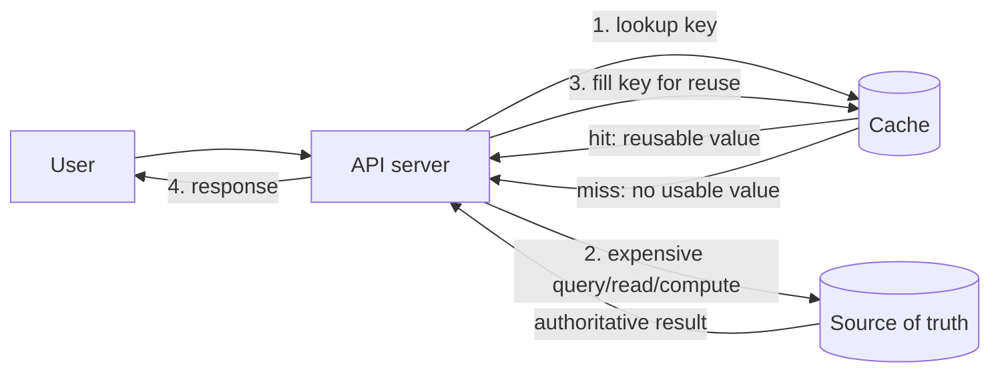
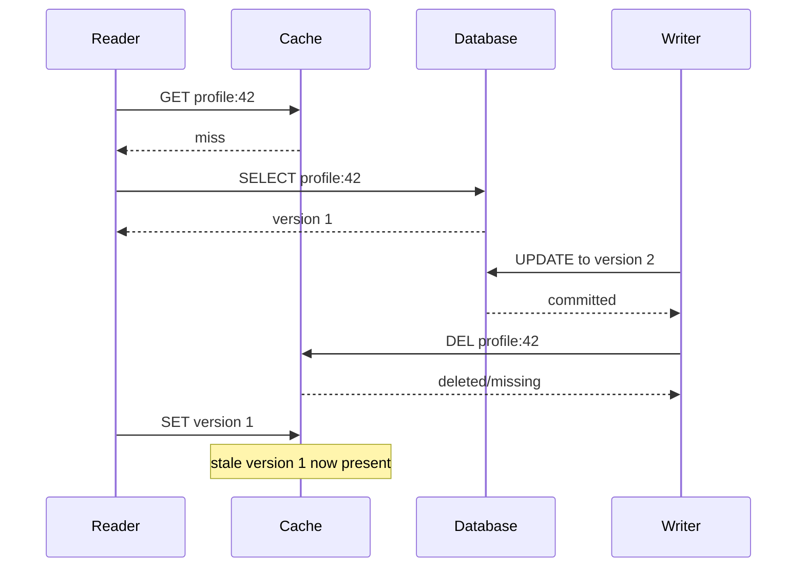

# SD-BEG-110 — What Is Caching?

> **Track:** Beginner
> **Artifact state:** Ready
> **Learning state:** Not started
> **Last updated:** 2026-09-01

## Source and coverage check

- Inspected: the complete timestamped transcript (`00:00:00.560–00:11:20.279`), both supplied slide pages, a full-duration visual survey of the `00:11:19.326` video, its animated request-path explanation, and its ending exercise.
- Coverage: complete across all supplied source material; there are no missing transcript intervals or slide pages.
- Transcript cross-checks: the slides/video resolve automatic-caption errors as **Redis**, **Memcached**, **disk I/O**, **table joins**, **precomputed**, **hash tables**, and **CDN**.
- Unclear source points: the course does not define cache invalidation, token-revocation policy, fallback capacity, benchmark method, or whether Redis is merely disposable in every architecture. These are preserved as boundaries and extended below rather than silently attributed to the instructor.
- Instructor-task scan: complete across the whole source and final 20%; one exercise was found at `00:10:23–00:11:12` and reconstructed as [`SD-BEG-110-T01`](tasks/SD-BEG-110-T01/README.md).

## What I should be able to do

- Define **caching** as a technique and a **cache** as a component or location.
- Explain precisely which network, disk, or computation work a cache hit avoids.
- Trace cache-aside hit, miss, fill, stale-data, outage, and recovery paths in order.
- Decide whether a workload has enough reuse/locality to justify caching.
- Calculate expected latency, miss load, fallback load, and rough cache capacity from explicit assumptions.
- Explain why “in RAM,” “temporary,” “key-value,” and “faster” are common properties rather than a universal definition.
- Diagnose low hit ratio, high miss penalty, evictions, hot keys, stampedes, stale authorization, and fallback-database saturation from evidence.
- Compare an in-process cache, Redis/Memcached, a database/materialized result, and a CDN by boundary and trade-off.
- Complete the instructor's Redis-versus-relational timing exercise without confusing a microbenchmark with a production capacity result.
- Answer caching questions at foundation, SDE-2, and SDE-3 depth while adapting to consistency, latency, durability, availability, or cost changes.

## Small bridge from earlier ideas

This lecture is independent. Three compact ideas make it easier:

1. **Latency** is how long one operation takes; **throughput** is how many operations finish per unit time. A cache can improve one, both, or neither, depending on bottlenecks and concurrency.
2. A **source of truth** is the system whose state decides correctness. A rebuildable cache usually copies data from that source; losing the cache should not lose the authoritative record.
3. A **working set** is the subset used repeatedly during a time window. Caching pays when that subset fits in a faster layer and requests reuse it often enough.

The course begins with performance intuition. Production design adds a correctness question: “Which copy is allowed to be stale, and for how long?”

## The 60-second story

Some responses repeatedly pay for the same slow work: a network hop, disk read, multi-table query, file access, or computation. Caching stores the reusable result in a location that is cheaper to access. On a **hit**, the system returns the cached value and avoids the expensive path. On a **miss**, it still pays the original cost and may store the result for the next request.

The win depends on reuse. Faster storage is usually smaller or more expensive, so we keep a useful subset rather than every item. A recent tweet, news article, profile, token decision, or live-stream segment may be read many times soon after creation.

The core condition is not “use Redis.” It is:

> Repeated requests can safely reuse a result, and the avoided cost is larger than cache lookup, fill, invalidation, memory, and operational cost.

A cache adds another copy and another failure mode. You must define the key, source of truth, freshness rule, miss behavior, outage behavior, capacity, and evidence that it is helping.

## Why the terms matter

| Term | Simple meaning | Why it matters here | Common confusion |
|---|---|---|---|
| Caching | technique of reusing a cheaper copy/result | names the behavior, not a product | saying “cache” only means Redis |
| Cache | place/component holding reusable state | defines latency and failure boundary | assuming every cache is RAM-only |
| Hit | requested usable value is present | takes the short path | presence alone is not enough if value is stale/invalid |
| Miss | requested usable value is absent | pays lookup plus original work | treating cache errors as ordinary misses without capacity/security thought |
| Hit ratio | usable hits divided by lookups | controls average latency and origin load | global ratio can hide one hot endpoint/key class |
| Miss penalty | extra work/latency on a miss | determines break-even point | counting only database time and forgetting lookup/fill |
| Locality | requests reuse nearby-in-time/data items | predicts whether a small subset helps | physical closeness alone |
| Working set | actively reused subset in a window | drives required cache capacity | total dataset size |
| Source of truth | copy that decides correctness | tells us where to recover after loss | assuming the fastest copy is authoritative |
| Freshness | how current a value must be | bounds acceptable staleness | equating TTL with guaranteed correctness |
| TTL | time after which a key expires | limits age and memory residence | assuming expiry happens at an exact wall-clock instant under all systems |
| Eviction | removal to free bounded capacity | changes hit ratio under pressure | confusing eviction with intentional invalidation |
| Invalidation | removal/update because source changed | protects correctness after writes | believing it is identical to expiry |
| Hot key | one key receives disproportionate traffic | can overload one shard/process | assuming high global hit ratio prevents hotspots |
| Stampede | many misses trigger the same expensive work | can overwhelm the source | treating each miss independently |

## Big picture

### Question this visual answers

Where does a cache shorten the request path, and what happens when the value is absent?



### How to read this visual

Start at the API. It checks the cache before the expensive source path. A hit returns through the API immediately. A miss returns control to the API, which fetches or computes the authoritative result, optionally fills the cache, and responds.

### Key insight

The cache does not remove the original path. It changes how often the original path is paid. Therefore hit rate, miss penalty, and fallback capacity matter as much as cache lookup speed.

### Simplification or limitation

This reconstructs the course's single-cache request flow. It omits concurrent misses, replication, invalidation races, TTL, eviction, partial outages, multi-region routing, consistency rules, and cases where Redis itself is authoritative.

## Core concepts

### 1. Caching is the technique; a cache is the reusable location

**Simple meaning:** Caching means keeping something useful so the next request avoids repeating expensive work. A cache is where that reusable state lives.

**Formal meaning:** Given an original function or fetch `F(k)` with cost `C_origin`, a cache stores a prior result `v` under key `k`. Reuse is beneficial when `v` remains valid and `C_lookup + expected maintenance cost < C_origin` often enough.

**Why it exists:** Without reuse, identical requests repeatedly spend network, disk, CPU, query, parsing, aggregation, or external-API cost.

**How it works:**

1. Choose a deterministic key for the request/result.
2. Look for a usable cached value.
3. Return it on a hit.
4. On a miss, execute the original path.
5. Validate the result and optionally cache it under the same key.
6. Expire, evict, update, or invalidate it when the freshness/capacity rule says so.

**Invariant or deciding condition:** The cached value must be safe to reuse for every request represented by its key during its validity window.

**Small example:** Key `profile:v3:42` maps to a precomputed profile for user `42`. Five table joins cost 25 ms; a valid cached profile costs 1 ms to fetch.

**Trade-off:** Less repeated work and origin load versus extra memory, another copy, staleness, invalidation logic, and operational complexity.

**Failure/observability:** A wrong key can leak or mix data; a stale value can violate business rules. Trace cache outcome, key class (not sensitive raw key), value version, age, source latency, and fallback behavior.

**When not to use it:** Requests are mostly unique, data changes faster than it is reused, correctness requires read-after-write with no stale window, or the origin is already cheap enough.

**Interview change:** If consistency becomes strict, move from “cache whenever hot” to defining version checks, invalidation acknowledgment, bypass/read-through rules, or rejecting caching for that path.

### 2. “Nearer” means cheaper on the real access path

**Simple meaning:** A useful cache is faster/cheaper to reach than the work it replaces. It need not be only RAM.

**Formal meaning:** Nearness is relative to a request boundary and includes network topology, protocol, serialization, storage tier, computation, queuing, and contention—not only physical distance.

**Why it exists:** The course correctly broadens caching beyond an in-memory product. A browser disk cache can avoid WAN traffic; an API process memory cache can avoid a Redis hop; a CDN edge can avoid an origin-region transfer; a database buffer cache can avoid disk.

**How it works:**

1. Draw the current expensive path.
2. Measure where time/resources are spent.
3. Place reusable state before that cost.
4. Confirm the new lookup is actually cheaper at expected concurrency.

**Invariant or deciding condition:** The cache must sit on a path that requests can reliably reach and must avoid more cost than it introduces.

**Small example:** Keeping a parsed configuration object inside an API process avoids disk read and parsing. It is a cache even though Redis is absent.

**Trade-off:** A nearer per-process cache has very low latency but duplicates memory and can diverge across instances. A shared Redis cache adds a network hop but centralizes reusable state.

**Failure/observability:** A supposedly near cache can become slower through connection-pool exhaustion, cross-zone routing, CPU saturation, large-value serialization, or packet loss. Measure end-to-end, not product reputation.

**When not to use it:** The added hop is comparable to the origin, the value is too large to copy, or per-instance divergence is unacceptable.

**Interview change:** If the interviewer moves the cache to another region, recalculate hit latency, transfer cost, availability, and failure domain; “in memory” no longer guarantees “near.”

### 3. Locality and the working set decide what deserves space

**Simple meaning:** Recent or popular items are often requested again soon. Cache that reused subset, not blindly everything.

**Formal meaning:** **Temporal locality** means an item used recently is likely to be used again soon. **Popularity skew** means a small fraction of keys receives a large fraction of requests. The working set is the distinct data actively reused during a chosen window.

**Why it exists:** Fast memory is finite and costs money. Caching the full database can duplicate capacity without improving decisions; it can also evict genuinely hot items when cold data enters.

**How it works:**

1. Measure request frequency and reuse distance by key class.
2. Estimate the working set for the intended TTL/window.
3. Size memory including key/value/metadata overhead.
4. Admit and evict items according to observed access patterns.
5. Recheck hit ratio and evictions as traffic changes.

**Invariant or deciding condition:** An admitted item should be likely enough to be reused before invalidation/expiry/eviction that its avoided cost repays its storage/fill cost.

**Small example:** A newly published news article may receive 50,000 reads in ten minutes; a one-year-old article may receive one. Recent content has higher short-term reuse.

**Trade-off:** A narrow hot set gives high value per byte but may miss long-tail requests. A broad set increases hit opportunity but costs more and may cause churn.

**Failure/observability:** Sudden traffic shifts make yesterday's hot set wrong. Watch per-key-class hits/misses, memory, evictions, rejected writes, and churn—not only a fleet-wide ratio.

**When not to use it:** Uniform one-time scans, write-heavy unique IDs, high-cardinality search results with little repetition, or privacy rules that forbid retaining results.

**Interview change:** If traffic becomes highly skewed, total memory may be sufficient while one key/shard saturates. Add hot-key detection, replication/read spreading, local near-cache, or request coalescing.

### 4. Cache-aside: the application controls lookup and fill

**Simple meaning:** The API checks the cache. On a miss, it reads the database and places the result in the cache.

**Formal meaning:** Cache-aside is an application-managed pattern in which the cache is consulted separately from the source of truth; misses and writes invoke explicit application logic.

**Why it exists:** It lets the application cache only useful results and preserve the database as the authoritative path.

**How it works:**

1. Build key `profile:v3:42`.
2. `GET` the key.
3. If present and valid, deserialize and return.
4. If absent, query the database.
5. If a row exists, serialize and `SET` with a freshness policy.
6. Return the same database result.

**Invariant or deciding condition:** A miss must preserve correctness even if cache fill fails. A hit must satisfy the key and freshness contract.

**Small example:** The first request spends 25 ms on joins and 1 ms on fill; the next 999 requests spend about 1 ms each if the profile remains valid.

**Trade-off:** Simple and resilient to cache loss when fallback is sized, but every application must implement misses, fills, invalidation, error handling, and concurrency controls correctly.

**Failure/observability:** Cache timeout, malformed value, deserialization error, fill failure, duplicate fills, and database overload are distinct outcomes. Tag them separately.

**When not to use it:** A platform-provided read-through layer is more reliable, every read must be transactionally synchronized with writes, or the application cannot safely own invalidation.

**Interview change:** At large scale, add single-flight/request coalescing, TTL jitter, negative-cache policy, backpressure, and fallback budgets before saying “cache down means database.”

### 5. Hits, misses, hit ratio, and miss penalty

**Simple meaning:** A hit uses the short path. A miss pays extra lookup plus the original work.

**Formal meaning:** For usable hits `H` and lookups `L`, `hit ratio = H / L`. If hit latency is `T_hit` and full miss latency is `T_miss`, average latency in a simplified model is:

```text
E[T] = h × T_hit + (1 - h) × T_miss
```

**Why it exists:** A fast cache with few hits can slow the system; a high hit ratio with a huge miss penalty can still violate tail-latency goals during churn/outage.

**How it works:**

1. Count lookups by request/key class.
2. Count only valid, successfully served hits.
3. Measure latency separately for hit and miss outcomes.
4. Include source fetch and fill in the miss path.
5. Compare origin QPS before/after and during cache failure.

**Invariant or deciding condition:** Metrics use the same outcome definition. A stale rejected entry, timeout, or decode failure is not a successful hit.

**Small example:** At 1,000 requests/s and 90% hit ratio, only about 100 requests/s reach the database in the steady simplified model.

**Trade-off:** Raising hit ratio may require more memory/longer TTL, which increases cost or staleness.

**Failure/observability:** A global 95% can hide an endpoint at 20%. Use dimensions that are bounded in cardinality: route, key class, region, cache shard, and outcome.

**When not to use it:** Hit ratio alone should not choose a cache; include avoided work, correctness, memory, invalidation, and failure costs.

**Interview change:** If database latency increases from 20 ms to 200 ms, miss penalty and outage risk rise sharply; prioritize stampede protection and fallback load shedding.

### 6. Keys define the reuse and isolation boundary

**Simple meaning:** A cache returns the value associated with a key. The key must represent every input that changes the answer.

**Formal meaning:** For cached function `f(x₁, …, xₙ)`, the key must distinguish any inputs, tenant, authorization context, locale, version, or feature state that can produce meaningfully different outputs.

**Why it exists:** A key that is too broad returns someone else's/wrong variant; a key that is too narrow destroys reuse and increases cardinality.

**How it works:**

1. List response-determining inputs.
2. Normalize them deterministically.
3. include namespace, schema/version, tenant/security scope, identity, and relevant variant.
4. Bound key length and sensitive content.
5. Define migration/invalidation when the representation changes.

**Invariant or deciding condition:** Equal keys must imply safely interchangeable cached answers.

**Small example:** `profile:v3:tenant-7:user-42:locale-en` prevents mixing tenants, schema versions, users, or locales.

**Trade-off:** More dimensions protect correctness but reduce hit rate and increase key count.

**Failure/observability:** Tenant omission can become a data leak. Never log secret tokens/raw personal data as cache-key labels. Log a safe key class and hashed diagnostic identifier when necessary.

**When not to use it:** Do not cache personalized responses when the authorization/key boundary is unclear.

**Interview change:** If permissions change frequently, include an authorization/version boundary or cache only non-sensitive public data.

### 7. Temporary copy, source of truth, and recovery

**Simple meaning:** In the course's model, the cache is a supplement: if it disappears, the system rebuilds values from the database.

**Formal meaning:** A rebuildable cache is a derived data store whose loss does not violate the authoritative durability invariant. It may still be required for latency/capacity availability.

**Why it exists:** Separating authoritative data from performance copies makes loss recovery conceptually simple.

**How it works:**

1. Database owns durable profile state.
2. Cache owns derived profile copies for bounded periods.
3. Cache loss converts hits into misses.
4. Misses read the database and repopulate.
5. Traffic controls protect the database during recovery.

**Invariant or deciding condition:** Every cached value can be recomputed/retrieved from a trustworthy source within recovery requirements.

**Small example:** Restarting an ephemeral profile cache loses 100,000 entries but not profiles. Requests rebuild them gradually.

**Trade-off:** Rebuildability reduces cache durability needs, but cold-start traffic and expensive recomputation can make cache availability operationally critical.

**Failure/observability:** Cache outage may cause a database QPS jump from 100 to 1,000 in the earlier example. Alert on fallback QPS, source saturation, timeouts, and rejected requests.

**When not to use it:** If Redis stores the only job state, lock ownership, rate-limit decision, or session with no authoritative recovery path, it is no longer “just a disposable cache.”

**Interview change:** If cache rebuild takes hours and the database cannot serve full traffic, design warmup, snapshots/persistence, staged admission, degraded responses, and recovery ownership.

### 8. Freshness, expiry, invalidation, and eviction are different

**Simple meaning:** Expiry removes old data by time; invalidation reacts to a source change; eviction frees capacity. None automatically guarantees correctness.

**Formal meaning:**

- **TTL/expiry:** time-based validity/residence policy.
- **Invalidation:** application/event-driven removal or replacement after a semantic change.
- **Eviction:** capacity policy removes entries, often regardless of source change.
- **Freshness:** application property stating whether a value is acceptable for a request.

**Why it exists:** Production caches become stale. A single “temporary” label hides why and when a value disappears or becomes invalid.

**How it works:**

1. Define maximum acceptable age per data class.
2. On writes, choose update/delete/version strategy.
3. Use TTL as a backstop, not magical synchronization.
4. Configure capacity/eviction based on the working set.
5. Treat missing values as expected and stale values according to policy.

**Invariant or deciding condition:** The value served must satisfy the request's freshness/authorization contract, regardless of why it remains in memory.

**Small example:** A public news headline may tolerate 30 seconds of staleness. A revoked token may tolerate none; fail-closed behavior may be required.

**Trade-off:** Longer TTL improves hit ratio and reduces source load but lengthens stale windows. Aggressive invalidation improves freshness but adds coordination and failure modes.

**Failure/observability:** Track value age/version, expired keys, evictions, invalidation lag/failures, and stale-read incidents separately.

**When not to use it:** Do not cache an authorization decision until revocation, expiry, tenant isolation, and outage policy are explicit.

**Interview change:** If requirement changes from eventual freshness to read-your-writes, use versioned keys, session bypass, synchronous invalidation/updates, or remove caching from that read path.

### 9. Redis and Memcached are examples, not the definition

**Simple meaning:** Redis and Memcached are popular shared key-value systems that can act as caches. A cache can also exist in a browser, process, disk, database, proxy, or CDN.

**Formal meaning:** The role “cache” is defined by reuse relative to another expensive path. The product may support many non-cache roles.

**Why it exists:** Product-first thinking causes unjustified infrastructure and false assumptions such as “all Redis data is disposable” or “all caches are RAM-only.”

**How it works:**

1. Define the learning/business question.
2. Identify required semantics and failure boundary.
3. Select the smallest cache location/product that satisfies them.
4. Configure capacity, durability, availability, security, and observability explicitly.

**Invariant or deciding condition:** Product configuration must match the role. A cache role requires a source/rebuild or an explicit decision to accept loss.

**Small example:** The task configures Redis with persistence disabled because it is intentionally disposable, while PostgreSQL retains a labeled volume. Redis also supports persistence modes; that does not make this experiment durable.

**Trade-off:** Redis offers richer data structures and optional persistence; Memcached is a focused volatile cache. Richness can help or add operational/configuration surface.

**Failure/observability:** Inspect actual version, persistence, max memory, eviction, replication, backups, and client behavior; do not infer from the product name.

**When not to use it:** A bounded in-process LRU may be enough; a CDN may be the correct boundary; a database index/materialized view may remove the expensive work without a second serving system.

**Interview change:** If the cache becomes authoritative, the design question changes to database durability, replication, backup, recovery, and consistency—not just hit ratio.

## Worked example and calculations

### Assumptions

Consider a profile endpoint:

- Request rate: `R = 1,000 requests/s`.
- Cache hit ratio: `h = 0.90` (90%).
- Cache hit latency: `T_hit = 1 ms`.
- Miss path: `1 ms` lookup + `20 ms` database query + `1 ms` cache fill = `T_miss = 22 ms`.
- Without cache: database path latency `T_origin = 20 ms`.
- Working set: `100,000` profiles.
- Serialized cached value: `2 KiB/profile`.
- Planning overhead assumption: `35%` for keys/metadata/allocator/fragmentation. This is a capacity assumption, not a Redis constant.

### Steps

#### 1. Expected latency

```text
E[T] = h × T_hit + (1 - h) × T_miss
     = 0.90 × 1 ms + 0.10 × 22 ms
     = 0.90 ms + 2.20 ms
     = 3.10 ms
```

Simplified average improvement versus 20 ms:

```text
(20 - 3.1) / 20 × 100 = 84.5%
```

This is an average model, not a p95/p99 guarantee.

#### 2. Database load in steady state

```text
database QPS = R × (1 - h)
             = 1,000 × 0.10
             = 100 queries/s
```

The cache absorbs approximately `900 requests/s` in this simplified read-only model.

#### 3. Cache-outage fallback load

If every lookup becomes a miss:

```text
fallback database QPS = 1,000 queries/s
increase versus cached steady state = 1,000 / 100 = 10×
```

“Data still comes from the database” is correct only if the database and dependencies survive this 10× step and the application controls retries.

#### 4. Break-even hit ratio for latency only

Solve for `h` where caching beats the 20 ms direct path:

```text
h × 1 + (1 - h) × 22 < 20
1h + 22 - 22h < 20
22 - 21h < 20
-21h < -2
h > 2 / 21
h > 0.0952 ≈ 9.52%
```

Under these assumptions, a hit ratio above about 9.5% improves average latency. Real break-even is higher after memory, infrastructure, invalidation, errors, and engineering cost.

#### 5. Rough working-set memory

Payload only:

```text
100,000 × 2 KiB = 200,000 KiB
200,000 / 1,024 = 195.3125 MiB
```

With the planning overhead:

```text
195.3125 MiB × 1.35 = 263.67 MiB
```

Round up for headroom rather than provisioning exactly `264 MiB`; eviction behavior, replicas, forks/persistence, buffers, allocator, growth, and hot-key traffic need separate budgets.

### Result and sanity check

The cache looks compelling: average modeled latency falls from 20 ms to 3.1 ms and database QPS falls from 1,000 to 100. The same numbers reveal the failure risk: a total cache outage multiplies database traffic by 10. The capacity estimate is plausible for one small working set, but total dataset size and real object overhead were intentionally excluded.

Change one condition: at only 20% hit ratio,

```text
E[T] = 0.20 × 1 + 0.80 × 22 = 17.8 ms
database QPS = 1,000 × 0.80 = 800
```

Latency is only slightly better than 20 ms while most origin load remains. The cache may not justify its cost.

## Deep mechanism

### Components, ownership, and boundaries

| Component | Owns | Must not silently own | Useful evidence |
|---|---|---|---|
| API/client | key construction, hit/miss logic, fallback, serialization | authoritative data unless explicitly designed | outcome-tagged trace, timeout, fill result, value version |
| Cache | bounded reusable entries and cache-specific metadata | correctness beyond configured freshness/durability | hits, misses, latency, memory, evictions, errors, hot keys |
| Source of truth | authoritative profile and transaction rules | infinite fallback capacity | query latency/QPS, locks, CPU, connections, storage, errors |
| Invalidation path | communicates semantic changes | guaranteed delivery unless designed/observed | event lag, retries, dead letters, invalidation failures |
| Load-control path | admission, coalescing, backpressure, degradation | unlimited retries | rejected/coalesced requests, queue depth, retry rate |

### Ordering, concurrency, and stale state

#### Question this visual answers

How can “delete cache after database update” still end with stale data?



#### How to read this visual

The reader misses and fetches version 1. Before it fills the cache, a writer commits version 2 and deletes the cache key. The delayed reader then writes its already-fetched version 1 after that invalidation.

#### Key insight

Correct final state depends on event ordering, not only on having an invalidation call. Versions, write ordering, short TTL, compare-and-set rules, delayed double-delete, or source-aware refresh policies may be needed depending on the requirement.

#### Simplification or limitation

This shows one race, not a universal fix. It omits replicas, transaction isolation, message delivery, multiple regions, clocks, retries, and cache libraries. The course does not present this race; it is a verified practical extension of the copied-state model.

### Failure and recovery

| Failure | Observable symptom | Mechanism | Protection/recovery | Remaining risk |
|---|---|---|---|---|
| Cache process/fleet down | hit ratio collapses; cache errors; origin QPS/latency jumps | all short paths become fallback | strict timeouts, circuit/bypass policy, load shedding, staged warmup | source may still saturate before controls react |
| Cold start/restart | many misses after recovery | empty working set | controlled prewarm, admission, request coalescing, gradual traffic | prewarm may load cold/unneeded items |
| Stampede on expiry | synchronized misses and duplicated expensive queries | popular key expires/evicts once | single-flight, leases, TTL jitter, stale-while-revalidate | coordinator can become a bottleneck/failure point |
| Hot key | one shard/core/network link saturates despite high hit ratio | skew concentrates requests | replicate/read-spread, local near-cache, key splitting where safe | updates and consistency become harder |
| Eviction churn | rising evictions and misses; latency oscillation | working set exceeds usable memory or wrong policy | capacity/admission/policy tuning, shorter values, tiering | a traffic shift can invalidate sizing |
| Stale profile | old field served after update | invalidation lag/race/TTL | versioned entries, event monitoring, read repair, bounded TTL | zero-staleness may require bypass/synchronization |
| Stale/revoked auth decision | unauthorized access or false denial | cached security state outlives truth | short bounded TTL, revocation/version check, fail-closed rules | security availability trade-off remains |
| Poisoned/wrong key | cross-tenant or wrong variant response | key omits deciding context | key contract tests, namespaces, versions, tenant/auth scope | high cardinality lowers reuse |
| Oversized value | high serialization/network/memory and tail latency | cache moves too much data | size limits, compression carefully, cache smaller projection | compression adds CPU and latency variance |
| Slow cache, not down | request threads wait; source not used promptly | connection pool/network/CPU contention | short bounded timeout, bulkhead, health/outlier detection | premature fallback can amplify origin load |
| Fill/invalidation failure | repeated misses or stale values | cache write/event delivery error | non-blocking fill where safe, retries with bounds, durable invalidation channel | retries can duplicate load |

### Observability

Measure each layer and outcome:

- **Application:** request latency by `cache_hit`, `cache_miss`, `cache_error`, `cache_bypass`; fallback count; fill duration/failure; value age/version; coalesced requests; rejected/degraded requests.
- **Cache:** `keyspace_hits`, `keyspace_misses`, command latency, connections, timeouts, memory used, max memory, evictions, expired keys, CPU, network bytes, replication/persistence state when configured.
- **Source:** QPS by query, latency, CPU, I/O, buffer-cache behavior, lock/wait time, connection-pool use, error/timeout rate.
- **Capacity:** working-set cardinality/bytes, object-size distribution, shard skew, hot-key estimates, memory headroom.
- **Correctness:** stale-read/version mismatch incidents, invalidation event lag/failures, authorization-revocation age.

Useful derived signals:

```text
hit_ratio = usable_hits / lookups
miss_ratio = 1 - hit_ratio
fallback_amplification = fallback_QPS_during_incident / normal_origin_QPS
estimated_avoided_origin_work = usable_hits × measured_origin_cost_per_request
```

Avoid unbounded raw keys/user IDs in metric labels. Diagnose with sampled/hashed identifiers and safe logs/traces.

Alert examples should couple cause and impact:

- hit ratio drops **and** origin QPS/latency rises;
- evictions rise while memory stays near limit;
- cache error rate rises and fallback budget approaches the source limit;
- invalidation lag exceeds the data class's freshness budget;
- one cache shard's CPU/traffic diverges sharply from peers.

## Design choices

| Choice | Benefits | Costs/risks | Prefer when | Avoid when |
|---|---|---|---|---|
| In-process bounded cache | lowest hop latency; no shared dependency | per-instance duplication/divergence; cold deploys | small read-mostly configuration/reference data | many instances need coherent/shared entries |
| Shared Redis/Memcached | cross-instance reuse; centralized capacity/policy | network hop and shared failure domain | hot working set reused across API instances | origin is equally cheap or shared outage risk is unjustified |
| CDN/edge cache | avoids WAN/origin bandwidth; near users | purge/freshness/security complexity | public/static/segment content with broad reuse | highly personalized/private mutable data without safe keys |
| Database buffer/result/materialized path | fewer serving systems; database semantics | still consumes DB resources; refresh/query constraints | the expensive work is index/aggregation related and DB can own it | database is already the bottleneck/failure domain to offload |
| Short TTL | bounds staleness and memory residence | more misses/refills | moderately dynamic data with simple freshness budget | each miss is extremely expensive or strict invalidation exists |
| Long TTL | high reuse and lower source load | longer stale window and memory pressure | immutable/versioned content | permissions, prices, inventory, or other rapidly changing state |
| Cache-aside | explicit selective caching; source remains clear | application owns races/fills/errors | common read-heavy derived data | team cannot reliably own invalidation/fallback |
| Negative caching | reduces repeated absent/failed lookups | can hide newly created/recovered values | bounded not-found outcomes with short safe TTL | authorization/errors that must recover immediately |
| Precompute/cache result | avoids CPU/query work entirely | update pipeline and stale results | expensive deterministic computation with reuse | low reuse or input space too large |
| No cache | simplest correctness/operations | repeats original work | source already meets SLO/cost and scale | measured repeated work is the bottleneck |

## Misconceptions

| Claim/confusion | What is actually true | Evidence or counterexample |
|---|---|---|
| “A cache is Redis.” | Redis can be a cache; browser disk, process memory, CDN, and database buffers/results can also cache. | The role is defined by avoided work relative to another path. |
| “Caches always live in RAM.” | RAM is common, but disk/edge/process/database layers can be caches; Redis can also persist. | Redis documents no persistence, RDB, AOF, or both. |
| “Cache down has little impact.” | Authoritative data may survive, yet latency/availability can collapse if fallback load saturates the source. | The worked example jumps from 100 to 1,000 DB QPS. |
| “High hit ratio proves success.” | It can hide low-value hits, a slow cache, stale values, one bad endpoint, or a hot shard. | Outcome latency, avoided work, correctness, and cost are also needed. |
| “TTL solves invalidation.” | TTL bounds age only after it is set; it does not coordinate writes or prevent races inside the window. | The stale-fill sequence can install old data after invalidation. |
| “A key-value lookup is always O(1), so latency is constant.” | Algorithmic average ignores network, serialization, queuing, contention, memory, eviction, and failure. | The lab reports a distribution rather than one constant. |
| “Cache everything to maximize hits.” | Fast capacity is finite; cold entries can waste memory and evict the working set. | Locality and reuse before eviction determine value. |
| “Redis is always faster than a relational database.” | Operation, durability, clients, network, data, query, cache state, and host determine observed timing. | The task intentionally refuses a universal ordering assertion. |
| “Cached auth tokens are safe because they expire.” | Revocation and fail-open/fail-closed behavior still require explicit design. | A token can be revoked before its cached TTL ends. |
| “A miss is harmless.” | Many synchronized misses can amplify one event into a source outage. | Stampede/request coalescing exists because misses are not independent at scale. |

## Real backend connection

The following is a conceptual FastAPI/PostgreSQL/Redis cache-aside shape, not a claim about Rahul's production code:

```python
async def get_profile(user_id: int) -> Profile:
    key = f"profile:v3:{user_id}"
    try:
        cached = await redis.get(key)
        if cached is not None:
            metrics.increment("profile_cache_lookup", outcome="hit")
            return Profile.model_validate_json(cached)
    except CacheTimeout:
        metrics.increment("profile_cache_lookup", outcome="error")

    metrics.increment("profile_cache_lookup", outcome="miss_or_bypass")
    profile = await load_profile_from_postgres(user_id)

    try:
        await redis.set(key, profile.model_dump_json(), ex=60)
    except CacheError:
        metrics.increment("profile_cache_fill", outcome="error")

    return profile
```

Important boundaries:

- A cache error is not automatically identical to a miss; the fallback path needs a timeout, budget, and security policy.
- The key version `v3` prevents old serialization from being interpreted as the new schema.
- The code does not solve invalidation after profile updates.
- A 60-second TTL is only an example; choose it from freshness, reuse, origin capacity, and failure requirements.
- Filling after the database read is allowed to fail because the database result is still correct in this rebuildable-cache model.
- Do not cache a personalized profile until tenant/authorization context is included safely.

AWS analogies when relevant:

- CloudFront caches eligible content at edge locations, avoiding origin/WAN work.
- ElastiCache can provide managed Redis/Memcached, but management does not remove key, freshness, fallback, or cost decisions.
- RDS/PostgreSQL remains the authoritative source in a common cache-aside design; a cache outage can still overload its connections/CPU/I/O.

## Instructor-assigned tasks

| Task | Faithful purpose | Tools | Reference verified? | Learner status |
|---|---|---|---|---|
| [`SD-BEG-110-T01`](tasks/SD-BEG-110-T01/README.md) | Set up Redis, practice put/get, measure it, and compare equivalent storage/retrieval with a relational database | Docker, Redis, PostgreSQL, Python | passed; see genuine evidence | not started |

The learner/reference boundary is strict: [`ATTEMPT.md`](tasks/SD-BEG-110-T01/ATTEMPT.md) remains Rahul-owned; the complete reference lives separately.

### Codex-added practice

These drills are not instructor homework:

1. **Predict:** At 20,000 requests/s, 92% hit ratio, and two database queries per miss, calculate normal database query rate. Then calculate it at 0% hits.
2. **Draw:** Recreate the cache-aside hit/miss flow and mark the authoritative copy, timeout, fill, and fallback boundary.
3. **Explain:** Why can an in-process cache be “nearer” than Redis but harder to keep coherent?
4. **Change:** A profile may now be stale for at most 100 ms instead of 60 seconds. Decide whether to invalidate synchronously, version, bypass, or remove the cache.
5. **Incident:** Hit ratio remains 95%, but p95 latency doubles. List evidence that distinguishes a slow cache, oversized values, hot shard, connection pool, and database misses.

## Useful English and technical phrases

### Locality

- Pronunciation: `loh-KAL-uh-tee`
- Simple meaning: a pattern where recently/nearby used data is likely to be used again.
- Hindi cue: `paas ya haal mein istemal hua data phir kaam aana`
- Why it matters here: locality tells us whether a small working set can serve many requests.
- Common misuse: saying “locality” means only physical geographic closeness.

Examples:

1. Simple: “Recent news has strong temporal locality.”
2. Engineering: “The access log shows enough locality to cache the newest product pages.”
3. Engineering: “A one-time export has poor locality, so the cache will mostly miss.”
4. Interview: “I would verify locality before sizing the cache.”
5. Professional/design review: “Our locality assumption weakened after traffic shifted to long-tail search results.”

### Stale

- Pronunciation: `stayl`
- Simple meaning: old enough that it may no longer match the source of truth.
- Hindi cue: `purana / ab current nahin`
- Why it matters here: a fast stale answer may violate correctness.
- Common misuse: using “stale” to mean missing; missing is a miss, stale is present but outdated/unacceptable.

Examples:

1. Simple: “The cached price is stale.”
2. Engineering: “A delayed invalidation left stale profile data for 30 seconds.”
3. Engineering: “We compare the cached version with the database version before serving it.”
4. Interview: “The acceptable stale window is a requirement, not a Redis default.”
5. Professional/design review: “This design reduces database load but increases the maximum stale interval.”

### Eviction

- Pronunciation: `ih-VIK-shuhn`
- Simple meaning: removing entries to make room in bounded capacity.
- Hindi cue: `jagah banane ke liye entry nikalna`
- Why it matters here: evictions turn future hits into misses and reveal working-set/capacity pressure.
- Common misuse: calling every deletion an eviction; invalidation and expiry have different causes.

Examples:

1. Simple: “The oldest entry was removed by eviction.”
2. Engineering: “Evictions increased when the working set exceeded usable memory.”
3. Engineering: “The cache uses a bounded policy rather than growing without limit.”
4. Interview: “I would correlate evictions with miss ratio and origin QPS.”
5. Professional/design review: “Adding memory treats capacity pressure, but admission and value size may be the real issue.”

### Degrade gracefully

- Pronunciation: `dih-GRAYD GRAYS-fuh-lee`
- Simple meaning: keep the most important behavior working with reduced quality during failure.
- Hindi cue: `failure mein controlled tareeke se kam quality par chalna`
- Why it matters here: full fallback during cache loss may overload the database; controlled degradation can protect it.
- Common misuse: saying the system degrades gracefully when it merely becomes slow or retries indefinitely.

Examples:

1. Simple: “The app shows a basic profile when recommendations are unavailable.”
2. Engineering: “During cache recovery, we degrade gracefully by omitting expensive secondary fields.”
3. Engineering: “Admission control protects PostgreSQL instead of allowing unlimited fallback.”
4. Interview: “I would define which endpoints degrade, fail closed, or remain fully consistent.”
5. Professional/design review: “The recovery plan is incomplete until graceful degradation and ownership are explicit.”

## Interview practice

### Foundation

**Question:** What is caching, and how does a cache-aside read work?

**Strong answer covers:** repeated expensive work; reusable cheaper copy; key; cache hit; miss; source-of-truth fetch; fill; temporary/validity boundary; one example; one reason not to cache.

**Weak-answer trap:** “Caching means storing data in Redis RAM, so reads are O(1).” This omits the relative path, correctness, miss behavior, and product boundary.

**Natural 60-second outline:**

```text
repeated expensive work
→ check reusable value by safe key
→ hit avoids origin
→ miss fetches source and may fill
→ win depends on reuse/hit rate
→ copy can be stale or unavailable
→ define freshness, fallback, and metrics
```

### SDE-2 working engineer

**Question:** A profile endpoint's p95 is 150 ms and PostgreSQL performs six joins. How would you decide whether and how to cache it?

**Reasoning checkpoints:**

1. Clarify latency SLO, read/write rate, freshness/read-your-writes, payload/tenant/auth boundary, and failure tolerance.
2. Measure query frequency, reuse/locality, query plan/latency, result size, and existing bottleneck.
3. Estimate hit/miss latency, required hit ratio, working-set memory, origin QPS, and cache-outage QPS.
4. Choose key/version/TTL/invalidation and cache-aside or an alternative.
5. Add timeout, coalescing, jitter, fallback budget, and controlled degradation.
6. Test exact correctness, updates, concurrent miss race, cache down/slow, cold start, and eviction.
7. Observe outcome-tagged latency, hit/miss, fill/invalidation, memory/eviction/hot keys, and PostgreSQL load.

**Follow-up:** The user must see their profile update immediately, while other users may see it within 30 seconds. Use session bypass/versioning/read-your-writes for the writer and bounded caching for others; state the precise invariant.

### SDE-3 senior design

**Prompt:** Design caching for a global news/profile service at 100,000 requests/s with 95% reads, strong popularity skew, 99.9% availability, and region-local latency below 50 ms.

**Clarify first:**

- endpoint/data classes, public versus personalized;
- regional request split and cross-region/source latency;
- freshness and read-your-writes per class;
- peak/average RPS, object-size distribution, working-set/reuse distribution;
- authoritative data ownership and replication;
- cache loss/fallback database capacity;
- durability/security/cost and operational ownership.

**Answer outline:**

1. Separate public immutable/versioned news from personalized profiles.
2. Put public content at CDN/edge; use region-local shared caches for reusable profile projections and a small in-process near-cache only where coherence permits.
3. Define versioned tenant-safe keys, TTL/invalidation, negative-cache policy, and source of truth.
4. Calculate steady miss QPS and total-failure fallback; keep source below safe capacity with admission control/degradation.
5. Handle hot keys through edge/local replication and request coalescing; jitter TTLs and stage warmup.
6. Protect writes/read-your-writes using version/bypass/update rules.
7. Design cache shard/region failure, slow-cache timeout, cold start, stale-serving policy, and recovery.
8. Operate with SLOs by outcome, hit/miss/eviction/hot-key/invalidation metrics, safe tracing, capacity forecasts, and failure drills.
9. Compare cost and complexity against query/index/materialized-view improvements and no cache.

**Requirement change:** Authentication decisions now use the same cache and revocations must take effect within one second. Isolate this security class, define fail-closed behavior, version/revocation propagation, bounded TTL, monitoring, and do not reuse public-content failure policy.

## Course, verified extensions, and uncertainty

### Course model

The supplied course explains:

- caching improves performance by storing frequently accessed data in a faster/nearer place;
- a cache can avoid expensive network I/O, disk I/O, or computation;
- examples include profile joins, repeated file reads, recent tweets/news, authentication-token checks, and recent live-stream segments on a CDN;
- the API checks the cache first, reads the database on a miss, fills the cache, and responds;
- caches are commonly temporary supplements, so database fallback preserves data when the cache is unavailable;
- faster storage is more expensive/limited, so cache a likely-to-be-read subset rather than everything;
- caches are not restricted to RAM; API-server disk or memory can serve as a cache relative to a more expensive path;
- a simple key-value/hash-table mental model is useful;
- Redis and Memcached are common examples;
- caching should follow measured frequent access, not be added for its own sake.

### Verified extensions

- Redis officially documents four persistence choices: RDB snapshots, AOF logging, no persistence (sometimes used for caching), or RDB+AOF. Therefore “Redis” does not itself mean “temporary” or “durable”; configuration decides. See [Redis persistence](https://redis.io/docs/latest/operate/oss_and_stack/management/persistence/).
- Redis documents bounded-memory eviction policies and notes that eviction behavior is tied to `maxmemory`; capacity policy must be explicit. See [Redis key eviction](https://redis.io/docs/latest/develop/reference/eviction/).
- Redis exposes operational sections such as server, clients, memory, persistence, stats, replication, CPU, command statistics, error statistics, and keyspace through `INFO`; cache observability can be tied to actual state. See [Redis `INFO`](https://redis.io/docs/latest/commands/info/).
- The task's basic operations follow the official [`SET`](https://redis.io/docs/latest/commands/set/) and [`GET`](https://redis.io/docs/latest/commands/get/) command references.
- The runtime pins are checked against current primary sources: the [Docker Official Images Redis registry](https://raw.githubusercontent.com/docker-library/official-images/master/library/redis), the [PostgreSQL image registry](https://raw.githubusercontent.com/docker-library/postgres/master/versions.json), and [PostgreSQL 18.6 release notes](https://www.postgresql.org/docs/release/18.6/).

### Inferences and practical connections

- “Nearer” is best interpreted as cheaper on the measured request path, not necessarily physically closer or RAM-only.
- A rebuildable cache can still be availability-critical when the source cannot absorb full fallback traffic.
- The course's auth-token example requires a separate security policy; blindly serving stale authorization or failing open can be worse than a performance outage.
- “Glorified hash table” is a beginner access-model analogy. Redis/Memcached and distributed caches add protocols, memory policies, failure, replication, persistence, topology, and operations.
- A local Redis-versus-PostgreSQL benchmark teaches mechanisms only when correctness, client lifetime, sample distribution, semantics, and limits are disclosed.

### Unresolved source points

- [x] No blocking ambiguity remains about the product names or exercise requirements; slides/video resolved the transcript errors.
- [ ] The instructor does not specify benchmark controls or the relational product. The task uses clearly labeled Codex-added PostgreSQL and measurement assumptions rather than attributing them to the course.
- [ ] The course does not specify invalidation, expiry, concurrency, or cache-outage capacity. These remain verified/practical extensions, not reconstructed course claims.

## Final revision card

### Five facts

1. Caching is reuse that avoids a more expensive path; Redis is one possible cache implementation.
2. A hit is valuable only when the value is usable and correct for the key/freshness boundary.
3. Average latency depends on hit latency, miss penalty, and hit ratio—not cache lookup speed alone.
4. Cache loss can preserve authoritative data yet destroy availability by multiplying origin traffic.
5. Expiry, invalidation, and eviction remove entries for different reasons and must be observed separately.

### Three decisions

1. Cache only when measured reuse and avoided cost justify memory, staleness, invalidation, and operations.
2. Define source of truth, key, freshness, miss/fill, outage, and recovery before selecting a product.
3. Reject a benchmark conclusion that does not prove correctness or disclose durability, clients, concurrency, payload, and scope.

### One failure

Hit ratio collapses → database QPS rises 10× → connection/CPU/I/O saturation → request timeouts/retries amplify load → use bounded cache timeouts, request coalescing, admission/load shedding, degraded responses, staged warmup, and observe both cache outcomes and origin headroom.

### Natural 60-second explanation

Use this speaking structure, not memorized prose:

```text
repeated expensive network/disk/CPU work
→ cache a safely reusable result under a correct key
→ hit takes short path; miss pays origin and may fill
→ locality/hit rate decides value; working set decides memory
→ copied data creates freshness/invalidation/eviction problems
→ cache outage can multiply origin load
→ choose from requirements and prove with correctness plus outcome metrics
```

See [review.md](review.md) for closed-book retrieval.
