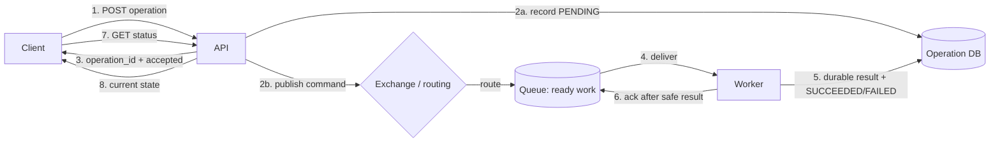

# SD-BEG-140 - Message Brokers and Queues

> **Track:** Beginner
> **Artifact state:** Ready
> **Learning state:** Not started
> **Last updated:** 2026-09-02

## Source and coverage check

- Inspected: the complete timestamped transcript (`00:00:00.719-00:15:32.680`), all five slide pages, the `00:15:31.743` video through a full-duration frame survey, and the complete final 20 percent including the spoken exercise and ending.
- Coverage: complete across all supplied source material; no source interval is missing.
- Visual fidelity: the notes reconstruct the request/API/broker/worker/status flow, video-processing pipeline, buffered notification flow, acknowledgement/requeue failure, auto-captioning flow, and final exercise in original diagrams and words. No slide image is copied.
- Transcript ambiguities resolved from slides/video: “asynchronous,” RabbitMQ, Amazon SQS, EC2, S3, 1080p, and auto-captioning.
- Unclear source points: the course deliberately treats broker and queue as one idea and gives a cross-product read/delete/reappear model. Product-specific boundaries are separated below. The exercise leaves its feature set and proof method open.
- Instructor-task scan: complete; one task was found at `00:14:37-00:15:20` and reconstructed as [`SD-BEG-140-T01`](tasks/SD-BEG-140-T01/README.md).

### Course timeline map

| Range | Course idea | Main example or visual |
|---|---|---|
| `00:00-00:01:42` | synchronous versus asynchronous work | feed/login/payment versus a multi-minute VM request |
| `00:01:42-00:04:07` | accept now, work later, expose status | client -> API -> database/task -> broker -> workers -> database |
| `00:04:07-00:06:55` | brokers connect services with messages | video upload produces 360p/480p/720p work |
| `00:06:55-00:09:11` | buffering lets consumers work at their pace | order traffic buffered before an email sender |
| `00:09:11-00:09:54` | retention is finite and configurable | SQS maximum-retention example |
| `00:09:54-00:12:13` | unfinished delivery must return | consumer crashes before completion/acknowledgement |
| `00:12:13-00:13:22` | redelivery can repeat an effect | email sent, then consumer crashes before completion signal |
| `00:13:22-00:14:37` | complete asynchronous product flow | video upload followed by background auto-captioning |
| `00:14:37-00:15:20` | hands-on assignment | local RabbitMQ, publish/consume code, documentation exploration |
| `00:15:20-end` | close | no additional task or constraint |

## What I should be able to do

- Decide whether work belongs in the request path or behind an asynchronous operation boundary.
- Draw producer -> exchange/routing -> queue -> consumer and explain which component owns the message at each step.
- Distinguish enqueue acceptance, publisher confirmation, delivery, business completion, consumer acknowledgement, and end-user status.
- Calculate whether a backlog grows, how large it becomes, how long it takes to drain, and what message age means for an SLO.
- Predict RabbitMQ behavior when a consumer connection closes before acknowledgement and explain why duplicate-safe processing is required.
- Compare RabbitMQ acknowledgement/redelivery with SQS receive/visibility/delete without mixing the two APIs.
- Design retries, time-to-live, dead-letter handling, durability, ordering, and observability with explicit limits.
- Implement and verify the instructor's RabbitMQ exercise without opening its reference solution first.

## Small bridge from earlier ideas

An HTTP request has a finite latency budget. If the caller needs a result before it can continue - login accepted, payment authorized, inventory reserved - the critical decision usually remains synchronous. If the caller only needs proof that durable work was accepted, the API can return an operation ID and let a worker finish later.

Three small distinctions make this lecture independent:

1. **Accepted is not completed.** A `202 Accepted`-style response means the server accepted responsibility for later processing; the resource should expose `PENDING`, `RUNNING`, `SUCCEEDED`, or `FAILED` rather than pretend the result exists.
2. **Asynchronous is a boundary, not a speed claim.** It shortens the caller's wait by moving work elsewhere. End-to-end completion can take longer.
3. **A retry repeats an attempt.** A safe handler needs an idempotency rule: processing the same logical command again must not create an extra business effect.

No earlier lecture is required. Database transactions matter later only when we connect a message to a durable domain change.

## The 60-second story

A client asks an API to start slow work, such as creating a VM or generating captions. Holding the request open for minutes gives a fragile user experience. Instead, the API validates the request, records an operation, publishes a small message, and quickly returns an operation ID. A broker routes and buffers that message. One of several workers consumes it when capacity is available, performs the slow work, records success or failure, and acknowledges the delivery.

The queue buys **time and decoupling**: producers need not run at exactly the same pace or be online at exactly the same instant as consumers. It does not buy infinity or correctness automatically. If arrivals exceed completions, backlog and message age grow. If a worker dies before acknowledgement, the broker can deliver the message again. If it dies after the side effect but before the acknowledgement, the side effect may be attempted twice. Correct systems therefore combine acknowledgement placement, stable message IDs, idempotent business logic, bounded retries, finite retention, and observable status.

## Why the terms matter

| Term | Simple meaning | Why it matters here | Common confusion |
|---|---|---|---|
| Synchronous | caller waits for the result of this interaction | right for decisions required immediately | “blocking thread” is an implementation detail, not the whole product contract |
| Asynchronous | caller and background completion happen at different times | releases the request while long work continues | not automatically parallel, faster, durable, or successful |
| Message | small data describing an event or command | transfers context without a direct long-running call | should not normally contain a huge video/file body |
| Producer/publisher | component that sends a message | begins publisher-to-broker responsibility | enqueue success is not worker success |
| Broker | server/intermediary that accepts, routes, stores, and delivers messages | creates the decoupling boundary | not identical to one queue |
| Exchange | RabbitMQ routing component that receives publishes | selects destination queues using bindings/routing keys | a message is not stored in an exchange |
| Queue | named buffer from which consumers receive deliveries | owns ready work and queue-specific policy | not every messaging product exposes the same queue semantics |
| Consumer/worker | application receiving and processing deliveries | converts queued intent into a business result | receiving is not completing |
| Acknowledgement (ack) | consumer says this delivery is safely handled | lets RabbitMQ remove/retire it | different from a publisher confirm or business response |
| Publisher confirm | broker tells a publisher it accepted responsibility | resolves the publish hop | says nothing about consumer execution |
| Redelivery | broker sends a logical message again | repairs uncertain/failed processing | can repeat an already-completed external effect |
| Idempotency | repeat the same logical request without another effect | makes at-least-once delivery usable | checking RabbitMQ's redelivery flag alone is not enough |
| Backlog | accepted work not yet completed | exposes capacity deficit and user delay | queue count alone misses age and unacknowledged work |
| Prefetch | cap on deliveries sent but not yet acked per consumer/channel | balances throughput against overload/fairness | not the same as worker concurrency or global rate limit |
| TTL/retention | how long data may remain before expiry | bounds storage and usefulness | expiration is not successful processing |
| Dead-letter path | place/routing for messages not handled normally | isolates terminal/repeated failure for review | not an automatic repair or guaranteed replay workflow |

## Big picture

### Question this visual answers

Where does a slow operation move after the request returns, and which facts can the user safely observe?

### How to read this visual

Follow the numbers, not just the arrows. The API first establishes durable intent and publishes work, then returns an identifier rather than the final result. The broker holds ready work until a worker has capacity. The worker makes the result safe before acknowledging. The client learns completion from application state, not from broker internals.

The `2a`/`2b` split is deliberately suspicious: a database write and a broker publish are normally two systems, so one can succeed while the other fails. Production designs close that gap with an outbox/relay or another explicit atomicity/reconciliation strategy.

### Key insight

There are at least three different success boundaries:

- the API accepted an operation;
- the broker accepted/routed a message;
- the business operation completed.

Conflating them creates false success, lost work, or stuck `PENDING` records.

### Simplification or limitation

The visual omits authentication, schema evolution, publisher retry/outbox, replicated brokers, multiple queues, worker concurrency, retry delay, dead-lettering, notification callbacks, cancellation, and regional failure. It also shows one operation database as a logical component, not a single physical node.

## Core concepts

### 1. Choose the asynchronous boundary deliberately

**Simple meaning:** return before slow or deferrable work finishes, while giving the caller a way to track it.

**Formal meaning:** request acceptance and operation completion are separate state transitions with separate failure outcomes.

**Why it exists:** long-held requests consume connection/budget, are vulnerable to proxy/client timeouts, and force the user to remain attached even when no immediate answer is needed.

**How it works:** validate -> create an operation/idempotency key -> make work durably dispatchable -> return an operation ID -> process in a worker -> persist final state -> expose status/callback.

**Invariant or deciding condition:** do not claim accepted until the system can recover the intent after the request process dies. Do not claim completed until the business result is durable.

**Small example:** creating a VM may take five minutes. The API returns `vm_operation=op-42, status=PENDING`; workers provision; a later status read returns `SUCCEEDED` plus the VM ID.

**Trade-off:** request latency and temporal coupling fall, but state machines, retries, stale status, cancellation, deduplication, and operations grow.

**Failure/observability:** a growing count of old `PENDING` rows with no queued/running work suggests a dispatch gap. Track acceptance-to-start and acceptance-to-finish age, not only HTTP latency.

**When not to use it:** keep a decision synchronous when the caller cannot proceed safely without it, the work reliably fits the latency budget, and adding a broker would create more risk than value. Payment authorization may be synchronous even while receipts, analytics, and settlement follow asynchronously.

**Interview change:** lower latency favors earlier acceptance; stronger immediate consistency may keep more work in the request; higher durability requires atomic intent/outbox and confirms; higher availability needs replicated queue/state; lower cost may favor a simpler database-backed job table at modest scale.

### 2. Broker, exchange, queue, producer, and consumer

**Simple meaning:** a producer gives a broker a message; routing chooses a queue; a consumer receives work from that queue.

**Formal meaning:** in RabbitMQ's AMQP 0-9-1 model, publishers send to an exchange, bindings map routes to queues, queues retain messages, and consumer subscriptions receive deliveries. The empty-name default exchange provides direct routing to a queue name.

**Why it exists:** producers and consumers can evolve, scale, and fail independently instead of maintaining one long synchronous call.

**How it works:** serialize a versioned envelope -> publish to an exchange with routing metadata -> exchange matches bindings -> zero/one/many queues receive copies -> a queue delivers to an eligible consumer -> consumer processes and settles delivery.

**Invariant or deciding condition:** the routing contract must place every required message in at least one intended queue, and no unauthorized consumer may read it.

**Small example:** `video.uploaded.v1` with `video_id=42` routes to a caption queue and a transcode queue. Each queue owns its own copy and completion lifecycle.

**Trade-off:** decoupling and independent scaling improve; topology, schema compatibility, tracing, security, and delayed failure become harder.

**Failure/observability:** an unroutable publish can disappear if the publisher does not request returns/confirmation. Monitor publishes, returned/unroutable messages, per-queue ingress/egress, consumers, and schema/decode failures.

**When not to use it:** a direct call is clearer when one caller needs one immediate response and both services share the same availability/latency budget. A database job table may be sufficient for low-volume work already transactionally tied to that database.

**Interview change:** fan-out adds queues/bindings; per-tenant isolation may add routes; strict per-key order constrains concurrency; large payloads should become object-store pointers; multi-region routing adds ownership and duplicate complexity.

### 3. Buffering and load leveling

**Simple meaning:** a queue lets producers burst briefly while consumers work at a steadier safe rate.

**Formal meaning:** let arrival rate be `lambda` messages/s and sustainable completion rate be `mu` messages/s. Ignoring retries, backlog slope is `lambda - mu`.

**Why it exists:** an order service may accept a short burst faster than an email API can safely handle. Direct calls would pass the spike into the dependency.

**How it works:** accept work -> store ready messages -> consumers pull/receive within prefetch/concurrency -> acknowledge completions -> add consumers or apply upstream backpressure when age/capacity limits approach.

**Invariant or deciding condition:** over the chosen time horizon, average completion capacity must exceed average effective arrivals including retries. A finite queue cannot fix a permanent capacity deficit.

**Small example:** arrivals at `500 msg/s` and completions at `400 msg/s` create `100 msg/s` of backlog. After `600 s`, that is `60,000 messages`.

**Trade-off:** spikes are smoothed and dependencies protected, but users see eventual completion and the system pays storage, delay, retry amplification, and operational cost.

**Failure/observability:** queue length and oldest-message age rise; publish rate exceeds acknowledgement rate; ready messages rise when workers lack capacity; unacknowledged messages rise when workers are stuck or prefetch is too high.

**When not to use it:** do not enqueue work already too stale to be useful, overload with no admission policy, or a hard real-time action whose deadline cannot tolerate waiting.

**Interview change:** higher peak rate changes backlog/storage; tighter completion SLO changes required `mu`; costly workers favor batching; fragile downstreams cap concurrency; hard cost caps require admission, priority, or degraded service.

### 4. Acknowledgement, ownership, and redelivery

**Simple meaning:** receiving is a trial; acknowledging says the consumer has made the result safe.

**Formal meaning:** in RabbitMQ manual-ack mode, a delivery remains unacknowledged until the consumer positively settles it. Closing its channel/connection before ack causes automatic requeueing and later redelivery. Delivery tags are scoped to the receiving channel.

**Why it exists:** deleting at delivery time would lose work whenever the consumer crashes before finishing.

**How it works:** queue marks ready -> broker delivers -> delivery becomes unacknowledged -> consumer validates and commits effect -> consumer acks on the same channel -> broker may delete/retire it. On connection/channel loss before ack, RabbitMQ requeues it.

**Invariant or deciding condition:** acknowledge only after the part of the business effect that must survive a retry is durably safe.

**Small example:** a caption worker receives `message_id=m-7`, writes captions and completion in one transaction, commits, then acks. If it crashes before commit, retry performs the work. If after commit but before ack, retry detects `m-7` already completed and safely no-ops.

**Trade-off:** manual ack protects against pre-completion loss, but retains in-flight state, increases redelivery/duplicate complexity, and can consume broker memory when acks are forgotten.

**Failure/observability:** high `messages_unacknowledged`, long handler duration, channel exceptions, repeated `redelivered=true`, and flat ack rate indicate stuck consumers, over-prefetch, or ack bugs.

**When not to use it:** automatic acknowledgement is acceptable only when losing a delivery after it reaches the client is explicitly tolerable. Do not use immediate requeue for permanent invalid input.

**Interview change:** long tasks need ack-timeout awareness/heartbeats or smaller units; expensive retries need checkpointing; strict side effects require idempotency; high throughput may batch acks carefully; low recovery latency favors prompt failure detection.

### Question this lifecycle visual answers

Why can the same message legitimately cause a second processing attempt?

```mermaid
stateDiagram-v2
    [*] --> Ready: publish routed and accepted
    Ready --> Unacked: broker delivers
    Unacked --> Completed: business result commits
    Completed --> Removed: consumer ack arrives
    Unacked --> Ready: channel/connection closes before result
    Completed --> Ready: channel/connection closes before ack
    Ready --> Unacked: later delivery; redelivered may be true
    Removed --> [*]
```

### How to read this lifecycle visual

There are two crash edges. A crash before business completion repeats unfinished work. The dangerous edge is `Completed -> Ready`: the business result exists, but the broker never saw the ack. The next attempt cannot know safety from queue state alone; it needs a stable domain identity.

### Key insight

At-least-once delivery deliberately trades possible duplicate attempts for lower loss risk. Exactly-once business **effects** require the business store/provider to participate through idempotency, uniqueness, transactions, or reconciliation.

### Simplification or limitation

This state machine omits negative acknowledgements, retry delay, delivery limits, dead-lettering, publisher-side duplicates, broker-node failure, acknowledgement timeouts, and concurrent consumers. “Redelivered” is useful evidence but not a complete delivery history.

### 5. Delivery semantics and idempotency

**Simple meaning:** decide whether loss or repetition is possible, then make the business outcome safe under that reality.

**Formal meaning:** at-most-once permits loss but avoids broker-driven retry; at-least-once retries uncertain work and permits duplicates; exactly-once effects require an atomic domain invariant, not a slogan attached only to transport.

**Why it exists:** networks can lose acknowledgements. A publisher can retry an accepted message whose confirm was lost; a consumer can repeat a committed effect whose ack was lost.

**How it works:** assign stable logical ID -> propagate it unchanged across retries -> make domain write conditional/unique by that ID -> commit -> ack -> let duplicates return the prior result or no-op.

**Invariant or deciding condition:** for one logical operation ID, the externally visible business transition occurs no more than once, even if delivery/handler execution occurs multiple times.

**Small example:** `email_request_id=order-42-confirmation` is a provider idempotency key. Two consumer attempts produce one provider-side send result, and both can finish successfully.

**Trade-off:** idempotency storage and retention cost money; key scope/version mistakes can suppress legitimate later actions or allow duplicates.

**Failure/observability:** unique-key conflicts, duplicate-attempt counters, repeated message IDs, provider idempotency responses, reconciliation gaps, and mismatched payload for the same key reveal problems.

**When not to use it:** a naturally commutative/idempotent operation such as setting a value to an exact target may need no separate dedupe table. A non-repeatable operation with no idempotency/reconciliation route may be unsuitable for automatic retry.

**Interview change:** a longer retry horizon lengthens dedupe retention; multi-region writes require global or home-region key ownership; higher volume may partition the idempotency store; lower cost may exploit a domain unique key instead of a generic dedupe ledger.

### 6. Retention, TTL, retries, and dead letters

**Simple meaning:** queued work needs an expiry budget and failed work needs a bounded destination.

**Formal meaning:** retention is the broker/product limit for stored messages; TTL expires a message/queue by policy; retry makes another processing attempt; dead-lettering routes a message after rejection, expiry, length overflow, or delivery policy, depending on product/configuration.

**Why it exists:** storage is finite, stale work can become harmful, and poison messages can otherwise loop forever.

**How it works:** classify error -> retry only transient errors with bounded attempts/backoff -> send terminal/exhausted work to an owned dead-letter path -> alert/review -> repair and deliberately replay or discard -> expire work beyond business usefulness.

**Invariant or deciding condition:** every message has a finite useful lifetime and a terminal owner/state; no failure may requeue indefinitely without delay, limit, alert, and decision.

**Small example:** caption service retries transient object-store timeouts at 10 s, 30 s, and 2 min; invalid codec goes directly to failure review; all jobs older than a 24-hour product deadline become `FAILED_EXPIRED` rather than silently completing late.

**Trade-off:** longer retention tolerates outages but consumes disk and may process stale intent; aggressive TTL saves resources but can discard recoverable business work; DLQs isolate failure but create a second backlog.

**Failure/observability:** track expired, dead-lettered, rejected, retry-attempt, oldest-message, DLQ age/depth, and replay results. Alert on age/SLO, not only count.

**When not to use it:** never use a DLQ as an unowned trash bin. Do not retry validation, authorization, or permanent schema errors unchanged.

**Interview change:** longer outage budget raises retention/storage; tighter SLO lowers retry delay; stronger durability may require safer dead-letter transfer; regulatory deletion constrains retention; cost pressure requires payload pointers, limits, and admission.

### 7. Durable queue, persistent message, publisher confirm

**Simple meaning:** three different controls answer whether topology survives, payload is intended to survive, and the broker actually accepted responsibility.

**Formal meaning:** RabbitMQ queue durability controls recovery of the queue definition; message delivery mode marks persistence intent; publisher confirms acknowledge broker handling according to queue semantics. Replicated queue type determines node-failure behavior.

**Why it exists:** merely writing bytes to a socket cannot prove routing, disk/replica acceptance, or future recovery.

**How it works:** declare durable/replicated queue -> publish persistent message -> require valid route -> wait for confirm -> retain stable ID for ambiguous retry -> consume/ack separately.

**Invariant or deciding condition:** a producer may tell the application “dispatch accepted” only after it has either a broker confirmation or another durable recoverable intent such as an outbox record.

**Small example:** API transaction writes operation `op-42` plus outbox event. Relay publishes persistent event and marks the outbox row sent after confirm. If confirm is lost, relay may republish the same event ID; consumer idempotency handles it.

**Trade-off:** fsync/replication/confirm waiting raises publish latency and reduces peak throughput; batching improves throughput but enlarges the ambiguous batch on failure.

**Failure/observability:** missing/late/nacked confirms, unroutable returns, unsent old outbox rows, broker disk/memory alarms, unavailable quorum, and publish retry counts expose the boundary.

**When not to use it:** transient telemetry may intentionally accept at-most-once loss and non-durable queues. Do not pay maximum durability cost without a business RPO that needs it.

**Interview change:** zero/near-zero RPO favors replicated queues, persistent messages, confirms, and outbox; ultra-low latency may accept bounded loss; multi-region durability changes replication/ownership; cost pressure tests whether replayable source data can replace durable queue retention.

### 8. Ordering and concurrency

**Simple meaning:** a queue can preserve an enqueue sequence, but concurrent delivery, retry, priority, and multiple routes can change completion order.

**Formal meaning:** ordering guarantees apply only within a product's declared scope - often one queue/partition and sometimes one consumer/key - not automatically across all producers, queues, consumers, or side effects.

**Why it exists:** adding consumers increases throughput; strict order creates serialization and hot-key constraints.

**How it works:** define ordering key -> route that key consistently -> allow parallelism across keys -> sequence/version domain updates -> prevent stale attempt from overwriting newer state -> handle requeue explicitly.

**Invariant or deciding condition:** if order matters, state the exact key and ensure an older operation cannot commit after a newer operation for that key.

**Small example:** process caption stages in order per `video_id`, but different videos can run concurrently. Each update includes expected stage/version so a late retry cannot move `CAPTIONED` back to `EXTRACTING_AUDIO`.

**Trade-off:** more consumers/queues improve throughput and availability but weaken simple order and complicate rebalancing; single active consumption preserves a narrow order at lower parallelism.

**Failure/observability:** sequence gaps, version conflicts, late-event counts, redelivery/requeue, per-key age, hot queues, and skew reveal ordering pressure.

**When not to use it:** do not demand global FIFO when the business only needs per-entity causality. The unnecessary constraint destroys capacity.

**Interview change:** stricter order reduces parallelism; higher throughput favors partitioned ownership; skew needs hot-key mitigation; lower latency may allow speculative work with version-checked commit.

## Worked example and calculations

### Assumptions

- An order spike lasts `10 minutes = 600 seconds`.
- Producers publish `500 notification messages/second` during the spike.
- Eight consumers each complete `50 messages/second`; total `mu = 8 * 50 = 400 messages/second`.
- Each stored message body plus simplified metadata estimate is `2 KiB/message` for this calculation.
- After the spike, new arrivals fall to `200 messages/second`; consumer capacity stays `400 messages/second`.
- Retries are ignored first, then added as a changed condition.

### Steps

1. Capacity deficit during spike:

   `500 msg/s - 400 msg/s = 100 msg/s`.

2. Backlog after 600 seconds:

   `100 msg/s * 600 s = 60,000 messages`.

3. Simplified payload-plus-metadata storage:

   `60,000 messages * 2 KiB/message = 120,000 KiB`.

   `120,000 / 1,024 = 117.1875 MiB`.

   Real disk/RAM use will be higher and queue-type dependent; this is an input-sizing estimate, not a RabbitMQ footprint measurement.

4. Post-spike net drain rate:

   `400 msg/s completions - 200 msg/s new arrivals = 200 msg/s`.

5. Time until the backlog clears while new work continues:

   `60,000 messages / 200 msg/s = 300 seconds = 5 minutes`.

6. Approximate wait for a message joining the tail at peak backlog under simple FIFO service:

   `60,000 / 400 msg/s = 150 seconds = 2.5 minutes` before its service begins. Newer arrivals join behind it, so they affect total drain time but not this simple tail position.

7. Changed condition: `5%` of completed attempts immediately retry once during the drain. Effective capacity spent on useful first-attempt completions is approximately:

   `400 / 1.05 = 380.95 logical messages/s`.

   Net logical drain becomes `380.95 - 200 = 180.95 msg/s`, so drain time becomes:

   `60,000 / 180.95 = 331.6 seconds`, about `5.53 minutes`.

### Result and sanity check

The queue successfully absorbs the ten-minute spike, but the system misses any completion SLO below roughly 2.5 minutes for work at the deepest point. Storage is modest only because the assumed message is small; putting a `50 MiB` video in each of `60,000` messages would imply `3,000,000 MiB`, about `2.86 TiB`, so messages should carry object references rather than media bodies.

The most important check is the sign of the post-spike net rate. Because `400 > 200`, the backlog eventually clears. If arrivals stayed at `500 msg/s`, no retention setting or extra disk would make the system stable; capacity/admission must change.

## Deep mechanism

### Components, ownership, and boundaries

| Boundary | Evidence of transfer | New owner | Still unproved |
|---|---|---|---|
| Client -> API | validated request and operation record | application workflow | broker dispatch and final result |
| Publisher -> broker | routable publisher confirm or durable outbox pending relay | broker/outbox workflow | consumer completion |
| Broker ready -> consumer unacknowledged | delivery tag on a live channel | one delivery attempt | durable business result |
| Consumer -> business store/provider | committed transaction or provider idempotency result | domain system | broker knows it is safe |
| Consumer -> broker | ack on owning channel | delivery may be deleted/retired | downstream users saw result |
| Application -> user | status/callback derived from domain state | caller can act on result | none beyond declared product contract |

The producer's database-and-publish dual write is a special boundary. Writing `PENDING` then failing to publish strands work. Publishing then failing to write status creates invisible work. An outbox stores the domain change and dispatch intent in one database transaction, then a relay publishes and confirms it. The relay may duplicate, so consumer idempotency remains necessary.

### Ordering, concurrency, and stale state

- Multiple consumers can hold different unacknowledged messages simultaneously; completion order can differ from delivery order.
- Prefetch greater than one increases in-flight work. It can improve utilization but worsens fairness and increases work tied to a failed connection.
- Redelivery can interleave with newer messages; never use “reappears at the head” as a cross-broker global guarantee.
- Multiple producers race. If business order matters, include entity ID plus sequence/version and enforce it at commit.
- A status API can be stale relative to worker progress. Define whether `SUCCEEDED` means domain commit, object visible, all fan-out work complete, or merely one stage done.
- A cancellation is another message/state transition, not time travel. Workers need version/state checks so late work cannot resurrect a cancelled operation.

### Failure and recovery

| Failure | Observable symptom | Mechanism | Protection/recovery | Remaining risk |
|---|---|---|---|---|
| API writes operation but publish fails | old `PENDING`, no queue/message trace | cross-system dual write | transactional outbox, relay retry, reconciliation | duplicate publishes after uncertain confirm |
| Publish is unroutable | return/exception, zero queue ingress | exchange/binding/routing mismatch | mandatory routing checks, topology tests | topology drift after deployment |
| Broker accepts but single node/disk fails | connection failures, missing availability | no replica/majority | replicated queue and tested recovery | majority loss and client recovery |
| Worker crashes before effect | connection closes, redelivery | no ack | retry on another attempt | poison task may loop |
| Worker crashes after effect before ack | same ID repeats, `redelivered` may be true | ack uncertainty window | idempotent domain/provider operation | dedupe retention/key error |
| Ack forgotten | rising unacknowledged count and memory | delivery never settles | instrumentation, timeout/connection close, code fix | mass redelivery on restart |
| Permanent bad message | repeated failure/redelivery | unchanged invalid input | bounded attempts, terminal state, DLQ/quarantine | unowned dead-letter backlog |
| Consumers slower than arrivals | age/depth grows, ack rate below publish rate | sustained `lambda > mu` | scale safely, optimize, backpressure/admission | downstream becomes bottleneck |
| TTL expires useful work | expired/dead-letter counts, user timeout | retention shorter than outage/wait | align TTL with business deadline and outage budget | more storage cost |
| Worker completes out of order | version conflict or state regression | concurrency/redelivery | per-key routing plus conditional versioned commit | hot-key serialization |
| Retry storm after outage | publish/delivery spikes, dependency saturation | simultaneous recovery | jitter, rate limits, staged drain | longer recovery time |

### Observability

Measure each boundary with a stable `operation_id`/`message_id` in structured logs and trace links:

- API: accepted/rejected rate, acceptance latency, operation-state counts, old `PENDING` age.
- Publisher/outbox: unsent oldest row, publish attempts, confirms/nacks/returns, confirm latency, routing failures.
- Queue: `messages_ready`, `messages_unacknowledged`, oldest useful message age, publish/deliver/ack/redelivery rates, consumer count, consumer capacity, disk/memory alarms.
- Consumer: handler latency by kind/result, in-flight count, ack/nack/reject, retries, redelivery flag, duplicate/no-op count, schema failures, dependency latency/errors.
- Dead-letter/replay: depth, oldest age, reason, owner, disposition latency, replay success and re-dead-letter rate.
- Product: acceptance-to-start/finish percentiles, operation failure/expiry/cancellation, user-visible duplicate effects, reconciliation gaps.

Alert on consequences and trends. `queue_depth > 10,000` is weak without normal rate/message size. `oldest_message_age > 80% of a 10-minute SLO while net drain <= 0` is actionable. Use both ready and unacknowledged counts: ready-high suggests insufficient delivery capacity; unacknowledged-high can suggest slow/stuck handlers or excessive prefetch.

## Design choices

| Choice | Benefits | Costs/risks | Prefer when | Avoid when |
|---|---|---|---|---|
| Synchronous call | immediate result, simple error path | temporal coupling, timeout/cascade risk | caller must decide now and work fits budget | multi-minute/deferrable work |
| Asynchronous operation + status | short request, recoverable progress | eventual result and state-machine complexity | caller can continue and poll/callback | result required before caller proceeds |
| Database job table | atomic with local domain data, few moving parts | polling/locking/scaling burden | modest volume and one database boundary | rich routing/fan-out/high broker throughput needed |
| RabbitMQ queue | routing, push consumers, ack/confirm, queue policies | broker operation and product-specific semantics | work queues/routing/low-latency delivery | repeated log replay is central |
| SQS standard queue | managed scale and polling/visibility model | cloud cost, polling, product limits, duplicates | AWS-managed queue fits system/account | local/offline requirement or Rabbit-specific routing |
| Manual ack after commit | protects unfinished work | duplicates after commit-before-ack | work must not be lost | loss is explicitly acceptable |
| Automatic ack | low settlement overhead | client crash can lose work | ephemeral best-effort events | important business work |
| Quorum queue | replication/data-safety direction | higher resource/latency cost, majority needed | important work across broker nodes | transient single-session data |
| Classic queue | simpler/non-replicated profiles and specific features | no modern classic mirroring | intentional non-replicated workload | queue contents require node-failure tolerance |
| One queue | simple order/operation | hot path and shared blast radius | small homogeneous workload | unrelated SLOs, tenants, or high throughput |
| Partition/routes by key | parallelism with per-key ownership | skew/rebalancing/operational complexity | per-key order at scale | global order required or low volume |
| Payload inline | one fetch and self-contained message | broker memory/disk/network pressure | small bounded data | videos/blobs or mutable secrets |
| Object pointer | small message and separate blob lifecycle | extra fetch, auth, version/expiry coordination | large immutable payload | object may disappear before processing |

## Misconceptions

| Claim/confusion | What is actually true | Evidence or counterexample |
|---|---|---|
| “Async makes the job faster.” | It reduces caller waiting; total completion may be unchanged or slower. | A two-hour transcode still takes two hours after a fast acceptance response. |
| “A `200`/`202` means work is done.” | Status code/body must match the application state contract. | `PENDING` operation can later fail or expire. |
| “Message broker and queue are exact synonyms.” | Broker is the intermediary; queues are storage/delivery destinations it manages. | RabbitMQ also has exchanges, bindings, channels, and streams. |
| “RabbitMQ producers send directly to a queue.” | AMQP publishes to an exchange; the default exchange makes queue-name routing look direct. | An unmatched route can be returned/dropped depending on publish options. |
| “Reading deletes the message.” | Product and ack mode decide settlement. | Manual-ack RabbitMQ holds it unacknowledged; SQS hides then requires delete. |
| “No ack means wait for the SQS-style visibility timeout.” | RabbitMQ and SQS differ. | RabbitMQ normally requeues on channel/connection closure; SQS visibility expiry makes a received message visible again. |
| “`durable=true` is sufficient.” | Queue durability, message persistence, confirms, replication, and client recovery are distinct. | A transient message in a durable queue can be discarded on restart. |
| “Publisher confirm means the email was sent.” | Confirm covers publisher -> broker/queue acceptance, not consumer or provider work. | Consumer acknowledgements are orthogonal. |
| “At-least-once means duplicate business effects.” | It permits duplicate deliveries/attempts; idempotent domain logic can still produce one effect. | Unique operation key turns later attempts into safe no-ops. |
| “Exactly-once is a broker checkbox.” | Transport cannot atomically cover an arbitrary external effect alone. | Crash after effect but before ack creates an ambiguity window. |
| “FIFO means global completion order.” | Scope and concurrency matter. | Two consumers can finish differently; retry can interleave. |
| “A queue fixes overload.” | It delays overload and provides evidence; sustained arrivals above capacity still diverge. | `lambda=500`, `mu=400` grows by 100 messages every second. |
| “DLQ means failure is handled.” | It only moves/records failure when correctly configured. | An unmonitored DLQ is another silently growing backlog. |
| “Duplicate cases are too rare to design for.” | Low probability times large volume becomes routine, and outages correlate failures. | One-in-a-million at one billion deliveries implies about 1,000 cases. |

## Real backend connection

Consider a Python/FastAPI caption API. This is a realistic example, not a claim about Rahul's work history.

1. `POST /videos/{video_id}/captions` accepts an `Idempotency-Key`.
2. A PostgreSQL transaction inserts or returns one operation row and one outbox row keyed by the logical operation.
3. The API returns an operation document such as `{"operation_id":"op-42","status":"PENDING"}`.
4. An outbox relay publishes `caption.requested.v1` with `message_id=op-42`, a schema version, object URI/version, tenant/security context reference, creation time, and deadline. It waits for publisher confirm before marking the outbox sent.
5. A consumer validates schema/deadline, starts trace context, and uses `op-42` to make its PostgreSQL result transition conditional/idempotent.
6. Large video bytes remain in S3/object storage. The message contains an immutable object/version pointer and authorization-safe metadata.
7. After commit, the consumer acks. Retriable fetch/ML failures use bounded delayed retry; invalid codec/auth/schema goes to a terminal state/dead-letter review.
8. `GET /operations/op-42` reads domain state. A callback/websocket may notify completion, but remains a delivery convenience rather than the source of truth.

The API/outbox transaction solves the “database row exists but no message” gap. It does not eliminate duplicate relay publishes, so stable IDs and idempotent consumers remain essential.

## Instructor-assigned tasks

| Task | Faithful purpose | Tools | Reference verified? | Learner status |
|---|---|---|---|---|
| [`SD-BEG-140-T01`](tasks/SD-BEG-140-T01/README.md) | Run RabbitMQ locally, publish and consume with code, and learn its features/guarantees through hands-on exploration | Docker, RabbitMQ 4.3.5, Python, Pika 1.4.4 | passed for separate reference path | not started |

The source conditionally permits replacing RabbitMQ with SQS when authorized AWS access already exists. The safe canonical task uses local RabbitMQ, requires no cloud account, and keeps the product semantics distinct.

### Codex-added practice

1. **Predict:** at publish, delivery-before-ack, connection-close, redelivery, and ack, what are `ready`, `unacknowledged`, owner, and safe retry state?
2. **Draw:** reconstruct client -> API -> outbox -> exchange -> queue -> consumer -> domain store -> ack -> status.
3. **Explain:** why do publisher confirms and consumer acknowledgements solve different problems?
4. **Calculate:** with `lambda=900 msg/s`, `mu=750 msg/s`, a 12-minute spike, and `3 KiB/message`, find backlog and simplified storage.
5. **Change:** require per-video ordering while maximizing cross-video parallelism. State routing key, commit invariant, hot-key risk, and metrics.
6. **Incident:** `ready=0`, `unacknowledged=80,000`, ack rate nearly zero. List evidence before adding consumers.

## Useful English and technical phrases

### Acknowledgement

- Pronunciation: `ak-NOL-ij-ment`
- Simple meaning: a signal that something was received or safely handled
- Hindi cue: `kaam surakshit hone ki pushti`
- Why it matters here: it defines when RabbitMQ can release a consumer delivery.
- Common misuse: saying “the message was acknowledged” without naming whether publisher, broker, consumer, or business user acknowledged what.

Examples:

1. Simple: “I sent an acknowledgement after reading the request.”
2. Engineering: “The worker acknowledges only after the transaction commits.”
3. Engineering: “A publisher confirm is not a consumer acknowledgement.”
4. Interview: “I would first clarify the acknowledgement boundary and the acceptable loss window.”
5. Design review: “Moving the acknowledgement earlier improves throughput but creates a message-loss window.”

### Idempotent

- Pronunciation: `eye-dem-POH-tent`
- Simple meaning: repeating the same logical action does not add another effect
- Hindi cue: `dobara chalne par extra asar nahin`
- Why it matters here: redelivery is expected under failure.
- Common misuse: “The consumer is idempotent because it checks `redelivered`.” The flag is a hint; the domain invariant must prevent the duplicate effect.

Examples:

1. Simple: “Setting the light to off is idempotent; toggling it is not.”
2. Engineering: “The unique operation ID makes the database mutation idempotent.”
3. Engineering: “We pass the same idempotency key to the email provider on every retry.”
4. Interview: “At-least-once delivery is acceptable if the handler is idempotent at the business boundary.”
5. Design review: “This retry is not safe until we define the idempotency-key scope and retention.”

### Backlog

- Pronunciation: `BAK-log`
- Simple meaning: accepted work waiting to finish
- Hindi cue: `jama hua pending kaam`
- Why it matters here: its rate and age show whether capacity meets demand.
- Common misuse: using backlog count alone without message size, arrival/ack rates, age, priority, or SLO.

Examples:

1. Simple: “The team has a backlog of requests.”
2. Engineering: “The queue backlog grows by 100 messages per second during the spike.”
3. Engineering: “Oldest-message age breached the SLO even though depth looked moderate.”
4. Interview: “I would estimate both peak backlog storage and post-spike drain time.”
5. Design review: “Adding consumers will not help if the database is the constrained downstream.”

### Redelivery

- Pronunciation: `ree-di-LIV-er-ee`
- Simple meaning: the broker sends a message again
- Hindi cue: `message phir se milna`
- Why it matters here: it is the recovery path for an unacknowledged delivery.
- Common misuse: treating `redelivered=false` as proof that no duplicate publish or business operation exists.

Examples:

1. Simple: “The parcel needed redelivery.”
2. Engineering: “Connection closure triggered redelivery of the unacknowledged message.”
3. Engineering: “We count redelivery by reason and message type.”
4. Interview: “Redelivery protects work but forces an idempotency decision.”
5. Design review: “A redelivery storm can overload the same dependency that caused the first failures.”

### Decouple

- Pronunciation: `dee-KUP-ul`
- Simple meaning: let two parts vary or fail more independently
- Hindi cue: `seedhi nirbharata kam karna`
- Why it matters here: producer availability/pace no longer has to match consumer availability/pace exactly.
- Common misuse: claiming a broker removes all coupling; schema, routing, capacity, timing, and business contracts remain.

Examples:

1. Simple: “The adapter decouples the plug from the device.”
2. Engineering: “The queue decouples request acceptance from caption generation.”
3. Engineering: “We reduced temporal coupling but retained schema coupling.”
4. Interview: “I would introduce a broker only if that decoupling justifies the delivery complexity.”
5. Design review: “This design moves the dependency; it does not eliminate it.”

## Interview practice

### Foundation

**Question:** What problem does a message broker solve, and what new problems does it introduce?

**Strong answer covers:** temporal/pace decoupling, routing and buffering, asynchronous status, finite capacity, delivery semantics, acknowledgement placement, duplicates/idempotency, retry/DLQ, durability, ordering, and observability. Use one concrete lifecycle rather than a list of product names.

**Weak-answer trap:** “It makes everything asynchronous and scalable.” This lacks deciding conditions, failure boundaries, and evidence.

### SDE-2 working engineer

**Question:** Your RabbitMQ email worker sends the email and then crashes before `basic_ack`. What happens, how do you prevent duplicate mail, and what do you monitor?

**Reasoning checkpoints:**

1. Confirm manual ack and connection/channel closure behavior.
2. Predict redelivery of the same logical message; do not promise exact timing/order.
3. Keep a stable notification ID across publisher retries and consumer redelivery.
4. Use provider-supported idempotency or a durable notification state machine/reconciliation plan.
5. Ack after the safe provider/domain boundary.
6. Bound retry and terminal failure; own the dead-letter queue.
7. Inspect ready/unacknowledged, redelivery, handler/provider latency/errors, duplicate/no-op, oldest age, and user-visible duplicate complaints.

**Follow-up:** If the email provider has no idempotency key and its timeout result is ambiguous, model `UNKNOWN`, reconcile provider state where possible, and avoid blindly marking either success or retry-safe.

### SDE-3 senior design

**Prompt:** Design asynchronous auto-captioning for `5,000 uploads/s` with 95% completed within 10 minutes and no duplicate final caption version.

**Clarify first:**

- Is `5,000/s` steady, peak, or replay? How long can the peak last?
- Average/p95 video duration and bytes? Languages/models? GPU seconds per minute?
- Must captions appear in stage order? What is the ordering key?
- Availability, RPO, retry deadline, cancellation, regional/data-residency constraints?
- What does “no duplicate final version” mean versus duplicate compute attempts?
- Can the client poll, receive callback, or both? What is the failure UX?
- Broker/compute/object-store budget and acceptable degraded mode?

**Answer outline:**

1. API uses idempotency key and operation resource; large bytes go directly to object storage.
2. Domain row + outbox atomically record accepted work; relay publishes versioned pointer messages with confirms.
3. Route/partition by video ID when per-video order matters; parallelize across IDs and stages.
4. Size workers from measured GPU service rate plus headroom; calculate peak backlog bytes and drain time.
5. Consumer commits version-checked caption result/idempotency record before ack.
6. Retry transient failures with jitter and limits; deadline/permanent errors become terminal/DLQ with owner and safe replay.
7. Replicated queue/domain/object storage satisfy declared RPO; multi-region ownership avoids conflicting writers.
8. Observe acceptance-to-start/finish, oldest age, ready/unacknowledged, rates, redelivery, retries, per-stage latency, GPU saturation, object errors, duplicate/no-op, DLQ, and reconciliation.
9. Compare RabbitMQ work queue, managed SQS, Kafka-style replay, and database job table against routing, replay, operations, latency, and cost.

**Requirement change:** captions must begin within 5 seconds but full completion may take 10 minutes. Split a lightweight admission/preview stage from heavy full-caption work, reserve priority capacity, cap large-video concurrency, expose stage status, and protect normal traffic from priority starvation.

## Course, verified extensions, and uncertainty

### Course model

- Synchronous interactions handle the request immediately; slow/deferrable work such as VM creation, video transcoding, encryption/decryption, and captioning belongs behind an asynchronous status flow.
- A client calls an API; the API records or enqueues work and responds; workers later consume it and update a database/status.
- Brokers connect services with messages and buffer producer bursts so consumers can work at their own pace.
- Retention is finite/configurable. Unfinished work should become available again when a consumer fails.
- The failure window after a side effect but before completion signalling can deliver the logical message more than once, so business logic must handle duplicates.
- The auto-caption example stores video in S3, publishes after upload, lets caption workers download/process it, updates a database, and later enables captions for the user.
- The assigned exercise is local RabbitMQ setup, code to publish and consume, and documentation/guarantee exploration; SQS is a conditional alternative for existing authorized AWS access.

### Verified extensions

- RabbitMQ distinguishes a broker from its queues and exchanges. Queues store messages; publishers send through exchanges, including the default exchange used for queue-name routing. Queue durability, exclusivity, auto-delete, arguments, ordering conditions, and metrics are separate properties in the current [RabbitMQ queue guide](https://www.rabbitmq.com/docs/queues).
- Consumer acknowledgements and publisher confirms are orthogonal. With manual acknowledgements, closing the delivery's channel/connection automatically requeues unacknowledged deliveries; clients must handle redelivery and use idempotent logic. The current [acknowledgement and confirms guide](https://www.rabbitmq.com/docs/confirms) documents the exact boundary.
- RabbitMQ's reliability guide states that acknowledgements support at-least-once delivery, publisher retries after an uncertain confirm can duplicate a publish, and consumers should be idempotent. Durable queues, persistent messages, replicated queue types, and publisher confirms jointly contribute to data safety; no single switch is enough. See [RabbitMQ reliability and data safety](https://www.rabbitmq.com/docs/reliability).
- RabbitMQ supports queue/message TTL, while expiry means the message will not be delivered, not that it completed. Policies are preferred for changeable TTL configuration. See [RabbitMQ TTL and expiration](https://www.rabbitmq.com/docs/ttl).
- RabbitMQ exposes ready, unacknowledged, publish/delivery rates, and consumers through management/HTTP metrics; consumer capacity is a hint for whether more/faster consumers or higher prefetch may help. See [RabbitMQ monitoring](https://www.rabbitmq.com/docs/monitoring) and [consumer capacity/prefetch](https://www.rabbitmq.com/docs/consumers).
- Dead-lettering has product/configuration-specific safety limits and can itself fail; terminal messages still need ownership and monitoring. See [RabbitMQ dead-letter exchanges](https://www.rabbitmq.com/docs/dlx).
- The course's SQS retention number remains current as checked on 2026-09-02: default four days and configurable up to 14 days. This is an SQS product limit, not a universal broker rule. See [Amazon SQS queue parameters](https://docs.aws.amazon.com/AWSSimpleQueueService/latest/SQSDeveloperGuide/sqs-configure-queue-parameters.html).
- SQS receive leaves a message stored but temporarily invisible; failure to delete before visibility expiry makes it visible again, and standard queues can still deliver more than once. RabbitMQ normally uses acknowledgement/channel lifecycle rather than this SQS API. See [Amazon SQS visibility timeout](https://docs.aws.amazon.com/AWSSimpleQueueService/latest/SQSDeveloperGuide/sqs-visibility-timeout.html).
- RabbitMQ `4.3.5` was the latest listed 4.3 patch and community-supported on 2026-09-02, and the exact management-alpine image tag existed in the Docker Official Images registry. See [RabbitMQ release information](https://www.rabbitmq.com/release-information) and the [official image registry](https://github.com/docker-library/official-images/blob/master/library/rabbitmq).

### Inferences and practical connections

- **Inference:** the course's database status row becomes much safer when paired with a transactional outbox, because database update plus broker publish is otherwise a dual write. The outbox reduces lost dispatch but does not remove duplicates.
- **Inference:** message age is usually a better user-SLO signal than depth alone because depth has no meaning without rate, size, priority, and service time.
- **Inference:** use object-store pointers for the lecture's videos. Large inline payloads waste broker memory, disk, network, and redelivery bandwidth.
- **Inference:** treat a message as an immutable, versioned contract. Schema compatibility is one of the couplings that a broker does not remove.
- **Inference:** the right acknowledgement point is a business decision. “After callback returns” is correct only if the callback has already made the required result durable.

### Unresolved source points

- [ ] The source does not define which RabbitMQ features/guarantees complete the broad documentation exercise. The task pack chooses a bounded evidence set and labels it as Codex-added verification.
- [ ] The source does not define a retry limit, dead-letter policy, message schema, queue type, or durability target.
- [ ] The source does not say whether the optional SQS route replaces all RabbitMQ requirements or is an extra exploration. The pack treats it as a conditional alternative and does not require cloud access.
- [ ] The generic “reappears at the head after some time” wording is not treated as a portable RabbitMQ/SQS ordering guarantee.

## Final revision card

### Five facts

1. Asynchronous acceptance shortens caller wait; it does not prove completion or make the work faster.
2. A broker routes/stores/delivers; a queue is one destination/buffer the broker manages.
3. Publisher confirms and consumer acknowledgements protect different hops.
4. Manual-ack failure can redeliver a message; stable IDs and idempotent business logic make repetition safe.
5. A queue is stable only when effective arrivals stay below sustainable completions over the relevant horizon; track message age and both ready/unacknowledged work.

### Three decisions

1. Keep work synchronous when the caller needs the result now and it reliably fits the budget; otherwise create an explicit asynchronous operation/status contract.
2. Ack after the durable business invariant, not merely after receipt; choose automatic ack only when loss is acceptable.
3. Choose retention, retry, DLQ, durability, replication, and ordering from SLO/RPO/business semantics rather than broker defaults.

### One failure

Effect commits -> ack is lost because worker/connection dies -> same message is redelivered -> stable ID finds already-committed result -> handler no-ops and acks -> duplicate attempt, one business effect.

### Natural 60-second explanation

“A message broker separates request acceptance from background completion. The API records an operation and publishes a small versioned message; the broker routes and buffers it; a worker processes it and acknowledges only after its result is durable. This smooths bursts and lets producers and consumers fail or scale more independently, but it adds eventual status, finite backlog, retries, and duplicate attempts. A publisher confirm only proves broker acceptance, while a consumer acknowledgement only settles one delivery. If a worker commits a side effect and dies before ack, the message may return, so I keep a stable operation ID and enforce idempotency in the domain or provider. I size the system from arrival versus completion rate and monitor oldest age, ready/unacknowledged counts, confirms, acks, redelivery, failures, and dead-letter work.”

See [review.md](review.md) for closed-book retrieval.
