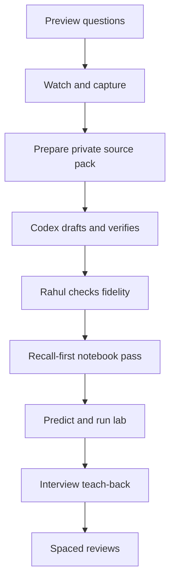

# Deep-learning workflow

## The learning target

For each system-design idea, Rahul should eventually be able to:

1. explain the problem it solves in plain language;
2. draw its important components and data flow from memory;
3. predict behavior under concurrency, failure, and scale;
4. run or inspect an experiment that demonstrates that behavior;
5. compare it with realistic alternatives;
6. defend a choice and adapt it when an interviewer changes a requirement.

Generating Markdown is only the start of this sequence.

## One-lecture loop

The important feedback loops are:

- If the notes do not match the lecture, return from **Rahul checks fidelity** to **Codex drafts and verifies**.
- If an experiment contradicts the mental model, update both the explanation and the model rather than memorizing the output.
- If an interview answer is weak, add the missing decision or failure mode to the review pack.

## Phase 0 — choose one outcome

Before watching, write one sentence:

> After this lecture, I want to be able to explain or demonstrate ________.

Then write three to five preview questions. For relational databases, examples might be:

- What guarantee does a transaction actually provide?
- What data structure makes indexed lookup faster?
- What happens to uncommitted work after a database crash?

These questions give the lecture somewhere to “land” in memory.

## Phase 1 — watch actively

Watch the lecture without trying to create polished notes in real time. Capture only:

- timestamps of important explanations;
- diagrams or tables that carry information the transcript will lose;
- unfamiliar words;
- claims that surprise you;
- questions or disagreements;
- homework given by the instructor.

Pause to predict an answer before the instructor reveals it. Prediction creates a stronger memory signal than passive agreement.

For a difficult lecture, use two passes:

1. **Structure pass:** understand the broad story and mark confusing sections.
2. **Mechanism pass:** revisit only those sections and capture exact state changes, calculations, and failure behavior.

## Phase 2 — prepare the private source pack

Use the layout in `inputs/README.md`. The ideal package has a timestamped transcript, selected screenshots, your questions, and the assigned homework.

### Best transcription strategy

- Prefer timestamped Markdown, SRT, or VTT.
- Keep one timestamp per paragraph or roughly every 30–60 seconds.
- Preserve uncertain words as `[unclear]` instead of inventing a correction.
- Check product names, algorithms, and database terminology against the video.
- Do not spend time correcting ordinary spoken grammar unless it changes meaning.

For the large masterclass videos, transcribe once locally and process the transcript in chunks. The final notes must still be a coherent concept document, not a sequence of chunk summaries.

## Phase 3 — use one Codex chat per lecture

Start a new Codex chat for each lecture so the transcript and decisions remain bounded. Use the prompt in `docs/prompts/START_LECTURE.md`.

Stay in the same chat for:

- correcting transcript interpretations;
- refining diagrams;
- deepening a confusing section;
- reviewing the completed lecture artifacts.

Start another chat only when:

- the next lecture begins;
- a lab becomes a sizeable independent implementation;
- a cross-lecture capstone needs its own architecture history.

### Recommended model use

- **GPT-5.6 Sol + Max:** first synthesis of a difficult lecture, ambiguous source reconciliation, lab architecture, and final audit.
- A lower power setting can handle mechanical spelling or link fixes, but quality-critical learning work should remain on Sol Max if usage permits.

## Phase 4 — review Codex's draft against the source

Codex can create a convincing explanation that is still wrong about what the lecturer meant. Do a fidelity review before handwriting:

1. Scan `source-log.md` for missing timestamp ranges or `[unclear]` items.
2. Check every diagram against the video frame that motivated it.
3. Check instructor homework separately from Codex-added practice.
4. Challenge any statement that sounds more certain than the lecture or source permits.
5. Ask Codex to show the evidence for a correction or extension.

Do not approve a lecture merely because the prose is polished.

## Phase 5 — use the physical notebook for reconstruction

Copying every Markdown sentence by hand feels productive but produces weak retrieval. Use this three-pass method instead:

### Pass A — closed-screen recall

Close the notes. On paper, write:

- the problem;
- the main diagram;
- the mechanism in numbered steps;
- two trade-offs;
- one failure case;
- one question you still have.

### Pass B — gap repair

Open `notes.md`, use another pen color, and add only what was missing or wrong. These colored gaps are the best evidence of what to review.

### Pass C — compressed page

Create one page that you could use one month later: one diagram, key decisions, equations, traps, and a 60-second explanation. Do not copy all examples.

## Phase 6 — perform, do not just read, the homework

Use `homework.md` and follow the loop:

1. **Predict:** write what you expect and why.
2. **Run:** perform the documented step without changing multiple variables at once.
3. **Observe:** capture queries, logs, timings, state, or screenshots.
4. **Explain:** connect the observation to the mechanism.
5. **Vary:** change one condition and predict again.

When the result differs from the prediction, that mismatch is the learning result. Record it.

## Phase 7 — interview retrieval

Use `interview-questions.md` in this order:

1. Answer the question aloud without notes.
2. Draw the model while speaking.
3. Compare your answer with the outline.
4. Answer the follow-up that changes a requirement.
5. Give a real backend example without exposing confidential details.

Finish with a two-minute teach-back to an imaginary junior engineer. If you cannot explain it simply, return to the mechanism rather than memorizing a script.

## Phase 8 — spaced review

Use these as starting intervals and adjust based on recall:

| Review | When | Activity | Pass condition |
|---|---|---|---|
| R0 | Same day | Closed-screen notebook reconstruction | Main diagram and mechanism are correct |
| R1 | Next day | 10-minute review pack | At least 80% retrieval without hints |
| R2 | 7 days | Interview questions plus redraw | Can explain trade-offs and one failure mode |
| R3 | 21 days | Mixed quiz across related lectures | Can distinguish neighboring concepts |
| R4 | 45 days | Design change or lab variation | Can adapt the idea to a new requirement |

If a review fails, shorten the next interval and repair the specific weak section. Do not restart the whole lecture automatically.

## Mastery ladder

| Level | Evidence |
|---|---|
| 1. Recognition | The term looks familiar |
| 2. Explanation | You can explain the mechanism in simple words |
| 3. Prediction | You can predict behavior under a controlled change |
| 4. Design | You can choose it, size it, and discuss alternatives |
| 5. Adaptation | You can revise the design after a failure or new constraint |

Mark a lecture `✅ Mastered` only at level 4 or above.

## Course phases and practical work

Avoid building a separate large application for every video. Use focused labs for mechanisms and a few capstones for integration.

| Beginner phase | Lectures | Practical anchor |
|---|---:|---|
| Framing and evaluation | 01–04 | Requirement and estimation drills |
| Data systems | 05–10 | PostgreSQL transactions, crashes, indexes, and partitioning lab |
| Caching and messaging | 11–16 | Cache-stampede and queue-versus-stream labs |
| Reliability and communication | 17–22 | Load balancing, circuit breaker, leader, and retry lab |
| Data structures for scale | 23–25 | Bloom-filter and consistent-hashing visualizers |
| Design case studies | 26–36 | One capstone evolved through several requirements |

Recommended capstones:

1. **Tiny URL platform:** API, PostgreSQL, Redis, rate limiting, async analytics, failure handling, observability, and capacity estimates.
2. **Social feed or notification platform:** fan-out choices, queues/streams, idempotency, ranking, storage, backpressure, and recovery.

The capstone architecture should evolve as lectures are completed. Do not pre-build every advanced component before its concept is understood.

## When to move from beginner to masterclass

Advance when all of the following are true for the essential beginner modules:

- you can redraw their principal models;
- you can answer working-engineer questions without reading;
- the database, cache/message, and reliability labs have been completed;
- you have completed at least one capstone design and defended its trade-offs;
- weak areas are listed with scheduled reviews rather than hidden behind completed checkboxes.

