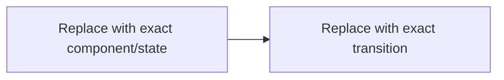

# <NN>. <Video title>

> **Track:** <Beginner | Advanced>  
> **Status:** <Notes ready | Reviewing | Comfortable>  
> **Last updated:** <YYYY-MM-DD>  
> **Related lab/project:** <link or Not created>

## Source check

- **Inspected:** <transcript, slides PDF, screenshots, video sections, Rahul's questions>
- **Coverage:** <complete or exact gaps>
- **Unclear source points:** <items or None>

Do not publish private paths, Drive links/IDs, raw transcript passages, or screenshots here.

## What I should learn

After this video, I should be able to:

- <observable outcome>
- <observable outcome>
- <observable outcome>

## The 60-second story

<Explain the problem, core idea, and result in very simple language. Introduce formal terms only after the plain idea.>

## Why this concept exists

### The problem without it

<Use a concrete backend scenario.>

### What a good solution needs

- <property and why it matters>

## Big picture

### Question this visual answers

<Exact question.>

**How to read it:** <walk through the diagram in order.>

**Key insight:** <the idea made visible by the diagram.>

Remove this diagram when a table or plain explanation is more exact. Add more small visuals only when each answers a different question.

## Core concepts

### <Concept 1>

**Simple meaning:** <plain explanation.>

**Formal meaning:** <precise terminology.>

**How it works:**

1. <cause and state change>
2. <cause and state change>
3. <observable result>

**Why it works:** <mechanism and invariant.>

**Example:** <small concrete example.>

**Trade-off:** <what is gained and paid.>

Repeat for the other central concepts; do not create filler sections for minor mentions.

## Worked example

### Setup and assumptions

- <value, unit, and reason>

### Walkthrough

<Show intermediate states or calculation steps.>

### Result and sanity check

<Explain whether the result is plausible and what it teaches.>

## Deep dive

### Internal mechanism and invariants

<Implementation-level detail needed for deep understanding and senior interviews.>

### Concurrency, ordering, and stale state

<What can race, reorder, block, duplicate, or become stale?>

### Failure and recovery

| Failure | What we observe | Why it happens | Protection/recovery | Remaining risk |
|---|---|---|---|---|
| <failure> | <symptom> | <mechanism> | <response> | <risk> |

### How we observe it

<Useful logs, metrics, traces, queries, or states.>

## Design choices and trade-offs

| Choice | Benefits | Costs/risks | Prefer when | Avoid when |
|---|---|---|---|---|
| <choice> | <benefits> | <costs> | <condition> | <condition> |

## Common confusions and misconceptions

| Confusion or claim | What is actually true | Evidence or example |
|---|---|---|
| <A versus B or misconception> | <deciding difference/correction> | <observable evidence> |

## Real backend example

<Connect the idea to a realistic Python/FastAPI/database/cache/queue/AWS system when relevant. Do not invent personal experience.>

## When not to use it

- <condition, why, and a better alternative>

## Homework and practice

### Instructor-assigned

- **Task:** <short faithful paraphrase or Not found in source>
- **Source timestamp:** <time when available>
- **What proves completion:** <evidence>

### Extra practice from Codex

1. **Predict:** <write an expected result and why before running anything.>
2. **Try:** <small safe action or thought experiment.>
3. **Observe:** <specific evidence.>
4. **Explain:** <connect evidence to the mechanism.>
5. **Vary:** <change one condition and predict again.>

### Optional lab idea

- **Learning question:** <one precise question or Not needed>
- **Why a lab would help:** <behavior prose cannot reveal>
- **Smallest useful scope:** <components/non-goals>

Do not build the lab during ordinary note creation unless Rahul asks.

## Useful English and technical words

Choose only high-value difficult words. Use fewer words for a short video.

### <Word or phrase>

- **Pronunciation:** <IPA or simple phonetic cue>
- **Simple English meaning:** <plain meaning>
- **Hindi cue (optional):** <short cue>
- **Meaning in this video:** <precise contextual use>
- **Common confusion:** <similar or incorrectly used word>

Five examples:

1. **Simple:** <natural example>
2. **Technical:** <engineering example>
3. **Technical:** <different engineering example>
4. **Interview:** <natural interview sentence>
5. **Professional:** <design review or incident sentence>

## Interview questions

Answer aloud before reading the cues.

### Foundation — <question>

**Strong answer should cover:** <problem, mechanism, boundary, example>

**Weak-answer trap:** <plausible but incomplete answer>

**Follow-up:** <question that tests understanding>

### Working engineer — <question>

**Reasoning checkpoints:** <symptom, mechanism, evidence, decision, trade-off>

**Follow-up:** <debugging or implementation change>

### Senior design — <question>

**Clarify first:** <scale, consistency, latency, durability, availability, or cost assumptions>

**Answer outline:** <decision, reason, alternative, failure/recovery, observability>

**Requirement change:** <one changed constraint and how the design should adapt>

## My questions and clarifications

### <Rahul's question>

<Direct simple answer followed by the deeper explanation and example. Add future durable clarifications here.>

## Course, verified additions, and uncertainty

### Course model

<Concise faithful description of the model taught in the video.>

### Verified additions

- <Claim and nearby primary-source citation, or None needed>

### Inferences

- <Clearly labeled reasoned connection, or None>

### Source uncertainties

- [ ] <timestamp and unresolved word/claim, or None>

## Final revision summary

### Five facts worth retaining

1. <fact>

### Three decisions worth defending

1. <decision and condition>

### One failure to remember

<symptom → cause → recovery>

### Sixty-second explanation

<Natural outline in Rahul's own speaking style, not a memorized script.>

See [review.md](review.md) for closed-book practice.
