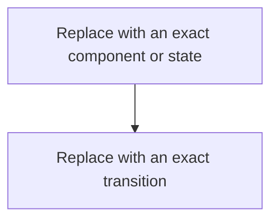

# <LECTURE-ID> — <Video title>

> **Track:** <Beginner | Advanced>  
> **Artifact state:** <Draft | Ready>  
> **Learning state:** <Not started | Learning | Practiced | Recalled | Demonstrated | Comfortable>  
> **Last updated:** <YYYY-MM-DD>

## Source and coverage check

- Inspected: <transcript, slides, video ranges, screenshots, Rahul's questions>
- Coverage: <complete or exact gaps>
- Unclear source points: <items or None>
- Instructor-task scan: <complete/incomplete; count and links>

Do not expose private paths, URLs/IDs, raw transcript passages, or copied slide images.

## What I should be able to do

- <observable outcome>
- <observable outcome>
- <observable outcome>

## Small bridge from earlier ideas

<Explain only the minimum background needed to study this video independently. Say “No bridge needed” when appropriate. Never block the chosen lecture.>

## The 60-second story

<Problem → simple idea → result, in plain language. Introduce formal terms after intuition.>

## Why the terms matter

| Term | Simple meaning | Why it matters here | Common confusion |
|---|---|---|---|
| <term> | <plain meaning> | <decision/mechanism> | <nearby term or misuse> |

## Big picture

### Question this visual answers

<Exact question.>

### How to read this visual

<Walk through it in order.>

### Key insight

<What becomes obvious.>

### Simplification or limitation

<What production reality is omitted.>

Use additional small visuals only when each answers a different question.

## Core concepts

### <Concept>

**Simple meaning:** <plain explanation.>

**Formal meaning:** <precise definition and boundary.>

**Why it exists:** <problem without it.>

**How it works:**

1. <cause/state change>
2. <cause/state change>
3. <observable result>

**Invariant or deciding condition:** <what must remain true.>

**Small example:** <specific values/components.>

**Trade-off:** <gain versus cost.>

**Failure/observability:** <symptom, evidence, recovery.>

**When not to use it:** <condition and alternative.>

Repeat for central concepts; do not inflate minor mentions.

## Worked example and calculations

### Assumptions

- <number, unit, source/reason>

### Steps

<Show intermediate calculations or states.>

### Result and sanity check

<Explain why the result is or is not plausible.>

## Deep mechanism

### Components, ownership, and boundaries

<Who owns state and which boundary changes guarantees?>

### Ordering, concurrency, and stale state

<What races, reorders, blocks, duplicates, or becomes stale?>

### Failure and recovery

| Failure | Observable symptom | Mechanism | Protection/recovery | Remaining risk |
|---|---|---|---|---|
| <failure> | <evidence> | <cause> | <action> | <risk> |

### Observability

<Useful metrics, logs, traces, queries, states, and alerts.>

## Design choices

| Choice | Benefits | Costs/risks | Prefer when | Avoid when |
|---|---|---|---|---|
| <choice> | <benefit> | <cost> | <condition> | <condition> |

## Misconceptions

| Claim/confusion | What is actually true | Evidence or counterexample |
|---|---|---|
| <claim> | <correction> | <trace/example> |

## Real backend connection

<Use a realistic Python/FastAPI/PostgreSQL/cache/queue/AWS example only when relevant. Distinguish an example from Rahul's actual experience.>

## Instructor-assigned tasks

If tasks exist:

| Task | Faithful purpose | Tools | Reference verified? | Learner status |
|---|---|---|---|---|
| [`<LECTURE-ID>-T01`](tasks/<LECTURE-ID>-T01/README.md) | <purpose> | <tools/none> | <passed/skipped> | <not started> |

If none:

> No instructor-assigned task found in the supplied source. The complete source and ending were scanned; see `source_manifest.json`.

### Codex-added practice

Keep this visibly separate:

1. Predict: <question>
2. Draw: <visual reconstruction>
3. Explain: <mechanism in your own words>
4. Change: <one altered requirement>

## Useful English and technical phrases

### <Term or phrase>

- Pronunciation: <cue>
- Simple meaning: <meaning>
- Hindi cue (optional): <short cue>
- Why it matters here: <context>
- Common misuse: <misuse>

Examples:

1. Simple: <sentence>
2. Engineering: <sentence>
3. Engineering: <different sentence>
4. Interview: <natural sentence>
5. Professional/design review: <natural sentence>

## Interview practice

### Foundation

**Question:** <definition/mechanism question>

**Strong answer covers:** <problem, mechanism, boundary, example>

**Weak-answer trap:** <plausible but shallow answer>

### SDE-2 working engineer

**Question:** <implementation/debugging decision>

**Reasoning checkpoints:** <evidence, mechanism, decision, trade-off, test/operation>

**Follow-up:** <one requirement change>

### SDE-3 senior design

**Prompt:** <open design/incident prompt>

**Clarify first:** <scale, latency, consistency, durability, availability, cost>

**Answer outline:** <decision, reason, alternative, failure/recovery, observability>

**Requirement change:** <new constraint and adaptation>

## Course, verified extensions, and uncertainty

### Course model

<Faithful source model.>

### Verified extensions

- <primary-source-backed addition, or None needed>

### Inferences and practical connections

- <clearly labeled inference, or None>

### Unresolved source points

- [ ] <timestamp and uncertainty, or None>

## Final revision card

### Five facts

1. <fact>

### Three decisions

1. <decision and condition>

### One failure

<symptom → cause → evidence → recovery>

### Natural 60-second explanation

<Speaking outline, not memorized prose.>

See [review.md](review.md) for closed-book retrieval.
