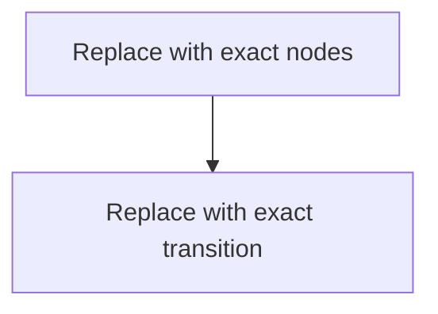

# Visuals — <Lecture title>

Every visual must answer a question. Remove unused sections rather than keeping empty diagrams.

## Visual 1 — <What question does this answer?>

### How to read it

<Walk through the diagram in the correct order and define the important boundary.>

### Key insight

<One sentence describing what the visual makes easier to understand.>

### Limits of this visual

<What concurrency, failure, timing, scale, or implementation detail is intentionally omitted?>

## Visual 2 — <What comparison or state change does this answer?>

<Use a sequence/state diagram or a Markdown table, whichever is exact.>

### How to read it

<Explanation.>

### Key insight

<Insight.>

## Draw-from-memory version

Without reading the full visuals, draw only:

1. <essential component/state>
2. <essential arrow/transition>
3. <essential invariant or failure point>

Then compare your drawing with the canonical visual above.

## Interactive visualizer proposal

> Use only if static Markdown cannot expose the behavior; otherwise write `Not needed`.

- **Question:** <behavior to reveal>
- **Controls:** <parameters and units>
- **Internal state shown:** <state>
- **Step/event log:** <events>
- **Key preset:** <edge case>
- **Expected learning:** <prediction that can be tested>

