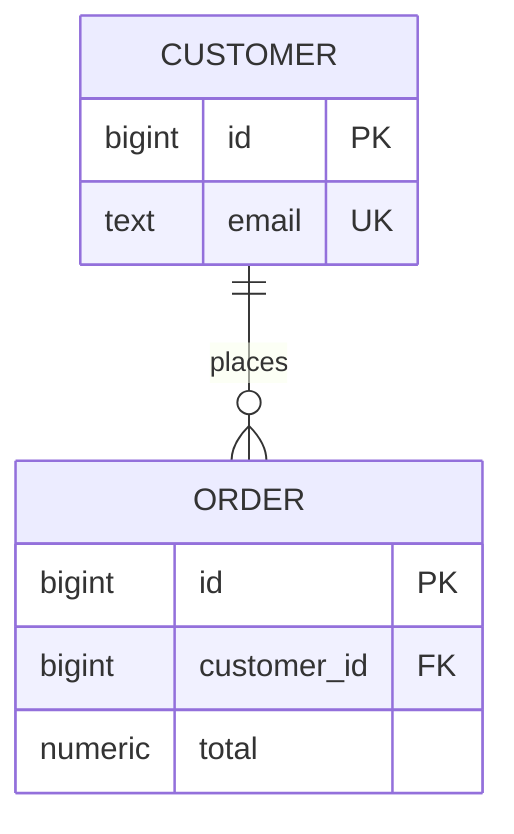

# SD-BEG-050 — Relational Databases

> **Validation fixture:** This synthetic pack tests repository contracts. It is not a reconstruction of the instructor's real lecture or assignment.

## Source and coverage check

The synthetic transcript and ending were inspected completely. One synthetic instructor task was recorded. No private source path, quotation, URL, or identifier is present.

## What I should be able to do

- Explain why relations, keys, and constraints make state easier to reason about.
- Trace a customer-to-order query without losing the row grain.
- Distinguish an application check from a database-enforced foreign-key invariant.

## Small bridge from earlier ideas

No bridge is required. Think of a table as a collection of facts with a declared row meaning. A key lets one fact identify another.

## The 60-second story

A relational database stores facts in tables and lets us connect those facts through keys. The useful part is not merely the rectangular shape. A declared primary key gives each row an identity, a foreign key prevents a relationship from pointing at a missing row, and a transaction lets related changes succeed or fail together. This makes the database an active guardian of invariants rather than a passive file store.

## Why the terms matter

| Term | Simple meaning | Why it matters here | Common confusion |
|---|---|---|---|
| Relation | A set-like collection of facts at one row grain | It defines what one row claims | A displayed SQL table may contain duplicate result rows because SQL uses bag semantics in many operations |
| Primary key | Stable row identity | Other records can refer to one exact fact | It is not automatically the best business-facing identifier |
| Foreign key | A database-enforced reference | It prevents orphaned relationships | It does not enforce every business workflow rule |
| Transaction | A boundary for related state change | Partial updates can roll back | It cannot atomically include an unrelated remote service |

## Big picture

### Question this visual answers

How does an order point to one existing customer?

### How to read this visual

Start at `CUSTOMER.id`. Every `ORDER.customer_id` value must either match one customer row or, if the schema permits it, be null. The crow's foot means one customer may have many orders.

### Key insight

The foreign key turns a drawing into an enforced integrity rule.

### Simplification or limitation

The diagram omits deletion policy, concurrent transactions, indexes, tenant boundaries, and the lifecycle of an order.

## Core concepts

### Row grain and identity

**Simple meaning:** Row grain answers “what exactly does one row represent?”

**Formal meaning:** The key attributes functionally determine the remaining attributes for the modeled fact.

**Why it exists:** Without an explicit grain, joins and aggregates silently multiply facts.

**How it works:** A customer row represents one customer; an order row represents one order; the foreign key carries customer identity into the order fact; a join reconstructs the relationship for a query.

**Invariant or deciding condition:** No order may refer to a customer that does not exist.

**Small example:** Customer 7 can own orders 101 and 102. Both order rows contain `customer_id = 7`; the customer data is not duplicated into every order.

**Trade-off:** Normalized facts reduce update anomalies, while joins add query work and require indexes and cardinality reasoning.

**Failure/observability:** A missing parent produces a foreign-key violation. Inspect the exact constraint and failing key instead of retrying blindly.

**When not to use it:** Do not force a remote service's private identity into a local cross-database foreign key; use an explicit service contract and reconciliation instead.

## Worked example and calculations

Assume two customers and three orders. Joining on the declared foreign key produces three result rows because the output grain is one order, not one customer. Grouping by customer changes the grain to one customer and yields counts of two and one. A result of six rows would indicate accidental fan-out from another one-to-many relation.

## Deep mechanism

PostgreSQL checks a foreign key against a suitable unique parent key and coordinates concurrent changes with locking. An application-level “check then insert” has a race: another transaction can delete the parent after the check. The database constraint evaluates inside database concurrency control, which is why it provides a stronger invariant.

### Failure and recovery

| Failure | Observable symptom | Mechanism | Protection/recovery | Remaining risk |
|---|---|---|---|---|
| Missing customer | Foreign-key violation | Referenced key has no parent | Reject input or create parent in a valid workflow | A syntactically valid customer may still be unauthorized |
| Duplicate email | Unique violation | Two rows claim one business identity | Handle conflict deterministically | Email lifecycle may require a separate identity model |
| Partial multi-step write | Inconsistent state without transaction | One statement commits before another fails | One explicit transaction and rollback | Remote effects need another reliability pattern |

### Observability

Capture the failing constraint name, transaction outcome, query shape, row counts, and slow-query plan. Do not log private field values merely to debug an integrity failure.

## Design choices

| Choice | Benefits | Costs/risks | Prefer when | Avoid when |
|---|---|---|---|---|
| Database foreign key | Strong local integrity | Write coordination and migration care | Data shares one ownership and transaction boundary | Parent lives in another service database |
| Application-only check | Custom message | Race-prone and bypassable | Only as an additional UX check | Used as the sole integrity guarantee |

## Misconceptions

| Claim/confusion | What is actually true | Evidence or counterexample |
|---|---|---|
| “The ORM owns integrity.” | The database constraint protects every writer. | A manual SQL writer bypasses an ORM check but not a foreign key. |
| “A join always duplicates data.” | Cardinality determines the result grain. | One customer joined to two orders correctly produces two order-grain rows. |

## Real backend connection

A FastAPI request may validate the JSON shape before opening a transaction, but PostgreSQL remains the authority for concurrent uniqueness and referential integrity. Map known constraint failures to deliberate API responses; do not turn every database error into a generic retry.

## Instructor-assigned tasks

| Task | Faithful purpose | Tools | Reference verified? | Learner status |
|---|---|---|---|---|
| [`SD-BEG-050-T01`](tasks/SD-BEG-050-T01/README.md) | Relate orders to customers and explain the invariant | PostgreSQL | Skipped: Docker unavailable in fixture | Not started |

### Codex-added practice

Predict the output grain before a join, draw the parent/child relationship, explain the constraint race it prevents, and decide what changes if customer data belongs to another service.

## Useful English and technical phrases

### Referential integrity

- Pronunciation: ref-er-EN-shul in-TEG-ri-tee
- Simple meaning: references keep pointing to valid records.
- Hindi cue (optional): relation valid rehna.
- Why it matters here: it names the invariant enforced by a foreign key.
- Common misuse: using it for every business authorization rule.

Examples: Referential integrity failed. The foreign key preserves referential integrity. We should enforce this invariant in PostgreSQL. In an interview, I would clarify the ownership boundary before adding a foreign key. Across services, we need reconciliation because local referential integrity cannot cross the network.

## Interview practice

### Foundation

**Question:** What does a foreign key guarantee? **Strong answer covers:** valid local reference, nullability, update/delete policy, and transaction boundary. **Weak-answer trap:** saying only that it joins two tables.

### SDE-2 working engineer

**Question:** Why can an application check not replace the constraint? **Reasoning checkpoints:** race window, other writers, error mapping, migration, and tests. **Follow-up:** What index is needed for common parent-to-child access?

### SDE-3 senior design

**Prompt:** Customer and order ownership split into separate services. **Clarify first:** source of truth, deletion, consistency window, availability, and reconciliation. **Answer outline:** remove cross-service FK, preserve local identity, use contracts/events, handle missing references, observe drift. **Requirement change:** a legal deletion must propagate within one hour.

## Course, verified extensions, and uncertainty

This fixture includes no real course statement. The mechanisms are synthetic validation content. A generated real pack must separate the course model, verified primary-source extensions, inferences, and unresolved transcript points.

## Final revision card

Five facts: define row grain; keys identify facts; foreign keys enforce local references; transactions protect related local changes; joins preserve or change grain according to cardinality. Three decisions: constraint versus app check, normalized facts versus duplication, local relationship versus remote ownership. One failure: orphan attempt → foreign-key violation → inspect constraint/key → repair workflow. Natural explanation: start with the fact, state the invariant, trace one example, then name the ownership boundary.

See [review.md](review.md) for closed-book retrieval.
